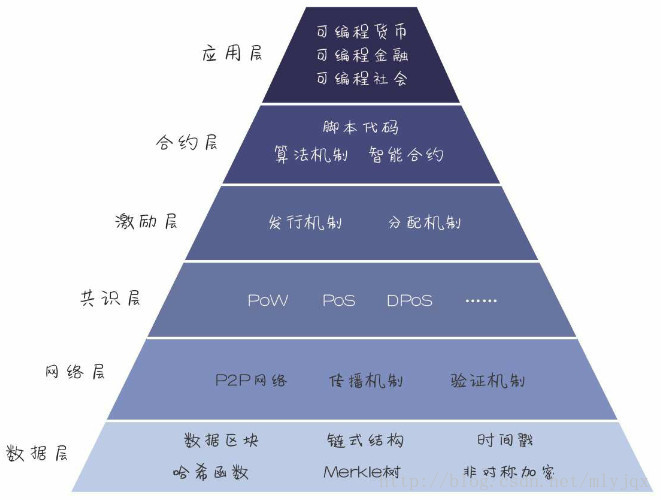

# 以太坊(Ethereum)学习  
- ## 基础知识  
  - ### [区块链知识学习](md/blockchain-base.md)  
- ## 以太坊进阶
  - ### [区块链学习]()  
- ## 以太坊开发 
  - ### [solidity区块链开发入门](md/blockchain-app-dev.md)  
  - ### [solidity以太坊开发入门](md/eth-app-dev.md)  
  - ### [JavaScript源码编译及调试](md/javascript.md)  
  - ### [Solidity源码编译及调试](md/solidity.md)  
  - ### [go-ethereum源码编译及调试](md/go-ethereum.md)  
  - ### [自己动手实现区块链](md/self-make-ethereum.md)  

区块链基础架构分为6层，包括数据层、网络层、共识层、激励层、合约层、应用层。每层分别完成一项核心功能，各层之间互相配合，实现一个去中心化的信任机制。  

 

  </img>

