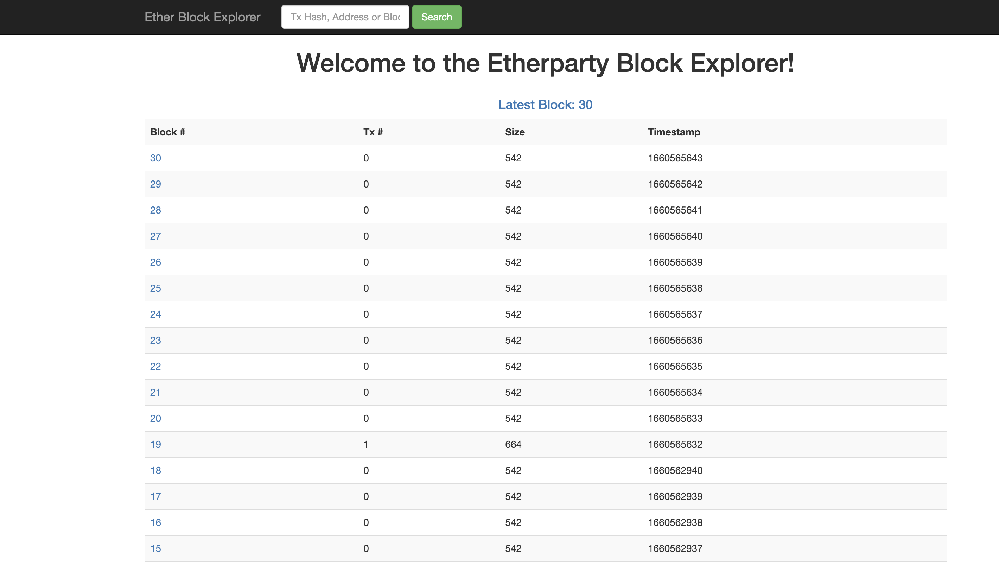
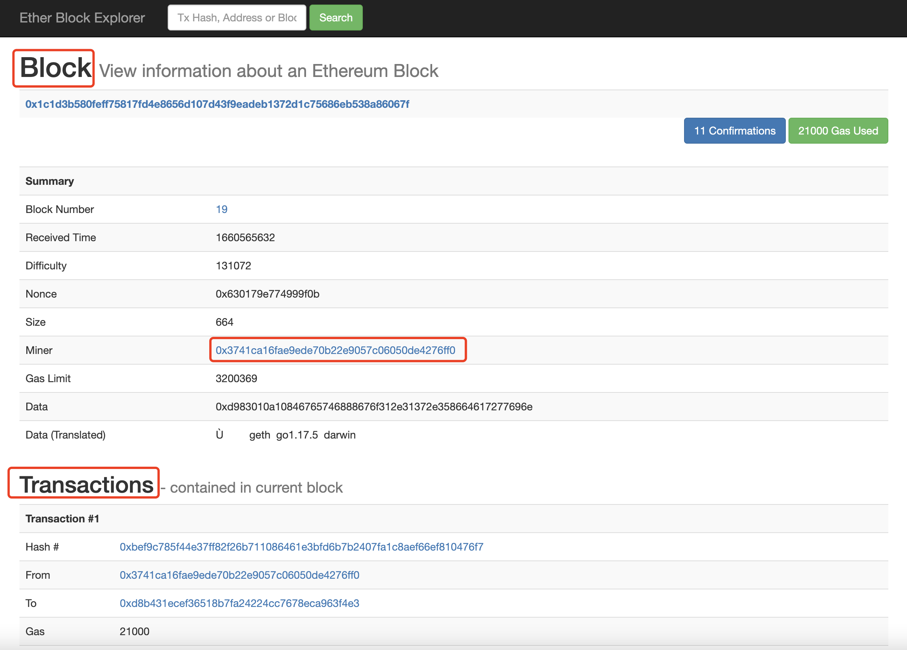

- # 链浏览器搭建

## 基础环境
使用的系统是Ubuntu  
```shell
sudo apt-get install -y make g++ wget ca-certificates
```

[安装nvm、node、npm](go-ethereum.md#本地编译Remix)  

## etherparty/explorer
[etherparty/explorer](https://github.com/etherparty/explorer)  

下载离线包
```shell
# 直接下载源码
git clone https://github.com/etherparty/explorer

npm start
```

Then visit http://localhost:8000 in your browser of choice. You might get an error message: 

修改ip地址及端口`package.json`  
```json
 "scripts": {
    "postinstall": "bower install",
    "prestart": "npm install",
    "start": "http-server ./app -a 10.25.16.221 -p 8000 -c-1",
```

### 错误处理
```shell
make: Entering directory '/root/work/explorer/node_modules/bufferutil/build'
  CXX(target) Release/obj.target/bufferutil/src/bufferutil.o
../src/bufferutil.cc:25:30: error: ‘v8::Handle’ has not been declared
   25 |   static void Initialize(v8::Handle<v8::Object> target)
      |                              ^~~~~~
../src/bufferutil.cc:25:36: error: expected ‘,’ or ‘...’ before ‘<’ token
   25 |   static void Initialize(v8::Handle<v8::Object> target)
```


## 配合geth  

[安装geth](go-ethereum.md#ubuntu-via-ppas)  

可以增加geth启动参数中`--rpccorsdomain`  
`geth --rpc --rpccorsdomain "http://localhost:8000"`  

如果geth版本较新，参数有变更
```shell
--rpc => --http
--rpcapi => --http.api
--rpccorsdomain => --http.corsdomain
```

也就是`geth --http --http.corsdomain "http://localhost:8000"`  


## 展示

<br>
<div align=center>
  </img>
</div>

<br>
<div align=center>
  </img>
</div>

