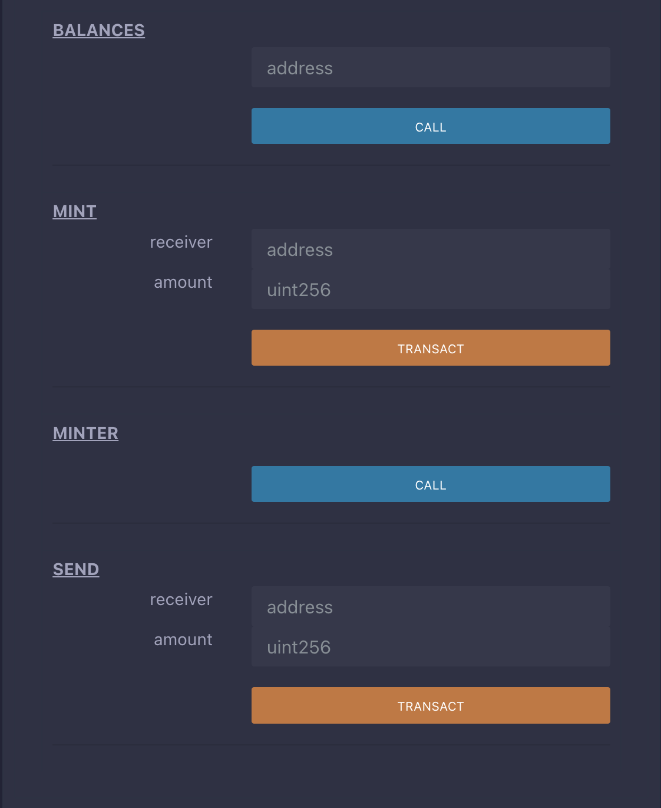

- # 目录

- ### [solidity中文文档](https://learnblockchain.cn/docs/solidity/0.8.0/index.html)  
- ### [github源码及youtube课程](https://github.com/willitscale/learning-solidity)  

- [入门](#入门)
  - [存储合约](#存储合约)
  - [货币合约（Subcurrency）示例](#货币合约subcurrency示例)
  - [区块链基础](#区块链基础)
    - [交易/事务](#交易事务)
    - [区块](#区块)
  - [以太坊虚拟机](#以太坊虚拟机)
    - [概述](#概述)
    - [账户](#账户)
    - [交易](#交易)
    - [Gas](#gas)
    - [存储，内存和栈](#存储内存和栈)
    - [指令集](#指令集)
    - [消息调用](#消息调用)
    - [委托调用/代码调用和库](#委托调用代码调用和库)
    - [日志](#日志)
    - [合约创建](#合约创建)
    - [失效和自毁](#失效和自毁)
- [根据例子学习Solidity](#根据例子学习solidity)
  - [投票合约](#投票合约)
  - [秘密竞价（盲拍）合约](#秘密竞价盲拍合约)
    - [简单的公开拍卖](#简单的公开拍卖)
    - [秘密竞拍（盲拍）](#秘密竞拍盲拍)
- [Solidity详解](#solidity详解)
  - [Solidity 源文件结构](#solidity-源文件结构)
    - [SPDX License Identifier](#spdx-license-identifier)
    - [Pragmas](#pragmas)
    - [版本标识](#版本标识)
    - [ABI Coder Pragma](#abi-coder-pragma)
    - [导入其他源文件](#导入其他源文件)
      - [语法与语义](#语法与语义)
    - [注释](#注释)
  - [合约结构](#合约结构)
    - [状态变量](#状态变量)
    - [函数](#函数)
    - [函数修改器 modifier](#函数修改器-modifier)
    - [事件 Event](#事件-event)
    - [结构体](#结构体)
    - [枚举类型](#枚举类型)
  - [类型](#类型)
    - [值类型](#值类型)
      - [布尔类型](#布尔类型)
      - [整型](#整型)
      - [比较运算](#比较运算)
      - [位运算](#位运算)
      - [移位](#移位)
      - [模运算（取余）](#模运算取余)
      - [幂运算](#幂运算)
      - [地址类型 Address](#地址类型-address)
      - [地址类型成员变量](#地址类型成员变量)
      - [合约类型](#合约类型)
      - [变长字节数组](#变长字节数组)
      - [地址字面常量](#地址字面常量)
      - [函数类型](#函数类型)
    - [引用类型](#引用类型)
      - [数组](#数组)
        - [创建内存数组](#创建内存数组)
        - [数组成员](#数组成员)

# 入门  
## 存储合约  
把一个数据保存到链上  

```sol
// SPDX-License-Identifier: GPL-3.0
pragma solidity >=0.4.16 <0.9.0;

contract SimpleStorage {
    uint storedData;

    function set(uint x) public {
        storedData = x;
    }

    function get() public view returns (uint) {
        return storedData;
    }
}
```

第一行是说明源代码是根据`GPL 3.0`版本授权的。默认情况下，在发布源代码时加入机器可读许可证说明是很重要的，

下一行是告诉编译器源代码所适用的Solidity版本为>=0.4.16 及 <0.9.0 。这样的说明是为了确保合约不会在新的编译器版本中发生异常的行为。关键字 `pragma` 是告知编译器如何处理源代码的通用指令（例如， `pragma once` ）。

Solidity中智能合约的含义就是一组`代码`（它的 功能 )和`数据`（它的 状态 ）的集合，并且它们是位于以太坊区块链的一个特定地址上的。 `uint storedData;` 这一行代码声明了一个名为``storedData``的状态变量，其类型为 `uint` (256位无符号整数）。 你也可以认为它是数据库里的一个插槽，并且可以通过调用管理数据库代码的函数进行查询和更改。在这个例子中，上述的合约定义了``set``和``get`` 函数，可以用来修改或检索变量的值。

要访问一个状态变量，你通常并不需要像添加 `this`. 这样的前缀，你只需要通过它的名字就可以直接访问它。与其他一些语言不同的是，省略它不仅仅是一个风格问题，因为它会导致了一种完全不同的访问成员的方式，这一块后面会详细介绍。

该合约能完成的事情并不多（由于以太坊构建的基础架构的原因）：它能允许任何人在合约中存储一个单独的数字，并且这个数字可以被世界上任何人访问，且没有可行的办法阻止你发布这个数字。当然，任何人都可以再次调用 `set` ，传入不同的值，覆盖你的数字，但是这个数字仍会被存储在区块链的历史记录中。随后，我们会看到怎样施加访问限制，以确保只有你才能改变这个数字。

编译及部署日志
```shell
[11:06:51 PM]: Network is a local or custom network!
[11:07:07 PM]: Compiling with version soljson-v0.8.0+commit.c7dfd78e.js
[11:07:10 PM]: Loading remote version v0.8.0+commit.c7dfd78e... please wait
[11:07:50 PM]: Remote version v0.8.0+commit.c7dfd78e loaded.
[11:07:50 PM]: Compilation finished for code/sol/learn/SimpleStorage.sol with solidity version 0.8.0+commit.c7dfd78e.Emscripten.clang.
[11:07:57 PM]: Deploying contract SimpleStorage started!
[11:07:57 PM]: Network is a local or custom network!
[11:07:57 PM]: Gas estimate 142569
[11:07:57 PM]: Contract deployed at 0x15d2dF09AA6bD79EC0995De51ab9B422ae2Ebe4f
[11:07:57 PM]: Deploying ...
[11:07:58 PM]: Network is a local or custom network!

# 获取值
[11:09:33 PM]: Calling method 'get' with [] from 0x13a5BB41D4c229b7f3c85509952080c7646a5E26 at contract address 0x15d2dF09AA6bD79EC0995De51ab9B422ae2Ebe4f
[11:09:33 PM]: "0"

# 设置值123
[11:10:28 PM]: Network is a local or custom network!
[11:10:28 PM]: Send data to method 'set' with ["123"] from 0x13a5BB41D4c229b7f3c85509952080c7646a5E26 at contract address 0x15d2dF09AA6bD79EC0995De51ab9B422ae2Ebe4f
[11:10:28 PM]: TRANSACTIONHASH :
[11:10:28 PM]: "0x655d6a4b63c8be34dc73153d5cfd06123c4669d65aa853422fa8ccc55c224c51"
[11:10:28 PM]: BLOCKHASH :
[11:10:28 PM]: "0x779d47d15c5788f341862a0e37de5e80a18e78115f360ab8fe75b7d01116410e"
[11:10:28 PM]: FROM :
[11:10:28 PM]: "0x13a5bb41d4c229b7f3c85509952080c7646a5e26"
[11:10:28 PM]: TO :
[11:10:28 PM]: "0x15d2df09aa6bd79ec0995de51ab9b422ae2ebe4f"
[11:10:28 PM]: GASUSED :
[11:10:28 PM]: 41602
[11:10:28 PM]: CUMULATIVEGASUSED :
[11:10:28 PM]: 41602
```

## 货币合约（Subcurrency）示例
下面的合约实现了一个最简单的加密货币。这里，币确实可以无中生有地产生，但是只有创建合约的人才能做到（实现一个不同的发行计划也不难）。而且，任何人都可以给其他人转币，不需要注册用户名和密码 —— 所需要的只是以太坊密钥对。  

```js
// SPDX-License-Identifier: GPL-3.0
pragma solidity  >=0.7.0 <0.9.0;

contract Coin {
    // 关键字“public”让这些变量可以从外部读取
    address public minter;
    mapping (address => uint) public balances;

    // 轻客户端可以通过事件针对变化作出高效的反应
    event Sent(address from, address to, uint amount);

    // 这是构造函数，只有当合约创建时运行
    constructor() {
        minter = msg.sender;
    }

    function mint(address receiver, uint amount) public {
        require(msg.sender == minter);
        require(amount < 1e60);
        balances[receiver] += amount;
    }

    function send(address receiver, uint amount) public {
        require(amount <= balances[msg.sender], "Insufficient balance.");
        balances[msg.sender] -= amount;
        balances[receiver] += amount;
        emit Sent(msg.sender, receiver, amount);
    }
}
```

合约界面: 
<br>
<div align=center>
  </img>
</div>  

> require(amount <= balances[msg.sender], "Insufficient balance."); 要求铸造者必须拥有足够的币

这个合约引入了一些新的概念，让我们逐一解读。  

`address public minter;` 这一行声明了一个可以被公开访问的 `address` 类型的状态变量。 address 类型是一个`160`位的值，且不允许任何算数操作。这种类型适合存储合约地址或外部人员的密钥对。关键字 `public` 自动生成一个函数，允许你在这个合约之外访问这个状态变量的当前值。如果没有这个关键字，其他的合约没有办法访问这个变量。由编译器生成的函数的代码大致如下所示（暂时忽略 external 和 view）：

```shell
function minter() external view returns (address) { return minter; }
```

当然，加一个和上面完全一样的函数是行不通的，因为我们会有同名的一个函数和一个变量，这里，主要是希望你能明白——编译器已经帮你实现了。  

下一行， `mapping (address => uint) public balances;` 也创建一个公共状态变量，但它是一个更复杂的数据类型。 该类型将`addres`s映射为无符号整数。 `Mappings` 可以看作是一个 `哈希表` 它会执行虚拟初始化，以使所有可能存在的键都映射到一个字节表示为全零的值。 但是，这种类比并不太恰当，因为它既不能获得映射的所有键的列表，也不能获得所有值的列表。 因此，要么记住你添加到`mapping`中的数据（使用列表或更高级的数据类型会更好），要么在不需要键列表或值列表的上下文中使用它，就如本例。 而由 `public` 关键字创建的`getter`函数 `getter function` 则是更复杂一些的情况， 它大致如下所示：  

```shell
function balances(address _account) external view returns (uint) {
    return balances[_account];
}
```

正如你所看到的，你可以通过该函数轻松地查询到账户的余额。

`event Sent(address from, address to, uint amount);` 这行声明了一个所谓的“事件（event）”，它会在 `send` 函数的最后一行被发出。用户界面（当然也包括服务器应用程序）可以监听区块链上正在发送的事件，而不会花费太多成本。一旦它被发出，监听该事件的`listener`都将收到通知。而所有的事件都包含了 `from` ， `to` 和 `amount` 三个参数，可方便追踪交易。 为了监听这个事件，你可以使用如下JavaScript代码（假设 Coin 是已经通过 web3.js 创建好的合约对象 ）：  

```js
Coin.Sent().watch({}, '', function(error, result) {
    if (!error) {
        console.log("Coin transfer: " + result.args.amount +
            " coins were sent from " + result.args.from +
            " to " + result.args.to + ".");
        console.log("Balances now:\n" +
            "Sender: " + Coin.balances.call(result.args.from) +
            "Receiver: " + Coin.balances.call(result.args.to));
    }
})
```

这里请注意自动生成的 `balances` 函数是如何从用户界面调用的。  

特殊函数 `constructor` 是仅在创建合约期间运行的构造函数，不能在事后调用。 它永久存储创建合约的人的地址: `msg` (以及 tx 和 block ) 是一个特殊的全局变量，其中包含一些允许访问区块链的属性。 `msg.sender` 始终是当前（外部）函数调用的来源地址。

最后，真正被用户或其他合约所调用的，以完成本合约功能的方法是 `mint` 和 `send`。 如果 `mint` 被合约创建者外的其他人调用则什么也不会发生。 另一方面， `send` 函数可被任何人用于向他人发送币 (当然，前提是发送者拥有这些币)。记住，如果你使用合约发送币给一个地址，当你在区块链浏览器上查看该地址时是看不到任何相关信息的。因为，实际上你发送币和更改余额的信息仅仅存储在特定合约的`数据存储器`中。通过使用事件，你可以非常简单地为你的新币创建一个“区块链浏览器”来追踪交易和余额。  

## 区块链基础
对于程序员来说，区块链这个概念并不难理解，这是因为大多数难懂的东西 (`挖矿`, `哈希` ，`椭圆曲线密码学` ，`点对点网络（P2P）` 等) 都只是用于提供特定的功能和承诺。你只需接受这些既有的特性功能，不必关心底层技术，比如，难道你必须知道亚马逊的 AWS 内部原理，你才能使用它吗？  

### 交易/事务
区块链是全球共享的`事务性`数据库，这意味着每个人都可加入网络来阅读数据库中的记录。如果你想改变数据库中的某些东西，你必须创建一个被所有其他人所接受的事务。事务一词意味着你想做的（假设您想要同时更改两个值），要么一点没做，要么全部完成。此外，当你的事务被应用到数据库时，其他事务不能修改数据库。

举个例子，设想一张表，列出电子货币中所有账户的余额。如果请求从一个账户转移到另一个账户，数据库的事务特性确保了如果从一个账户扣除金额，它总被添加到另一个账户。如果由于某些原因，无法添加金额到目标账户时，源账户也不会发生任何变化。

此外，交易总是由发送人（创建者）签名。

这样，就可非常简单地为数据库的特定修改增加访问保护机制。在电子货币的例子中，一个简单的检查可以确保只有持有`账户密钥`的人才能从中转账。

### 区块
在比特币中，要解决的一个主要难题，被称为“双花攻击 (double-spend attack)”：如果网络存在两笔交易，都想花光同一个账户的钱时（即所谓的冲突）会发生什么情况？交易互相冲突？

简单的回答是你不必在乎此问题。网络会为你自动选择一条交易序列，并打包到所谓的“区块”中，然后它们将在所有参与节点中执行和分发。如果两笔交易互相矛盾，那么最终被确认为后发生的交易将被拒绝，不会被包含到区块中。

这些块按时间形成了一个线性序列，这正是“区块链”这个词的来源。区块以一定的时间间隔添加到链上 —— 对于以太坊，这间隔大约是17秒。

作为“顺序选择机制”（也就是所谓的“挖矿”）的一部分，可能有时会发生块（blocks）被回滚的情况，但仅在链的“末端”。末端增加的块越多，其发生回滚的概率越小。因此你的交易被回滚甚至从区块链中抹除，这是可能的，但等待的时间越长，这种情况发生的概率就越小。  

## 以太坊虚拟机
### 概述
以太坊虚拟机 EVM 是智能合约的运行环境。它不仅是沙盒封装的，而且是完全隔离的，也就是说在 EVM 中运行代码是无法访问网络、文件系统和其他进程的。甚至智能合约之间的访问也是受限的。  

### 账户
以太坊中有两类账户（它们共用同一个地址空间）： `外部账户` 由公钥-私钥对（也就是人）控制； `合约账户` 由和账户一起存储的代码控制.

外部账户的地址是由公钥决定的，而合约账户的地址是在创建该合约时确定的（这个地址通过合约创建者的地址和从该地址发出过的交易数量计算得到的，也就是所谓的“nonce”）  

无论帐户是否存储代码，这两类账户对 `EVM` 来说是一样的。

每个账户都有一个键值对形式的持久化存储。其中 `key` 和 `value` 的长度都是256位，我们称之为 存储 。

此外，每个账户有一个以太币余额（ `balance` ）（单位是“Wei”, 1 ether 是 10**18 wei），余额会因为发送包含以太币的交易而改变。  

### 交易
交易可以看作是从一个帐户发送到另一个帐户的`消息`（这里的账户，可能是相同的或特殊的零帐户，请参阅下文）。它能包含一个二进制数据（合约负载）和以太币。

如果目标账户含有代码，此代码会被执行，并以 `payload` 作为入参。

如果目标账户是零账户（账户地址为 0 )，此交易将创建一个 `新合约` 。 如前文所述，合约的地址不是零地址，而是通过合约创建者的地址和从该地址发出过的交易数量计算得到的（所谓的“nonce”）。 这个用来创建合约的交易的 `payload` 会被转换为 `EVM` 字节码并执行。执行的输出将作为合约代码被永久存储。这意味着，为创建一个合约，你不需要发送实际的合约代码，而是发送能够产生合约代码的代码。

> 在合约创建的过程中，它的代码还是空的。所以直到构造函数执行结束，你都不应该在其中调用合约自己函数。  

### Gas
一经创建，每笔交易都收取一定数量的 `gas` ，目的是限制执行交易所需要的工作量和为交易支付手续费。`EVM` 执行交易时，`gas` 将按特定规则逐渐耗尽。

`gas price` 是交易发送者设置的一个值，发送者账户需要预付的手续费= `gas_price * gas` 。如果交易执行后还有剩余， `gas` 会原路返还。

无论执行到什么位置，一旦 `gas` 被耗尽（比如降为负值），将会触发一个 out-of-gas 异常。当前调用帧（call frame）所做的所有状态修改都将被回滚。

译者注：调用帧（call frame），指的是下文讲到的EVM的运行栈（stack）中当前操作所需要的若干元素。  

### 存储，内存和栈
每个账户有一块持久化内存区称为 `存储` 。 存储是将256位字映射到256位字的键值存储区。 在合约中枚举存储是不可能的，且读存储的相对开销很高，修改存储的开销甚至更高。合约只能读写存储区内属于自己的部分。

第二个内存区称为 `内存` ，合约会试图为每一次消息调用获取一块被重新擦拭干净的内存实例。 内存是线性的，可按字节级寻址，但读的长度被限制为256位，而写的长度可以是8位或256位。当访问（无论是读还是写）之前从未访问过的内存字（word）时（无论是偏移到该字内的任何位置），内存将按字进行扩展（每个字是256位）。扩容也将消耗一定的gas。 随着内存使用量的增长，其费用也会增高（以平方级别）。

`EVM` 不是基于寄存器的，而是基于栈的，因此所有的计算都在一个被称为 栈（stack） 的区域执行。 栈最大有1024个元素，每个元素长度是一个字（256位）。对栈的访问只限于其顶端，限制方式为：允许拷贝最顶端的16个元素中的一个到栈顶，或者是交换栈顶元素和下面16个元素中的一个。所有其他操作都只能取最顶的两个（或一个，或更多，取决于具体的操作）元素，运算后，把结果压入栈顶。当然可以把栈上的元素放到存储或内存中。但是无法只访问栈上指定深度的那个元素，除非先从栈顶移除其他元素。

### 指令集
EVM的指令集量应尽量少，以最大限度地避免可能导致共识问题的错误实现。所有的指令都是针对”256位的字（word）”这个基本的数据类型来进行操作。具备常用的算术、位、逻辑和比较操作。也可以做到有条件和无条件跳转。此外，合约可以访问当前区块的相关属性，比如它的编号和时间戳。
### 消息调用
合约可以通过消息调用的方式来调用其它合约或者发送以太币到非合约账户。消息调用和交易非常类似，它们都有一个源、目标、数据、以太币、gas和返回数据。事实上每个交易都由一个顶层消息调用组成，这个消息调用又可创建更多的消息调用。

合约可以决定在其内部的消息调用中，对于剩余的 `gas` ，应发送和保留多少。如果在内部消息调用时发生了`out-of-gas`异常（或其他任何异常），这将由一个被压入栈顶的错误值所指明。此时，只有与该内部消息调用一起发送的gas会被消耗掉。并且，Solidity中，发起调用的合约默认会触发一个手工的异常，以便异常可以从调用栈里“冒泡出来”。 如前文所述，被调用的合约（可以和调用者是同一个合约）会获得一块刚刚清空过的内存，并可以访问调用的payload——由被称为 calldata 的独立区域所提供的数据。调用执行结束后，返回数据将被存放在调用方预先分配好的一块内存中。 调用深度被 限制 为 1024 ，因此对于更加复杂的操作，我们应使用循环而不是递归。

### 委托调用/代码调用和库
一种特殊类型的消息调用，被称为 委托调用(`delegatecall`) 。它和一般的消息调用的区别在于，目标地址的代码将在发起调用的合约的上下文中执行，并且 `msg.sender` 和 `msg.value` 不变。 这意味着一个合约可以在运行时从另外一个地址动态加载代码。存储、当前地址和余额都指向发起调用的合约，只有代码是从被调用地址获取的。 这使得 Solidity 可以实现”库“能力：可复用的代码库可以放在一个合约的存储上，如用来实现复杂的数据结构的库。


### 日志
有一种特殊的可索引的数据结构，其存储的数据可以一路映射直到区块层级。这个特性被称为 日志(logs) ，Solidity用它来实现 事件(events) 。合约创建之后就无法访问日志数据，但是这些数据可以从区块链外高效的访问。因为部分日志数据被存储在 布隆过滤器（Bloom filter) 中，我们可以高效并且加密安全地搜索日志，所以那些没有下载整个区块链的网络节点（轻客户端）也可以找到这些日志。

### 合约创建
合约甚至可以通过一个特殊的指令来创建其他合约（不是简单的调用零地址）。创建合约的调用 `create calls` 和普通消息调用的唯一区别在于，负载会被执行，执行的结果被存储为合约代码，调用者/创建者在栈上得到新合约的地址。


### 失效和自毁
合约代码从区块链上移除的唯一方式是合约在合约地址上的执行自毁操作 `selfdestruct` 。合约账户上剩余的以太币会发送给指定的目标，然后其存储和代码从状态中被移除。移除一个合约听上去不错，但其实有潜在的危险，如果有人发送以太币到移除的合约，这些以太币将永远丢失。

> 尽管一个合约的代码中没有显式地调用 `selfdestruct` ，它仍然有可能通过 `delegatecall` 或 `callcode` 执行自毁操作。

如果要使合同失效，则应通过更改内部状态来禁用合约，这样可以在使用函数无法执行从而进行 revert，从而达到返还以太的目的。

> 旧合约的删减可能会，也可能不会被以太坊的各种客户端程序实现。另外，归档节点可选择无限期保留合约存储和代码。  
> 目前， `外部账户` 不能从状态中移除。


# 根据例子学习Solidity
## 投票合约
以下的合约有一些复杂，但展示了很多Solidity的语言特性。它实现了一个投票合约。 当然，电子投票的主要问题是如何将`投票权`分配给正确的人员以及如何防止被操纵。 我们不会在这里解决所有的问题，但至少我们会展示如何进行委托投票，同时，`计票`又是 自动和完全透明的 。

我们的想法是为每个（投票）表决创建一份合约，为每个选项提供简称。 然后作为合约的创造者——即主席，将给予每个独立的地址以投票权。

地址后面的人可以选择自己投票，或者委托给他们信任的人来投票。

在投票时间结束时，`winningProposal()` 将返回获得最多投票的提案。 

[Ballot.sol](../code/sol/learn/Ballot.sol)  

## 秘密竞价（盲拍）合约
在本节中，我们将展示如何轻松地在以太坊上创建一个秘密竞价的合约。 我们将从公开拍卖开始，每个人都可以看到出价，然后将此合约扩展到盲拍合约， 在竞标期结束之前无法看到实际出价。  

### 简单的公开拍卖
以下简单的拍卖合约的总体思路是每个人都可以在投标期内发送他们的出价。 出价已经包含了资金/以太币，来将投标人与他们的投标绑定。 如果最高出价提高了（被其他出价者的出价超过），之前出价最高的出价者可以拿回她的钱。 在投标期结束后，受益人需要手动调用合约来接收他的钱 - 合约不能自己激活接收。  

[SimpleAuction.sol](../code/sol/learn/SimpleAuction.sol)  

### 秘密竞拍（盲拍）
上面的公开拍卖接下来将被扩展为一个秘密竞拍。 秘密竞拍的好处是在投标结束前不会有时间压力。 在一个透明的计算平台上进行秘密竞拍听起来像是自相矛盾，但密码学可以实现它。

在 投标期间 ，投标人实际上并没有发送她的出价，而只是发送一个哈希版本的出价。 由于目前几乎不可能找到两个（足够长的）值，其哈希值是相等的，因此投标人可通过该方式提交报价。 在投标结束后，投标人必须公开他们的出价：他们不加密的发送他们的出价，合约检查出价的哈希值是否与投标期间提供的相同。

另一个挑战是如何使拍卖同时做到 绑定和秘密 : 唯一能阻止投标者在她赢得拍卖后不付款的方式是，让她将钱连同出价一起发出。 但由于资金转移在以太坊中不能被隐藏，因此任何人都可以看到转移的资金。

下面的合约通过接受任何大于最高出价的值来解决这个问题。 当然，因为这只能在披露阶段进行检查，有些出价可能是 无效 的， 并且，这是故意的(与高出价一起，它甚至提供了一个明确的标志来标识无效的出价): 投标人可以通过设置几个或高或低的无效出价来迷惑竞争对手。


[BlindAuction.sol](../code/sol/learn/BlindAuction.sol)


# Solidity详解 
## Solidity 源文件结构
### SPDX License Identifier
### Pragmas
关键字 `pragma` 版本标识指令，用来启用某些编译器检查， 版本 标识pragma 指令通常只对本文件有效，所以我们需要把这个版本 标识pragma 添加到项目中所有的源文件。 如果使用了 import 导入 其他的文件, 标识pragma 并不会从被导入的文件，加入到导入的文件中。

### 版本标识
为了避免未来被可能引入不兼容更新的编译器所编译，源文件可以（也应该）使用版本 标识 `pragma` 所注解。 我们力图把这类不兼容变更做到尽可能小，但是，Solidity 本身就处在快速的发展之中，所以我们很难保证不引入修改语法的变更。 因此对含重大变更的版本，通读变更日志永远是好办法，变更日志通常会有版本号表明更新点。

版本标识使用如下:

```shell
pragma solidity ^0.5.2;
```

这样，源文件将既不允许低于 `0.5.2` 版本的编译器编译， 也不允许高于（包含） `0.6.0` 版本的编译器编译（第二个条件因使用 ^ 被添加）。 这种做法的考虑是，编译器在 0.6.0 版本之前不会有重大变更，所以可确保源代码始终按预期被编译。 上面例子中不固定编译器的具体版本号，因此编译器的补丁版也可以使用。

### ABI Coder Pragma


### 导入其他源文件
#### 语法与语义
在全局层面上，可使用如下格式的导入语句：

```shell
import "filename";
```

此语句将从 “filename” 中**导入所有的全局符号到当前全局作用域**中（不同于 ES6，Solidity 是向后兼容的）。

这种形式已经不建议使用，因为它会无法预测地污染当前命名空间。 如果在“filename”中添加新的符号，则会自动添加出现在所有导入 “filename” 的文件中。 更好的方式是明确导入的具体 符号。

像下面这样，创建了新的 symbolName 全局符号，他的成员都来自与导入的 "filename" 文件中的全局符号，如：

```shell
import * as symbolName from "filename";
```

然后所有全局符号都以``symbolName.symbol``格式提供。 此语法的变体不属于ES6，但可能有用：

```shell
import "filename" as symbolName;
```

它等价于 `import * as symbolName from "filename"`;。


### 注释

```shell
// 这是一个单行注释。

/*
这是一个
多行注释。
*/
```
## 合约结构 

在 Solidity 语言中，合约类似于其他面向对象编程语言中的**类**。

每个合约中可以包含 `状态变量`、 `函数`、事件 `Event`、 `结构体`、 和 `枚举类型` 的声明，且合约可以从其他合约继承。  

还有一些特殊的合约，如： `库` 和 `接口`.

专门的 `合约` 章节会比本节包含更多的内容，本节用于帮助我们合约包含哪些内容，做一个简单的入门。

### 状态变量

状态变量是永久地存储在合约存储中的值。

```js
pragma solidity >=0.4.0 <0.9.0;

contract TinyStorage {
    uint storedXlbData; // 状态变量
    // ...
}
```

### 函数
函数是代码的可执行单元。函数通常在合约内部定义，但也可以在合约外定义。

```js
// SPDX-License-Identifier: GPL-3.0
pragma solidity >0.7.0 <0.9.0;

contract TinyAuction {
    function Mybid() public payable { // 定义函数
        // ...
    }
}

// Helper function defined outside of a contract
function helper(uint x) pure returns (uint) {
    return x * 2;
}
```

### 函数修改器 modifier
函数修改器modifier 可以用来以声明的方式修改函数语义  

```js
pragma solidity >=0.4.22 <0.9.0;

contract MyPurchase {
    address public seller;

    modifier onlySeller() { // 修改器
        require(
            msg.sender == seller,
            "Only seller can call this."
        );
        _;
    }

    function abort() public onlySeller { // 修改器用法
        // ...
    }
}
```

### 事件 Event
事件是能方便地调用以太坊虚拟机日志功能的接口。  

```js
pragma solidity >=0.4.21 <0.9.0;
contract TinyAuction {
    event HighestBidIncreased(address bidder, uint amount); // 事件

    function bid() public payable {
        // ...
        emit HighestBidIncreased(msg.sender, msg.value); // 触发事件
    }
}
```

有关如何声明事件和如何在 [DApp 中使用事件](https://learnblockchain.cn/2018/05/09/solidity-event/)的信息，参阅合约章节中的 事件 Events。  

### 结构体
结构体是可以将几个变量分组的自定义类型（参阅类型章节中的 结构体）  

```js
pragma solidity >=0.4.0 <0.9.0;

contract TinyBallot {
    struct Voter { // 结构体
        uint weight;
        bool voted;
        address delegate;
        uint vote;
    }
}
```

### 枚举类型
枚举可用来创建由一定数量的“常量值”构成的自定义类型（参阅类型章节中的 枚举类型）。  

```js
pragma solidity >=0.4.0 <0.9.0;

contract Upchain {
    enum State { Created, Locked, InValid } // 枚举
}
```

## 类型
Solidity 是一种`静态类型`语言，这意味着每个变量（状态变量和局部变量）都需要在编译时指定变量的类型。

Solidity 提供了几种基本类型，并且基本类型可以用来组合出复杂类型。

除此之外，类型之间可以在包含运算符号的表达式中进行交互。 关于各种运算符号，可以参考 运算符优先级 。

“undefined”或“null”值的概念在Solidity中不存在，但是新声明的变量总是有一个 默认值 ，具体的默认值跟类型相关。 要处理任何意外的值，应该使用 错误处理 来恢复整个交易，或者返回一个带有第二个 `bool` 值的元组表示成功。
### 值类型
以下类型也称为值类型，因为这些类型的变量将始终按值来传递。 也就是说，当这些变量被用作函数参数或者用在赋值语句中时，总会进行值拷贝。

#### 布尔类型
`bool` ：可能的取值为字面常量值 `true` 和 `false` 。  

运算符：
- ! （逻辑非）
- && （逻辑与， “and” ）
- || （逻辑或， “or” ）
- == （等于）
- != （不等于）

#### 整型
`int` / `uint` ：分别表示有符号和无符号的不同位数的整型变量。 支持关键字 `uint8` 到 `uint256` （无符号，从 8 位到 256 位）以及 `int8` 到 `int256`，以 8 位为步长递增。 `uint` 和 `int` 分别是 `uint256` 和 `int256` 的别名。  

对于整形 X，可以使用 `type(X).min` 和 `type(X).max` 去获取这个类型的最小值与最大值。  

#### 比较运算
比较整型的值

#### 位运算

位运算在数字的二进制补码表示上执行。 这意味着： `~int256（0）== int256(-1)`。  

#### 移位

移位操作的结果具有左操作数的类型，同时会截断结果以匹配类型。 右操作数必须是无符号类型。 尝试按带符号的类型移动将产生编译错误。

#### 模运算（取余）

#### 幂运算

#### 地址类型 Address

地址类型有两种形式，他们大致相同：

- address：保存一个20字节的值（以太坊地址的大小）。
- address payable ：可支付地址，与 address 相同，不过有成员函数 `transfer` 和 `send` 。


这种区别背后的思想是 `address payable` 可以接受以太币的地址，而一个普通的 address 则不能。

类型转换:

允许从 `address payable` 到 `address` 的隐式转换，而从 `address` 到 `address payable` 必须显示的转换, 通过 `payable(<address>)` 进行转换。 

`address` 允许和 `uint160`、 整型字面常量、`bytes20` 及合约类型相互转换。

> 如果将使用较大字节数组类型转换为 address ，例如 bytes32 ，那么 address 将被截断。 为了减少转换歧义，0.4.24及更高编译器版本要求我们在转换中显式截断处理。 以32bytes值 0x111122223333444455556666777788889999AAAABBBBCCCCDDDDEEEEFFFFCCCC 为例， 如果使用 address(uint160(bytes20(b))) 结果是 0x111122223333444455556666777788889999aAaa， 而使用 address(uint160(uint256(b))) 结果是 0x777788889999AaAAbBbbCcccddDdeeeEfFFfCcCc 。  


#### 地址类型成员变量
查看所有的成员，可参考 `地址成员`  

- `balance` 和 `transfer`   
- `send`  send 是 transfer 的低级版本。  
- `call`， `delegatecall` 和 `staticcall`  


可以使用 `balance` 属性来查询一个地址的余额， 也可以使用 `transfer` 函数向一个可支付地址（payable address）发送 以太币Ether （以 wei 为单位）：  

```js
address x = 0x123;
address myAddress = this;
if (x.balance < 10 && myAddress.balance >= 10) x.transfer(10);  
```

如果当前合约的余额不够多，则 `transfer `函数会执行失败，或者如果以太转移被接收帐户拒绝， `transfer` 函数同样会失败而进行回退。  


#### 合约类型

每一个 `contract` 定义都有他自己的类型。

您可以隐式地将合约转换为从他们继承的合约。 合约可以显式转换为 `address` 类型。

只有当合约具有 接收`receive`函数 或 `payable` 回退函数时，才能显式和 address payable 类型相互转换 转换仍然使用 address(x) 执行， 如果合约类型没有接收或payable 回退功能，则可以使用 payable(address(x)) 转换为 address payable 。  

#### 变长字节数组
- `bytes`  变长字节数组，参见 数组。它并不是值类型。  
- `string`  变长 UTF-8 编码字符串类型，参见 数组。并不是值类型  

#### 地址字面常量


#### 函数类型

函数类型表示成如下的形式
```js
function (<parameter types>) {internal|external} [pure|constant|view|payable] [returns (<return types>)]
```

> 函数类型默认是内部函数，因此不需要声明 internal 关键字。  

访问权限
`public`：公共函数，内部正常访问，外部正常访问，子类可以继承 `internal`：内部函数，内部正常访问，外部无法访问，子类可以继承。 `private`： 私有函数，内部正常访问，外部无法访问，子类无法继承。 `external`： 外部函数，内部不能访问，外部正常访问，子类可继承。  

返回值类型
当函数有返回值，函数中正常来讲需要有 `pure|view|constant`关键字 如果没有返回值，在调用函数过程中，需要主动去调用底层的call()方法 当函数返回值为全局变量或属性时，可以使用view或者constant view可以理解成constant的新版本，可以简单理解成他们俩等价 `pure` ：如果知识纯粹的返回一个值，直接使用 `pure` 反之，使用`view`或者`constant`即可

值类型及拷贝
`uint`为值类型，为深拷贝 `string`为引用类型，既可以深拷贝，也可以浅拷贝  


### 引用类型  
引用类型可以通过多个不同的名称修改它的值，而值类型的变量，每次都有独立的副本。因此，必须比值类型更谨慎地处理引用类型。 目前，引用类型包括结构，`数组`和`映射`，如果使用引用类型，则必须明确指明数据存储哪种类型的位置（空间）里： 
- `内存memory` 即数据在内存中，因此数据仅在其生命周期内（函数调用期间）有效。不能用于外部调用。   
- `存储storage` 状态变量保存的位置，只要合约存在就一直存储． 
- `调用数据calldata` 用来保存函数参数的特殊数据位置，是一个只读位置。

```shell
// SPDX-License-Identifier: GPL-3.0
pragma solidity >=0.5.0 <0.9.0;

contract Tiny {
    uint[] x; // x 的数据存储位置是 storage，　位置可以忽略

    // memoryArray 的数据存储位置是 memory
    function f(uint[] memory memoryArray) public {
        x = memoryArray; // 将整个数组拷贝到 storage 中，可行
        uint[] storage y = x;  // 分配一个指针（其中 y 的数据存储位置是 storage），可行
        y[7]; // 返回第 8 个元素，可行
        y.pop(); // 通过 y 修改 x，可行
        delete x; // 清除数组，同时修改 y，可行

        // 下面的就不可行了；需要在 storage 中创建新的未命名的临时数组，
        // 但 storage 是“静态”分配的：
        // y = memoryArray;  // Type uint256[] memory is not implicitly convertible to expected type uint256[] storage pointer.
        // 下面这一行也不可行，因为这会“重置”指针，
        // 但并没有可以让它指向的合适的存储位置。
        // delete y;  // TypeError: Unary operator delete cannot be applied to type uint256[] storage pointer

        g(x); // 调用 g 函数，同时移交对 x 的引用
        h(x); // 调用 h 函数，同时在 memory 中创建一个独立的临时拷贝
    }

    function g(uint[] storage ) internal pure {}
    function h(uint[] memory) public pure {}
}
```

#### 数组
数组可以在声明时指定长度，也可以动态调整大小（长度）。  

一个元素类型为 `T`，固定长度为 `k` 的数组可以声明为 `T[k]`，而动态数组声明为 `T[]`。 举个例子，一个长度为 `5`，元素类型为 `uint` 的动态数组的数组（二维数组），应声明为 `uint[][5]` （注意这里跟其它语言比，数组长度的声明位置是反的）。  

##### 创建内存数组 
可使用 `new` 关键字在 `内存memory` 中基于运行时创建动态长度数组。 与 存储storage 数组相反的是，你 不能 通过修改成员变量 .push 改变 内存memory 数组的大小。

必须提前计算所需的大小或者创建一个新的内存数组并复制每个元素。  

```js
// SPDX-License-Identifier: GPL-3.0
pragma solidity >=0.4.16 <0.9.0;

contract TX {
    function f(uint len) public pure {
        uint[] memory a = new uint[](7);
        bytes memory b = new bytes(len);

        assert(a.length == 7);
        assert(b.length == len);

        a[6] = 8;
    }
}
```

##### 数组成员
- length:  
数组有 length 成员变量表示当前数组的长度。 一经创建，内存memory 数组的大小就是固定的（但却是动态的，也就是说，它可以根据运行时的参数创建）。
- push():  
动态的 存储storage 数组以及 bytes 类型（ string 类型不可以）都有一个 push() 的成员函数，它用来添加新的零初始化元素到数组末尾，并返回元素引用． 因此可以这样：　 x.push().t = 2 或 x.push() = b.
- push(x):  
动态的 存储storage 数组以及 bytes 类型（ string 类型不可以）都有一个 push(ｘ) 的成员函数，用来在数组末尾添加一个给定的元素，这个函数没有返回值．
- pop:  
变长的 存储storage 数组以及 bytes 类型（ string 类型不可以）都有一个 pop 的成员函数， 它用来从数组末尾删除元素。 同样的会在移除的元素上隐含调用 delete 。


### 映射
映射类型在声明时的形式为 `mapping(_KeyType => _ValueType)`。 其中 `_KeyType` 可以是任何基本类型，即可以是任何的内建类型， bytes 和 string 或合约类型、枚举类型。 而其他用户定义的类型或复杂的类型如：映射、结构体、即除 `bytes` 和 `string` 之外的数组类型是不可以作为 `_KeyType` 的类型的。  

`_ValueType` 可以是包括映射类型在内的任何类型。  

映射可以视作 哈希表 ，它们在实际的初始化过程中创建每个可能的 `key`， 并将其映射到字节形式全是零的值：一个类型的 默认值。然而下面是映射与哈希表不同的地方： 在映射中，实际上并不存储 `key`，而是存储它的 `keccak256` 哈希值，从而便于查询实际的值。  


下面的例子是　`ERC20 token`　的简单版本． `_allowances` 是一个嵌套`mapping`的例子． `_allowances` 用来记录其他的账号，可以允许从其账号使用多少数量的币．  

```js
// SPDX-License-Identifier: GPL-3.0
pragma solidity >=0.4.22 <0.9.0;

contract MappingExample {

    mapping (address => uint256) private _balances;
    mapping (address => mapping (address => uint256)) private _allowances;

    event Transfer(address indexed from, address indexed to, uint256 value);
    event Approval(address indexed owner, address indexed spender, uint256 value);

    function allowance(address owner, address spender) public view returns (uint256) {
        return _allowances[owner][spender];
    }

    function transferFrom(address sender, address recipient, uint256 amount) public returns (bool) {
        _transfer(sender, recipient, amount);
        approve(sender, msg.sender, amount);
        return true;
    }

    function approve(address owner, address spender, uint256 amount) public returns (bool) {
        require(owner != address(0), "ERC20: approve from the zero address");
        require(spender != address(0), "ERC20: approve to the zero address");

        _allowances[owner][spender] = amount;
        emit Approval(owner, spender, amount);
        return true;
    }

    function _transfer(address sender, address recipient, uint256 amount) internal {
        require(sender != address(0), "ERC20: transfer from the zero address");
        require(recipient != address(0), "ERC20: transfer to the zero address");

        _balances[sender] -= amount;
        _balances[recipient] += amount;
        emit Transfer(sender, recipient, amount);
    }
}
```

## 单位和全局变量
### 以太币单位
以太币 `Ether` 单位之间的换算就是在数字后边加上 `wei`、`gwei` 或 `ether` 来实现的，如果后面没有单位，缺省为 `wei`。例如 2 ether == 2000 finney 的逻辑判断值为 true

### 区块和交易属性
- `blockhash(uint blockNumber) returns (bytes32)`：指定区块的区块哈希——仅可用于最新的 256 个区块且不包括当前区块
- `block.chainid (uint)`: 当前链 id
- `block.coinbase ( address )`: 挖出当前区块的矿工地址
- `block.difficulty ( uint )`: 当前区块难度
- `block.gaslimit ( uint )`: 当前区块 gas 限额
- `block.number ( uint )`: 当前区块号
- `block.timestamp ( uint)`: 自 unix epoch 起始当前区块以秒计的时间戳
- `gasleft() returns (uint256)` ：剩余的 gas
- `msg.data ( bytes )`: 完整的 calldata
- `msg.sender ( address )`: 消息发送者（当前调用）
- `msg.sig ( bytes4 )`: calldata 的前 4 字节（也就是函数标识符）
- `msg.value ( uint )`: 随消息发送的 wei 的数量
- `tx.gasprice (uint)`: 交易的 gas 价格
- `tx.origin (address payable)`: 交易发起者（完全的调用链）


### 错误处理


### 地址成员
- `<address>.balance (uint256)`
  以 Wei 为单位的 地址类型 Address 的余额。
- `<address>.code (bytes memory)`
  在 地址类型 Address 上的代码(可以为空)
- `<address>.codehash (bytes32)`
  地址类型 Address 的codehash
- `<address payable>.transfer(uint256 amount)`
  向 地址类型 Address 发送数量为 amount 的 Wei，失败时抛出异常，使用固定（不可调节）的 2300 gas 的矿工费。
- `<address payable>.send(uint256 amount) returns (bool)`
  向 地址类型 Address 发送数量为 amount 的 Wei，失败时返回 false，发送 2300 gas 的矿工费用，不可调节。
- `<address>.call(bytes memory) returns (bool, bytes memory)`
  用给定的有效载荷（payload）发出低级 CALL 调用，返回成功状态及返回数据，发送所有可用 gas，也可以调节 gas。
- `<address>.delegatecall(bytes memory) returns (bool, bytes memory)`
  用给定的有效载荷 发出低级 DELEGATECALL 调用 ，返回成功状态并返回数据，发送所有可用 gas，也可以调节 gas。 发出低级函数 DELEGATECALL，失败时返回 false，发送所有可用 gas，可调节。
- `<address>.staticcall(bytes memory) returns (bool, bytes memory)`
  用给定的有效载荷 发出低级 STATICCALL 调用 ，返回成功状态并返回数据，发送所有可用 gas，也可以调节 gas。


## 速查表
### 修饰符 
- `pure` for functions: Disallows modification or access of state.
- `view` for functions: Disallows modification of state.
- `payable` for functions: Allows them to receive Ether together with a call.
- `constant` for state variables: Disallows assignment (except initialisation), does not occupy storage slot.
- `immutable` for state variables: Allows exactly one assignment at construction time and is constant afterwards. Is stored in code.
- `anonymous` for events: Does not store event signature as topic.
- `indexed` for event parameters: Stores the parameter as topic.
- `virtual` for functions and modifiers: Allows the function’s or modifier’s behaviour to be changed in derived contracts.
- `override`: States that this function, modifier or public state variable changes the behaviour of a function or modifier in a base contract.  


