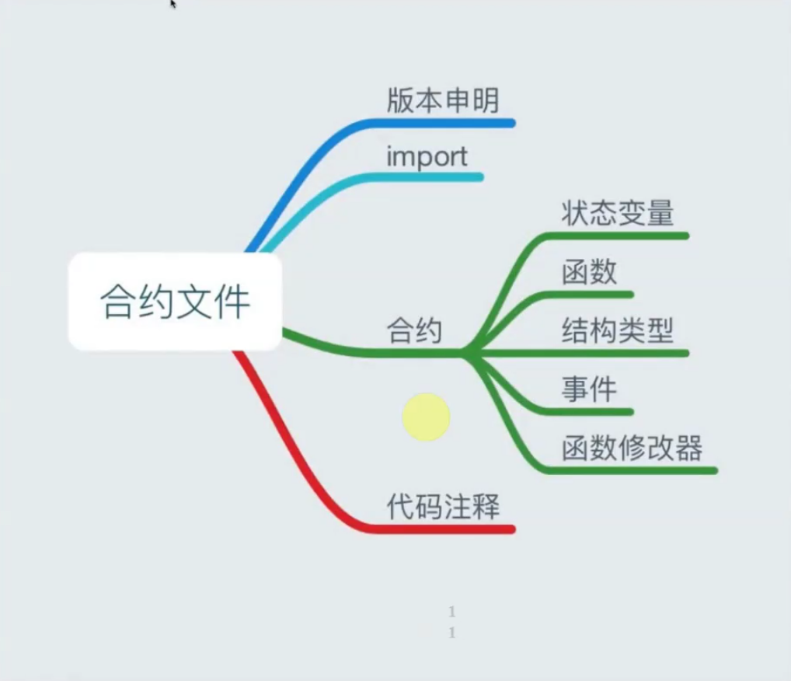
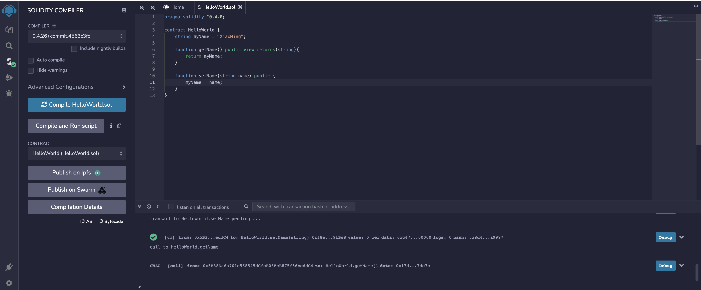
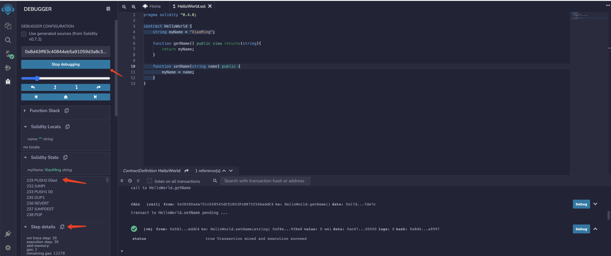

# 目录  
- [solidity合约文件结构](#solidity合约文件结构)
- [solidity 教程](#solidity-教程)
  - [基础知识介绍](#基础知识介绍)


- ### [github.com/ethereum/solidity](https://github.com/ethereum/solidity)  
- ### [github源码及youtube课程](https://github.com/willitscale/learning-solidity)  
- ### [solidity官方文档](https://solidity-cn.readthedocs.io/zh/develop/index.html)    
- ### [在线编辑器](https://remix.ethereum.org/)  

## solidity合约文件结构

<br>
<div align=center>
  </img>
</div>

## solidity 教程  
- ### [原培训视频地址](https://edu.51cto.com/course/14453.html)  
- ### [官方文档](https://remix-ide.readthedocs.io/en/latest/) 

<br>
<div align=center>
  </img>
</div>

<br>    

### 1 基础 
```javascript
pragma solidity ^0.4.0;

contract HelloWorld {
    string myName = "XiaoMing";

    function getName() public view returns(string){
        return myName;
    }

    function setName(string name) public {
        myName = name;
    }
}
```
<br>
<div align=center>
  </img>
</div>

<br>
<div align=center>
  </img>
</div>

<br>
<div align=center>
  </img>
</div>

[回到目录](#目录)   

### 2 继承  

```js
pragma solidity ^0.5.0;

interface Regulator {
    function checkValue(uint amount) external returns (bool);
    function loan() external returns (bool);
}

contract Bank is Regulator {
    uint private value;
    
    constructor(uint amount) public {
        value = amount;
    }
    
    function deposit(uint amount) public {
        value += amount;
    }
    
    function withdraw(uint amount) public {
        if (checkValue(amount)) {
            value -= amount;
        }
    }
    
    function balance() public view returns (uint) {
        return value;
    }
    
    function checkValue(uint amount) public returns (bool) {
        // Classic mistake in the tutorial value should be above the amount
        return value >= amount;
    }
    
    function loan() public returns (bool) {
        return value > 0;
    }
}

contract MyFirstContract is Bank(10) {
    string private name;
    uint private age;
    
    function setName(string memory newName) public {
        name = newName;
    }
    
    function getName() public view returns (string memory) {
        return name;
    }
    
    function setAge(uint newAge) public {
        age = newAge;
    }
    
    function getAge() public view returns (uint) {
        return age;
    }
}
```

### 3 自定义修饰符和错误处理  

```js
pragma solidity ^0.4.0;

interface Regulator {
    function checkValue(uint amount) external returns (bool);
    function loan() external returns (bool);
}

contract Bank is Regulator {
    uint private value;
    address private owner;
    
    modifier ownerFunc {
        require(owner == msg.sender);
        _;
    }

    constructor(uint amount) public {
        value = amount;
        owner = msg.sender;
    }
    
    function deposit(uint amount) public ownerFunc {
        value += amount;
    }
    
    function withdraw(uint amount) public ownerFunc {
        if (checkValue(amount)) {
            value -= amount;
        }
    }
    
    function balance() public view returns (uint) {
        return value;
    }
    
    function checkValue(uint amount) public returns (bool) {
        // Classic mistake in the tutorial value should be above the amount
        return value >= amount;
    }
    
    function loan() public returns (bool) {
        return value > 0;
    }
}

contract MyFirstContract is Bank(10) {
    string private name;
    uint private age;
    
    function setName(string newName) public {
        name = newName;
    }
    
    function getName() public view returns (string) {
        return name;
    }
    
    function setAge(uint newAge) public {
        age = newAge;
    }
    
    function getAge() public view returns (uint) {
        return age;
    }
}

contract TestThrows {
    function testAssert() public pure {
        assert(1 == 2);
    }
    
    function testRequire() public pure {
        require(2 == 1);
    }
    
    function testRevert() public pure {
        revert();
    }
    
    function testThrow() public pure {
        throw;
    }
}
```

### 4 导入和库  
依赖库`library.sol`:  
```js
pragma solidity ^0.4.0;

library IntExtended {
    
    function increment(uint _self) public pure returns (uint) {
        return _self+1;
    }
    
    function decrement(uint _self) public pure returns (uint) {
        return _self-1;
    }
    
    function incrementByValue(uint _self, uint _value) public pure returns (uint) {
        return _self + _value;
    }
    
    function decrementByValue(uint _self, uint _value) public pure returns (uint) {
        return _self - _value;
    }
}
```

```js
pragma solidity ^0.4.0;

import "browser/library.sol";

contract TestLibrary {
    using IntExtended for uint;
    
    function testIncrement(uint _base) public pure returns (uint) {
        return IntExtended.increment(_base);
    }
    
    function testDecrement(uint _base) public pure returns (uint) {
        return IntExtended.decrement(_base);
    }
    
    function testIncrementByValue(uint _base, uint _value) public pure returns (uint) {
        return _base.incrementByValue(_value);
    }
    
    function testDecrementByValue(uint _base, uint _value) public pure returns (uint) {
        return _base.decrementByValue(_value);
    }
}
```

### 5 事件记录和交易信息  

```js
pragma solidity ^0.4.0;

contract Transaction {
    
    event SenderLogger(address);
    event ValueLogger(uint);
    
    address private owner;
    
    modifier isOwner {
        require(owner == msg.sender);
        _;
    }
    
    modifier validValue {
        assert(msg.value >= 1 ether);
        _;
    }
    
    constructor() public {
        owner = msg.sender;
    }
    
    function () public payable isOwner validValue {
        emit SenderLogger(msg.sender);
        emit ValueLogger(msg.value);
    }
}
```

### 6 数据类型（数组、映射、结构）
- 值类型 
  - 布尔类型 `true` 和 `false` 
  - 整型 `int` / `uint` ,uint8 ~ uint256(unit), int8 ~ int256(int)  
  - 定长浮点型 `fixed` / `ufixed`  
  - 地址类型 地址类型存储一个 20 字节的值（以太坊地址的大小)  `balance`(余额) 和 `transfer`(向一个地址发送以太币(wei))
  - 定长字节数组 `byte`(bytes1), 变长字节数组 `bytes` 和 `string`  
  - 枚举类型 enum ActionChoices { GoLeft, GoRight, GoStraight, SitStill } 
  - 函数类型 `function (<parameter types>) {internal|external} [pure|constant|view|payable] [returns (<return types>)]`  
- 引用类型 
  - 数据位置 `storage` `memory`
  - 数组 `uint[] memory a = new uint[](7);` 成员包含`length` 和 `push`
  - 结构体 Solidity 支持通过构造结构体的形式定义新的类型 `struct`  
- 映射 
  - mapping(_KeyType => _ValueType)  `mapping(address => uint) public balances;`

```js
pragma solidity ^0.4.0;

contract DataTypes {
    
    bool myBool = false;
    
    int8 myInt = -128;
    uint8 myUInt = 255;
    
    string myString;
    uint8[] myStringArr;

    byte myValue;
    bytes1 myBytes1; 
    bytes32 myBytes32;
    
//    fixed256x8 myFixed = 1; // 255.0
//    ufixed myFixed = 1;

    enum Action {ADD, REMOVE, UPDATE}
    
    Action myAction = Action.ADD;
    
    address myAddress;
    
    function assignAddress() public {
        myAddress = msg.sender;
        myAddress.balance;
        myAddress.transfer(10);
    }
    
    uint[] myIntArr = [1,2,3];
    
    function arrFunc() public {
        myIntArr.push(1);
        myIntArr.length;
        myIntArr[0];
    }
    
    uint[10] myFixedArr;
    
    struct Account {
        uint balance;
        uint dailyLimit;
    }
    
    Account myAccount;
    
    function structFunc() public {
        myAccount.balance = 100;
    }
    
    mapping (address => Account) _accounts;
    
    function () public payable {
        _accounts[msg.sender].balance += msg.value;
    }
    
    function getBalance() public view returns (uint) {
        return _accounts[msg.sender].balance;
    }
}
```


### 7 扩展字符串功能和字节  

`TestStrings.sol`  
```js
pragma solidity ^0.4.0;

import "browser/Strings.sol";

contract TestStrings {
    
    using Strings for string;
    
    function testConcat(string _base) public pure returns (string) {
        return _base.concat("_suffix");
    }
    
    function needleInHaystack(string _base) public pure returns (int) {
        return _base.strpos("t");
    }
}
```

`Strings.sol`  
```js
pragma solidity ^0.4.0;

library Strings {
    
    function concat(string _base, string _value) pure internal returns (string) {
        bytes memory _baseBytes = bytes(_base);
        bytes memory _valueBytes = bytes(_value);
        
        string memory _tmpValue = new string(_baseBytes.length + _valueBytes.length);
        bytes memory _newValue = bytes(_tmpValue);
        
        uint i;
        uint j;
        
        for(i=0;i<_baseBytes.length;i++) {
            _newValue[j++] = _baseBytes[i];
        }
        
        for(i=0;i<_valueBytes.length;i++) {
            _newValue[j++] = _valueBytes[i];
        }
        
        return string(_newValue);
    }
    
    function strpos(string _base, string _value) pure internal returns (int) {
        bytes memory _baseBytes = bytes(_base);
        bytes memory _valueBytes = bytes(_value);

        assert(_valueBytes.length == 1);        
        
        for(uint i=0;i<_baseBytes.length;i++) {
            if (_baseBytes[i] == _valueBytes[0]) {
                return int(i);
            }
        }
        
        return -1;
    }
}
```


### 8 使用 Remix 调试 Solidity
### 9 ERC20 代币和创建自己的加密货币
### 10 ERC223 代币和创建自己的加密货币
### 11 部署代币并创建自己的加密货币
### 12 功能组装
### 13 教学汇编
### 14 在合约之间转移以太坊
### 15 公开与外部
### 16 基于时间的事件
### 17 多态性
### 18 随机性和赌博
### 19 嵌套数组和存储
### 20 参数映射和多个返回值
### 21 Truffle、Atom 和 TestRPC
### 22 使用 TDD 开发 ICO/Crowdsale
### 23 State Modifiers (view, pure, constant)
### 24 Multisig Wallet
### 25 多重签名钱包（续）多重身份验证
### 26 审计、安全和测试（很长，但很重要）
### 27 开始使用 Metamask 进行浏览器开发
### 28 由 Angular 提供支持的区块链地址簿
### 29 什么是 WEI，Ether 是如何定义的？
### 30 GAS解释
### 31 使用 Java 和 web3j 与 RPC 交互
### 32 使用 web3j 使用 Java 传输以太
### 33 使用 Java 和 web3j 部署和使用合约


