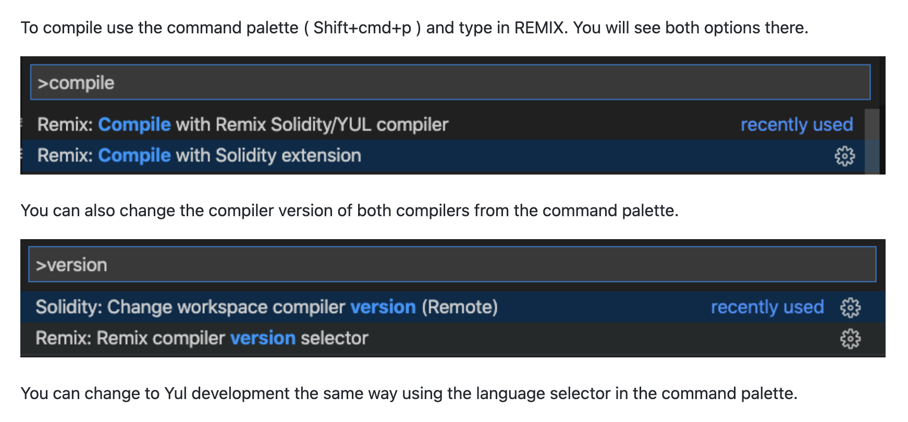
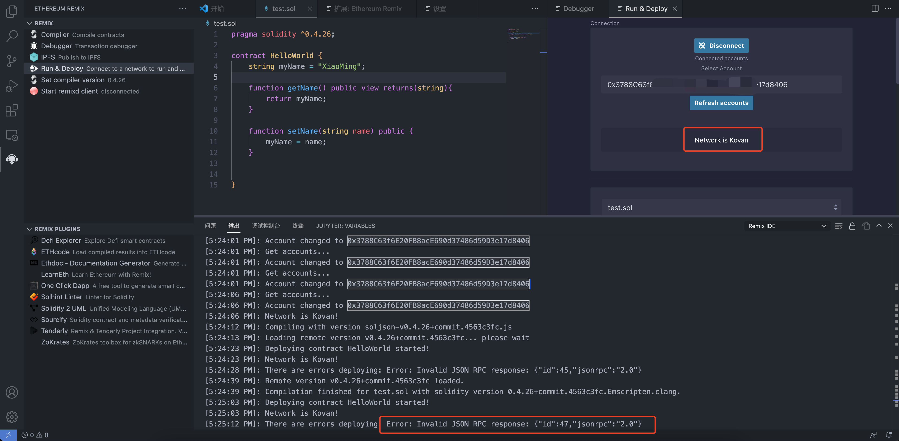
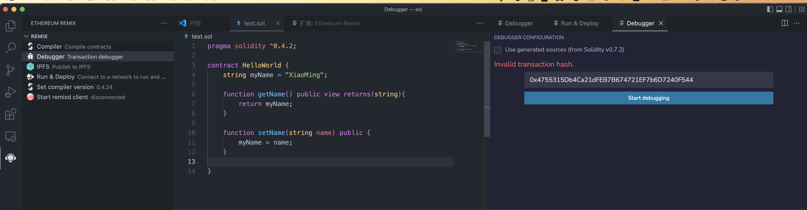
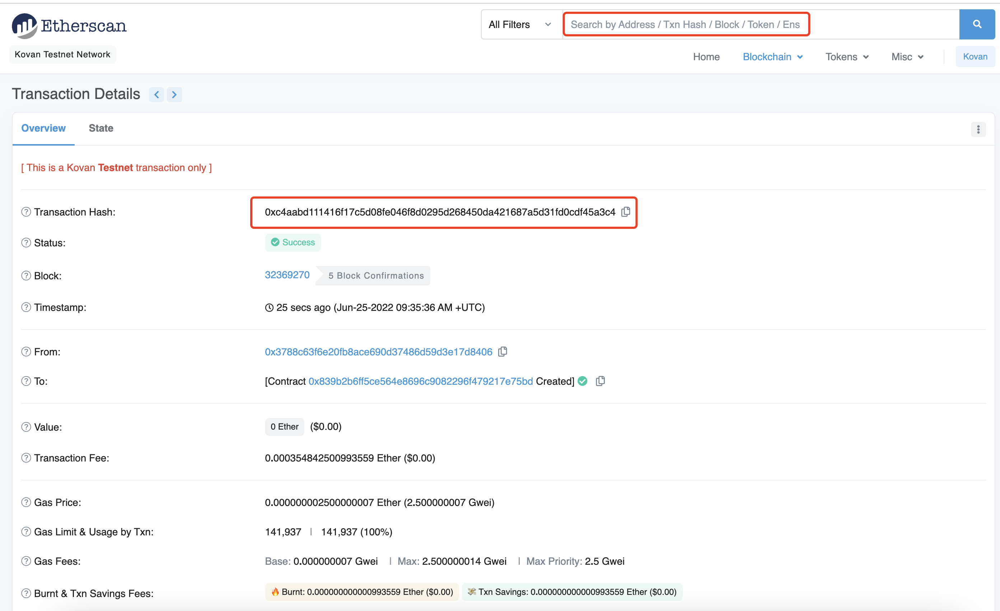
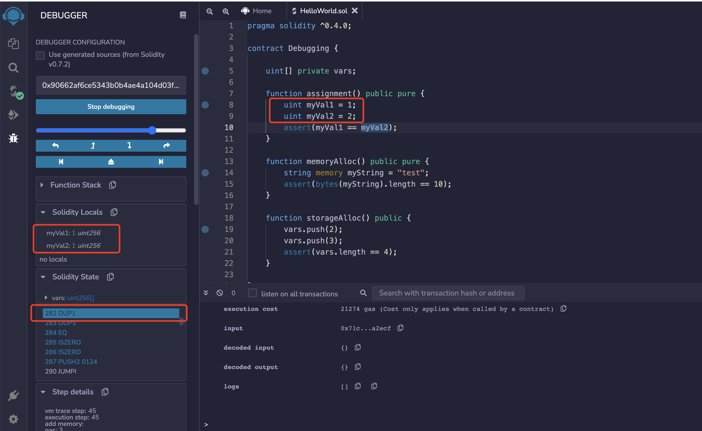
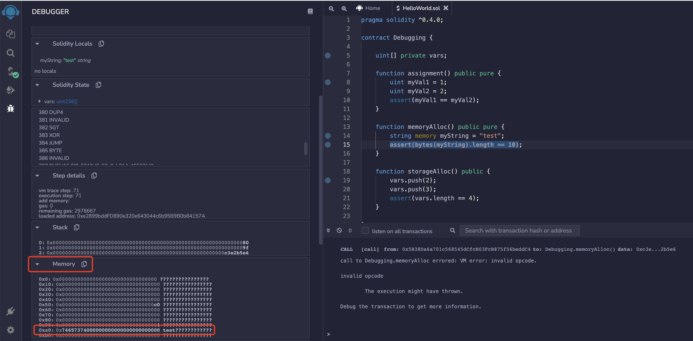
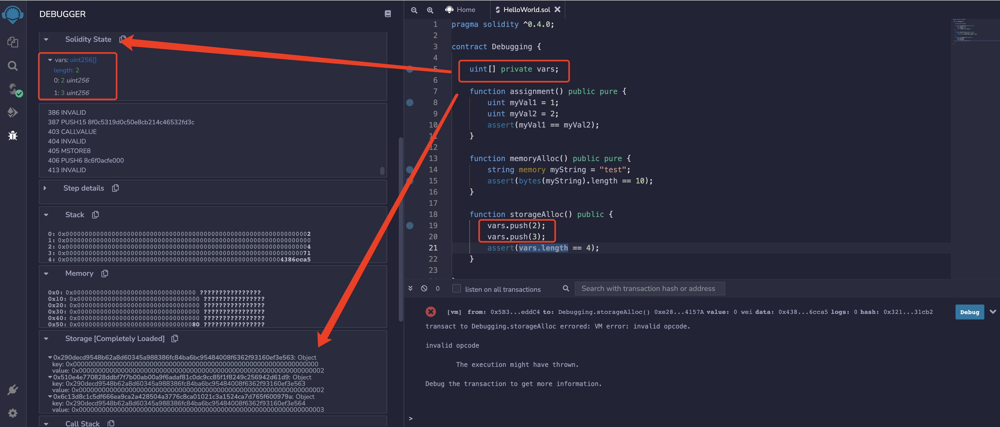
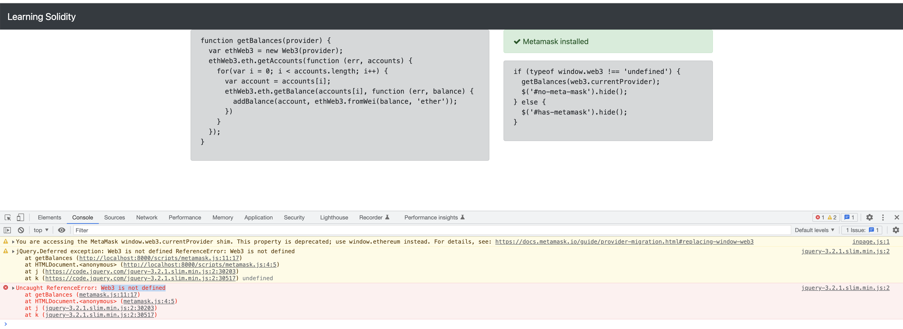
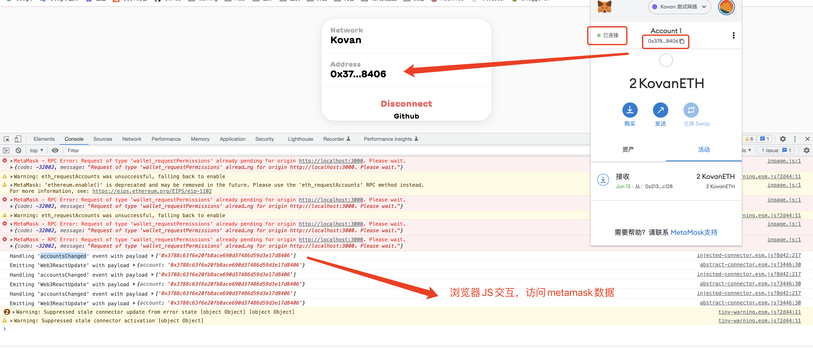

# 目录
- [solidity合约文件结构](#solidity合约文件结构)
- [solidity 教程](#solidity-教程)
  - [1 基础](#1-基础)
  - [2 继承](#2-继承)
  - [3 自定义修饰符和错误处理](#3-自定义修饰符和错误处理)
  - [4 导入和库](#4-导入和库)
  - [5 事件记录和交易信息](#5-事件记录和交易信息)
  - [6 数据类型（数组、映射、结构）](#6-数据类型数组映射结构)
  - [7 扩展字符串功能和字节](#7-扩展字符串功能和字节)
  - [8 使用 Remix 调试 Solidity](#8-使用-remix-调试-solidity)
  - [9 ERC20 代币和创建自己的加密货币](#9-erc20-代币和创建自己的加密货币)
  - [10 ERC223 代币和创建自己的加密货币](#10-erc223-代币和创建自己的加密货币)
  - [11 部署代币并创建自己的加密货币](#11-部署代币并创建自己的加密货币)
  - [12 功能组装](#12-功能组装)
  - [13 汇编教学](#13-汇编教学)
  - [14 在合约之间转移以太坊](#14-在合约之间转移以太坊)
  - [15 公开与外部](#15-公开与外部)
  - [16 基于时间的事件](#16-基于时间的事件)
  - [17 多态性](#17-多态性)
  - [18 随机性和赌博](#18-随机性和赌博)
  - [19 嵌套数组和存储](#19-嵌套数组和存储)
  - [20 参数映射和多个返回值](#20-参数映射和多个返回值)
  - [21 Truffle、Atom 和 TestRPC](#21-truffleatom-和-testrpc)
  - [22 使用 TDD 开发 ICO/Crowdsale](#22-使用-tdd-开发-icocrowdsale)
  - [23 State Modifiers (view, pure, constant)](#23-state-modifiers-view-pure-constant)
  - [24 Multisig Wallet](#24-multisig-wallet)
  - [25 多重签名钱包（续）多重身份验证](#25-多重签名钱包续多重身份验证)
  - [26 审计、安全和测试（很长，但很重要）](#26-审计安全和测试很长但很重要)
  - [27 开始使用 Metamask 进行浏览器开发](#27-开始使用-metamask-进行浏览器开发)
  - [28 由 Angular 提供支持的区块链地址簿](#28-由-angular-提供支持的区块链地址簿)
  - [29 什么是 WEI，Ether 是如何定义的？](#29-什么是-weiether-是如何定义的)
  - [30 GAS解释](#30-gas解释)
  - [31 使用 Java 和 web3j 与 RPC 交互](#31-使用-java-和-web3j-与-rpc-交互)
  - [32 使用 web3j 使用 Java 传输以太](#32-使用-web3j-使用-java-传输以太)
  - [33 使用 Java 和 web3j 部署和使用合约](#33-使用-java-和-web3j-部署和使用合约)


- ### [github.com/ethereum/solidity](https://github.com/ethereum/solidity)  
- ### [github源码及youtube课程](https://github.com/willitscale/learning-solidity)  
- ### [solidity官方文档](https://solidity-cn.readthedocs.io/zh/develop/index.html)    
- ### [在线编辑器](https://remix.ethereum.org/)  

## solidity合约文件结构

<br>
<div align=center>
  </img>
</div>

## solidity 教程  
- ### [原培训视频地址](https://edu.51cto.com/course/14453.html)  
- ### [官方文档](https://remix-ide.readthedocs.io/en/latest/) 

<br>
<div align=center>
  </img>
</div>

<br>    

### 0 vscode+remix+metamask
[vscode-remix](https://github.com/ethereum/remix-vscode)  
- #### 编译  
在vscode中安装remix插件后，点击编译，使用最新版本编译，需要更改为指定版本:
```js
[4:43:35 PM]: Compiling with version latest
[4:43:36 PM]: Compiling with local or cached version: 0.8.6+commit.11564f7e.Emscripten.clang... step:1
```

<br>
<div align=center>
  </img>
</div>

```shell
[4:53:23 PM]: Compiling with version soljson-v0.4.0+commit.acd334c9.js
[4:53:25 PM]: Loading remote version v0.4.0+commit.acd334c9... please wait
[4:53:33 PM]: Remote version v0.4.0+commit.acd334c9 loaded.
[4:53:33 PM]: test.sol:6:31: Error: Expected token LBrace got 'View'
    function getName() public view returns(string){
                              ^

[4:53:33 PM]: Compilation finished for test.sol with solidity version 0.4.0+commit.acd334c9-mod.Emscripten.clang.
```

版本号从`pragma solidity ^0.4.0;`修改为:`pragma solidity ^0.4.26;`就可以了。


- #### 运行部署  

点击运行部署，通过手机切换到测试网络，先后扫描二维码登录，登录后点击部署，出现错误: 

<br>
<div align=center>
  </img>
</div>

但是网页版的Remix是可以的，Deploy后需要MetaMask授权，这里没有。  
` There are errors deploying: Error: Invalid JSON RPC response: {"id":47,"jsonrpc":"2.0"}`  

使用本地环境试试:  
```
npm install -g solc
solcjs -V


npm install -g ganache-cli
```

直接连接本地环境: `http://127.0.0.1:8545`  
```
▶ ganache-cli
Ganache CLI v6.12.2 (ganache-core: 2.13.2)

Available Accounts
==================
(0) 0xf932f501dd0018Ae5365Df134370E260284C5F7A (100 ETH)
(1) 0x3b5ae286903Da6CCE52e70aD8B8Fd5Db85abb6F4 (100 ETH)
(2) 0x1b948695fe1EA13306B811ffF8CB8B587911b0F4 (100 ETH)
(3) 0x6F131AF9510b21631bb4f428ad315C8B264d6895 (100 ETH)
(4) 0x284f5a442e341f3a549bc30Ff196c5ce3eCDD18e (100 ETH)
(5) 0x99B318a0DCF74D37B16092888A40db26A91CA346 (100 ETH)
(6) 0xcF45e08595c134cAC8A05D36D4100498b8B5d6dA (100 ETH)
(7) 0x0783096FaE716eBEc35F92676AF685D9412A3817 (100 ETH)
(8) 0x6CA4C7e0b385941AD327d5E7080B7550B0B9ad7C (100 ETH)
(9) 0x70CC7c7F491A84A2891704C5f3296eD118821c04 (100 ETH)

Private Keys
==================
(0) 0x26b278c9eb5349a2c55d0e34c5422378aa0997cb89e5d67b2384dd61c03a7b57
(1) 0x2bce7dde4a162ad8167265ba44c67c8d1cb5df49a86f4b6a27b4291890c4d28f
(2) 0xd05eefb8ba95a737e8512397d0b6ed76a8a66136a19fea5dbf9bc6fc583dddc2
(3) 0xed8c4640aaf06c52317a05d11b57b93e491bb5d613aa234b11cd8d21d1ccee6d
(4) 0x52a81cd1e51da3e0aa9ace1dcddf93ca114e12e8a14f210ebe0ec31a6ef4034e
(5) 0x14690966a6c3c233ca25902ffc0aee26fe2b2c8b9a9b84958a83356527e1818a
(6) 0x665d424714b40923ef34b8f87e54ccf5df28515e36b42973a37f386df1f94d18
(7) 0x50b6a0afeda6397ef0639471d6716d62ed9a68ae5795a1388acc4c11402e7398
(8) 0xb63b9a7b3add4ff5d8ba884095b468a165048c6e0b6d1369f6eedbd86f4f0dec
(9) 0x593aaeac149ac089d8b0d4543012a800181883ee02cd6cb361d22f5094c56c96

HD Wallet
==================
Mnemonic:      become peasant return entire absent slush oven soap mansion two favorite museum
Base HD Path:  m/44'/60'/0'/0/{account_index}

Gas Price
==================
20000000000

Gas Limit
==================
6721975

Call Gas Limit
==================
9007199254740991

Listening on 127.0.0.1:8545
```

- #### Debug 
  
<div align=center>
  </img>
</div>  

- #### 部署后状态  
可以通过[etherscan](https://kovan.etherscan.io/)查看    
<br>
<div align=center>
  </img>
</div>


<br>
这次部署测试的信息:  
<div align=center>
  </img>
</div>


### 1 基础 
```javascript
pragma solidity ^0.4.0;

contract HelloWorld {
    string myName = "XiaoMing";

    function getName() public view returns(string){
        return myName;
    }

    function setName(string name) public {
        myName = name;
    }
}
```
<br>
<div align=center>
  </img>
</div>

<br>
<div align=center>
  </img>
</div>

<br>
<div align=center>
  </img>
</div>

[回到目录](#目录)   

### 2 继承  

```js
pragma solidity ^0.5.0;

interface Regulator {
    function checkValue(uint amount) external returns (bool);
    function loan() external returns (bool);
}

contract Bank is Regulator {
    uint private value;
    
    constructor(uint amount) public {
        value = amount;
    }
    
    function deposit(uint amount) public {
        value += amount;
    }
    
    function withdraw(uint amount) public {
        if (checkValue(amount)) {
            value -= amount;
        }
    }
    
    function balance() public view returns (uint) {
        return value;
    }
    
    function checkValue(uint amount) public returns (bool) {
        // Classic mistake in the tutorial value should be above the amount
        return value >= amount;
    }
    
    function loan() public returns (bool) {
        return value > 0;
    }
}

contract MyFirstContract is Bank(10) {
    string private name;
    uint private age;
    
    function setName(string memory newName) public {
        name = newName;
    }
    
    function getName() public view returns (string memory) {
        return name;
    }
    
    function setAge(uint newAge) public {
        age = newAge;
    }
    
    function getAge() public view returns (uint) {
        return age;
    }
}
```
[回到目录](#目录)  
### 3 自定义修饰符和错误处理  

```js
pragma solidity ^0.4.0;

interface Regulator {
    function checkValue(uint amount) external returns (bool);
    function loan() external returns (bool);
}

contract Bank is Regulator {
    uint private value;
    address private owner;
    
    modifier ownerFunc {
        require(owner == msg.sender);
        _;
    }

    constructor(uint amount) public {
        value = amount;
        owner = msg.sender;
    }
    
    function deposit(uint amount) public ownerFunc {
        value += amount;
    }
    
    function withdraw(uint amount) public ownerFunc {
        if (checkValue(amount)) {
            value -= amount;
        }
    }
    
    function balance() public view returns (uint) {
        return value;
    }
    
    function checkValue(uint amount) public returns (bool) {
        // Classic mistake in the tutorial value should be above the amount
        return value >= amount;
    }
    
    function loan() public returns (bool) {
        return value > 0;
    }
}

contract MyFirstContract is Bank(10) {
    string private name;
    uint private age;
    
    function setName(string newName) public {
        name = newName;
    }
    
    function getName() public view returns (string) {
        return name;
    }
    
    function setAge(uint newAge) public {
        age = newAge;
    }
    
    function getAge() public view returns (uint) {
        return age;
    }
}

contract TestThrows {
    function testAssert() public pure {
        assert(1 == 2);
    }
    
    function testRequire() public pure {
        require(2 == 1);
    }
    
    function testRevert() public pure {
        revert();
    }
    
    function testThrow() public pure {
        throw;
    }
}
```
[回到目录](#目录)  
### 4 导入和库  
依赖库`library.sol`:  
```js
pragma solidity ^0.4.0;

library IntExtended {
    
    function increment(uint _self) public pure returns (uint) {
        return _self+1;
    }
    
    function decrement(uint _self) public pure returns (uint) {
        return _self-1;
    }
    
    function incrementByValue(uint _self, uint _value) public pure returns (uint) {
        return _self + _value;
    }
    
    function decrementByValue(uint _self, uint _value) public pure returns (uint) {
        return _self - _value;
    }
}
```

```js
pragma solidity ^0.4.0;

import "browser/library.sol";

contract TestLibrary {
    using IntExtended for uint;
    
    function testIncrement(uint _base) public pure returns (uint) {
        return IntExtended.increment(_base);
    }
    
    function testDecrement(uint _base) public pure returns (uint) {
        return IntExtended.decrement(_base);
    }
    
    function testIncrementByValue(uint _base, uint _value) public pure returns (uint) {
        return _base.incrementByValue(_value);
    }
    
    function testDecrementByValue(uint _base, uint _value) public pure returns (uint) {
        return _base.decrementByValue(_value);
    }
}
```
[回到目录](#目录)  
### 5 事件记录和交易信息  

```js
pragma solidity ^0.4.0;

contract Transaction {
    
    event SenderLogger(address);
    event ValueLogger(uint);
    
    address private owner;
    
    modifier isOwner {
        require(owner == msg.sender);
        _;
    }
    
    modifier validValue {
        assert(msg.value >= 1 ether);
        _;
    }
    
    constructor() public {
        owner = msg.sender;
    }
    
    function () public payable isOwner validValue {
        emit SenderLogger(msg.sender);
        emit ValueLogger(msg.value);
    }
}
```
[回到目录](#目录)  
### 6 数据类型（数组、映射、结构）
- 值类型 
  - 布尔类型 `true` 和 `false` 
  - 整型 `int` / `uint` ,uint8 ~ uint256(unit), int8 ~ int256(int)  
  - 定长浮点型 `fixed` / `ufixed`  
  - 地址类型 地址类型存储一个 20 字节的值（以太坊地址的大小)  `balance`(余额) 和 `transfer`(向一个地址发送以太币(wei))
  - 定长字节数组 `byte`(bytes1), 变长字节数组 `bytes` 和 `string`  
  - 枚举类型 enum ActionChoices { GoLeft, GoRight, GoStraight, SitStill } 
  - 函数类型 `function (<parameter types>) {internal|external} [pure|constant|view|payable] [returns (<return types>)]`  
- 引用类型 
  - 数据位置 `storage` `memory`
  - 数组 `uint[] memory a = new uint[](7);` 成员包含`length` 和 `push`
  - 结构体 Solidity 支持通过构造结构体的形式定义新的类型 `struct`  
- 映射 
  - mapping(_KeyType => _ValueType)  `mapping(address => uint) public balances;`

```js
pragma solidity ^0.4.0;

contract DataTypes {
    
    bool myBool = false;
    
    int8 myInt = -128;
    uint8 myUInt = 255;
    
    string myString;
    uint8[] myStringArr;

    byte myValue;
    bytes1 myBytes1; 
    bytes32 myBytes32;
    
//    fixed256x8 myFixed = 1; // 255.0
//    ufixed myFixed = 1;

    enum Action {ADD, REMOVE, UPDATE}
    
    Action myAction = Action.ADD;
    
    address myAddress;
    
    function assignAddress() public {
        myAddress = msg.sender;
        myAddress.balance;
        myAddress.transfer(10);
    }
    
    uint[] myIntArr = [1,2,3];
    
    function arrFunc() public {
        myIntArr.push(1);
        myIntArr.length;
        myIntArr[0];
    }
    
    uint[10] myFixedArr;
    
    struct Account {
        uint balance;
        uint dailyLimit;
    }
    
    Account myAccount;
    
    function structFunc() public {
        myAccount.balance = 100;
    }
    
    mapping (address => Account) _accounts;
    
    function () public payable {
        _accounts[msg.sender].balance += msg.value;
    }
    
    function getBalance() public view returns (uint) {
        return _accounts[msg.sender].balance;
    }
}
```

[回到目录](#目录)  
### 7 扩展字符串功能和字节  

`TestStrings.sol`  
```js
pragma solidity ^0.4.0;

import "browser/Strings.sol";

contract TestStrings {
    
    using Strings for string;
    
    function testConcat(string _base) public pure returns (string) {
        return _base.concat("_suffix");
    }
    
    function needleInHaystack(string _base) public pure returns (int) {
        return _base.strpos("t");
    }
}
```

`Strings.sol`  
```js
pragma solidity ^0.4.0;

library Strings {
    
    function concat(string _base, string _value) pure internal returns (string) {
        bytes memory _baseBytes = bytes(_base);
        bytes memory _valueBytes = bytes(_value);
        
        string memory _tmpValue = new string(_baseBytes.length + _valueBytes.length);
        bytes memory _newValue = bytes(_tmpValue);
        
        uint i;
        uint j;
        
        for(i=0;i<_baseBytes.length;i++) {
            _newValue[j++] = _baseBytes[i];
        }
        
        for(i=0;i<_valueBytes.length;i++) {
            _newValue[j++] = _valueBytes[i];
        }
        
        return string(_newValue);
    }
    
    function strpos(string _base, string _value) pure internal returns (int) {
        bytes memory _baseBytes = bytes(_base);
        bytes memory _valueBytes = bytes(_value);

        assert(_valueBytes.length == 1);        
        
        for(uint i=0;i<_baseBytes.length;i++) {
            if (_baseBytes[i] == _valueBytes[0]) {
                return int(i);
            }
        }
        
        return -1;
    }
}
```

[回到目录](#目录)  
### 8 使用 Remix 调试 Solidity

```js
pragma solidity ^0.4.0;

contract Debugging {
    
    uint[] private vars;
    
    function assignment() public pure {
        uint myVal1 = 1;
        uint myVal2 = 2;
        assert(myVal1 == myVal2);
    }
    
    function memoryAlloc() public pure {
        string memory myString = "test";
        assert(bytes(myString).length == 10);
    }
    
    function storageAlloc() public {
        vars.push(2);
        vars.push(3);
        assert(vars.length == 4);
    }
    
}
```

调用`assignment`出现如下错误: 
```shell
call to Debugging.assignment
CALL
[call]from: 0x5B38Da6a701c568545dCfcB03FcB875f56beddC4to: Debugging.assignment()data: 0x71c...a2ecf
call to Debugging.assignment errored: VM error: invalid opcode.

invalid opcode
	
	The execution might have thrown.

Debug the transaction to get more information.
```  

`assert(myVal1 == myVal2);` 返回false，测试结果失败导致。  

<br>
值类型:
<div align=center>
  </img>
</div>


<br>
引用类型: 
<div align=center>
  </img>
</div>

<br>
数组: 
<div align=center>
  </img>
</div>

[回到目录](#目录)  
### 9 ERC20 代币和创建自己的加密货币

`ERC20.sol`
```js
pragma solidity ^0.4.0;

interface ERC20 {
    function totalSupply() external constant returns (uint _totalSupply);
    function balanceOf(address _owner) external constant returns (uint balance);
    function transfer(address _to, uint _value) external returns (bool success);
    function transferFrom(address _from, address _to, uint _value) external returns (bool success);
    function approve(address _spender, uint _value) external returns (bool success);
    function allowance(address _owner, address _spender) external constant returns (uint remaining);
    event Transfer(address indexed _from, address indexed _to, uint _value);
    event Approval(address indexed _owner, address indexed _spender, uint _value);
}
```

`MyToken.sol`  
```js
pragma solidity ^0.4.0;

import "browser/ERC20.sol";

contract MyFirstToken is ERC20 {
    string public constant symbol = "MFT";
    string public constant name = "My First Token";
    uint8 public constant decimals = 18;
    
    uint private constant __totalSupply = 1000;
    mapping (address => uint) private __balanceOf;
    mapping (address => mapping (address => uint)) private __allowances;
    
    constructor() public {
            __balanceOf[msg.sender] = __totalSupply;
    }
    
    function totalSupply() public constant returns (uint _totalSupply) {
        _totalSupply = __totalSupply;
    }
    
    function balanceOf(address _addr) public constant returns (uint balance) {
        return __balanceOf[_addr];
    }
    
    function transfer(address _to, uint _value) public returns (bool success) {
        if (_value > 0 && _value <= balanceOf(msg.sender)) {
            __balanceOf[msg.sender] -= _value;
            __balanceOf[_to] += _value;
            return true;
        }
        return false;
    }
    
    function transferFrom(address _from, address _to, uint _value) public returns (bool success) {
        if (__allowances[_from][msg.sender] > 0 &&
            _value > 0 &&
            __allowances[_from][msg.sender] >= _value && 
            __balanceOf[_from] >= _value) {
            __balanceOf[_from] -= _value;
            __balanceOf[_to] += _value;
            // Missed from the video
            __allowances[_from][msg.sender] -= _value;
            return true;
        }
        return false;
    }
    
    function approve(address _spender, uint _value) public returns (bool success) {
        __allowances[msg.sender][_spender] = _value;
        return true;
    }
    
    function allowance(address _owner, address _spender) public constant returns (uint remaining) {
        return __allowances[_owner][_spender];
    }
}
```


[回到目录](#目录)  
### 10 ERC223 代币和创建自己的加密货币

`ERC223ReceivingContract.sol`
```
pragma solidity ^0.4.0;

contract ERC223ReceivingContract {
    function tokenFallback(address _from, uint _value, bytes _data) public;
}
```


```js
pragma solidity ^0.4.0;

contract Token {
    string internal _symbol;
    string internal _name;
    uint8 internal _decimals;
    uint internal _totalSupply = 1000;
    mapping (address => uint) internal _balanceOf;
    mapping (address => mapping (address => uint)) internal _allowances;
    
    function Token(string symbol, string name, uint8 decimals, uint totalSupply) public {
        _symbol = symbol;
        _name = name;
        _decimals = decimals;
        _totalSupply = totalSupply;
    }
    
    function name() public constant returns (string) {
        return _name;
    }
    
    function symbol() public constant returns (string) {
        return _symbol;
    }
    
    function decimals() public constant returns (uint8) {
        return _decimals;
    }
    
    function totalSupply() public constant returns (uint) {
        return _totalSupply;
    }
    
    function balanceOf(address _addr) public constant returns (uint);
    function transfer(address _to, uint _value) public returns (bool);
    event Transfer(address indexed _from, address indexed _to, uint _value);
}
```

[回到目录](#目录)  
### 11 部署代币并创建自己的加密货币  

[回到目录](#目录)  
### 12 功能组装

```js
pragma solidity ^0.4.0;

contract Assembly {
    function nativeLoops() public returns (uint _r) {
        for(uint i = 0; i < 10; i++) {
            _r++;
        }
    }
    
    function asmLoops() public returns (uint _r) {
        assembly {
            let i := 0
            loop:
            i := add(i, 1)
            _r := add(_r, 1)
            jumpi(loop, lt(i, 10))
        }
    }

    function nativeConditional(uint _v) public returns (uint) {
        if (5 == _v) {
            return 55;
        } else if (6 == _v) {
            return 66;
        } 
        return 11;
    }
    
    function asmConditional(uint _v) public returns (uint _r) {
        assembly {
            switch _v
            case 5 {
                _r := 55
            }
            case 6 { 
                _r := 66
            }
            default {
                _r := 11
            }
        }
    }
    
    function asmReturns(uint _v) public returns (uint) {
        assembly {
            let _ptr := add(msize(), 1)
            mstore(_ptr, _v)
            return(_ptr, 0x20)
        }
    }
}
```

[回到目录](#目录)  
### 13 汇编教学

```js
pragma solidity ^0.4.0;

contract Assembly {
    function nativeLoops() public returns (uint _r) {
        for(uint i = 0; i < 10; i++) {
            _r++;
        }
    }
    
    function asmLoops() public returns (uint _r) {
        assembly {
            let i := 0
            loop:
            i := add(i, 1)
            _r := add(_r, 1)
            jumpi(loop, lt(i, 10))
        }
    }
    
    function inlineAsmLoops() public returns (uint _r) {
        assembly {
            0 // i
            10 // max
            
            loop:
            // i := add(i, 1)
            dup2 
            1
            add
            swap2
            pop
            
            // _r := add(_r, 1)
            dup3 
            1
            add
            swap3
            pop
            
            // lt(i, 10)
            dup1
            dup3
            lt
            
            // jumpi(loop, lt(i, 10))
            loop
            jumpi
            
            pop
            pop
        }
    }
}
```

[回到目录](#目录)  
### 14 在合约之间转移以太坊  

```js
pragma solidity ^0.5.0;

contract EtherTransferTo {
    function () external payable {
    }
    
    function getBalance() public returns (uint) {
        return address(this).balance;
    }
}

contract EtherTransferFrom {
    
    EtherTransferTo private _instance;
    
    constructor() public {
        // _instance = EtherTransferTo(address(this));
        _instance = new EtherTransferTo();
    }
    
    function getBalance() public returns (uint) {
        return address(this).balance;
    }
    
    function getBalanceOfInstance() public returns (uint) {
        //return address(_instance).balance;
        return _instance.getBalance();
    }
    
    function () external payable {
        //msg.sender.send(msg.value);
        address(_instance).send(msg.value);
    }
}
```

[回到目录](#目录)  
### 15 公开与外部
[回到目录](#目录)  
### 16 基于时间的事件
[回到目录](#目录)  
### 17 多态性
[回到目录](#目录)  
### 18 随机性和赌博
[回到目录](#目录)  
### 19 嵌套数组和存储
[回到目录](#目录)  
### 20 参数映射和多个返回值
[回到目录](#目录)  
### 21 Truffle、Atom 和 TestRPC
[回到目录](#目录)  
### 22 使用 TDD 开发 ICO/Crowdsale
ICO国内视频源码:  
```js

```


[回到目录](#目录)  
### 23 State Modifiers (view, pure, constant)
[回到目录](#目录)  
### 24 Multisig Wallet
[回到目录](#目录)  
### 25 多重签名钱包（续）多重身份验证
[回到目录](#目录)  
### 26 审计、安全和测试（很长，但很重要）

`Migrations.sol`
```js
pragma solidity ^0.4.17;

contract Migrations {
  address public owner;
  uint public last_completed_migration;

  modifier restricted() {
    if (msg.sender == owner) _;
  }

  function Migrations() public {
    owner = msg.sender;
  }

  function setCompleted(uint completed) public restricted {
    last_completed_migration = completed;
  }

  function upgrade(address new_address) public restricted {
    Migrations upgraded = Migrations(new_address);
    upgraded.setCompleted(last_completed_migration);
  }
}
```

`MultiSigWallet.sol`  
```js
pragma solidity ^0.4.0;

contract MultiSigWallet {

    address private _owner;
    mapping(address => uint8) private _owners;

    uint _transactionIdx;
    uint[] private _pendingTransactions;

    struct Transaction {
      address from;
      address to;
      uint amount;
      uint8 signatureCount;
      mapping (address => uint8) signatures;
    }

    mapping(uint => Transaction) _transactions;
    uint8 constant private _sigRequiredCount = 2;

    modifier validOwner() {
        require(msg.sender == _owner || _owners[msg.sender] == 1);
        //require(_owners[msg.sender] == 1);
        _;
    }

    event DepositFunds(address from, uint amount);
    event TransactionCreated(address from, address to, uint amount, uint transactionId);
    event TransactionCompleted(address from, address to, uint amount, uint transactionId);
    event TransactionSigned(address by, uint transactionId);

    function MultiSigWallet()
        public {
        // Set master contract owner
        _owner = msg.sender;
        //_owners[msg.sender] = 1;
    }

    function addOwner(address owner)
        // isOwner
        validOwner
        public {
        _owners[owner] = 1;
    }

    function removeOwner(address owner)
        // isOwner
        // The owner validation was missing
        validOwner
        public {
        _owners[owner] = 0;
    }

    function ()
        public
        payable {
        DepositFunds(msg.sender, msg.value);
    }

    function send()
      public
      payable{}

    function withdraw(uint amount)
        validOwner
        public {
        transferTo(msg.sender, amount);
    }

    function transferTo(address to, uint amount)
        validOwner
        public {
        require(address(this).balance >= amount);
        uint transactionId = _transactionIdx++;
        Transaction memory transaction;
        transaction.from = msg.sender;
        transaction.to = to;
        transaction.amount = amount;
        transaction.signatureCount = 0;
        _transactions[transactionId] = transaction;
        _pendingTransactions.push(transactionId);
        TransactionCreated(msg.sender, to, amount, transactionId);
    }

    function getActiveTransactions()
      validOwner
      view
      public
      returns (uint[]) {
      return _pendingTransactions;
    }

    function signTransaction(uint transactionId)
      validOwner
      public {

      Transaction storage transaction = _transactions[transactionId];

      // Transaction must exist
      require(0x0 != transaction.from);
      //Creator cannot sign this
      require(msg.sender != transaction.from);
      // Has not already signed this transaction
      require(transaction.signatures[msg.sender] == 0);

      transaction.signatures[msg.sender] = 1;
      transaction.signatureCount++;

      TransactionSigned(msg.sender, transactionId);

      if (transaction.signatureCount >= _sigRequiredCount) {
        require(address(this).balance >= transaction.amount);
        transaction.to.transfer(transaction.amount);
        TransactionCompleted(msg.sender, transaction.to, transaction.amount, transactionId);
        deleteTransaction(transactionId);
      }
    }

    function deleteTransaction(uint transactionId)
      validOwner
      public {
      uint8 replace = 0;
      require(_pendingTransactions.length > 0);
      for(uint i = 0; i < _pendingTransactions.length; i++) {
          if (1 == replace) {
              _pendingTransactions[i-1] = _pendingTransactions[i];
          } else if (_pendingTransactions[i] == transactionId) {
              replace = 1;
          }
      }
      assert(replace == 1);
      // Created an Overflow
      delete _pendingTransactions[_pendingTransactions.length - 1];
      _pendingTransactions.length--;
      delete _transactions[transactionId];
    }

    function getPendingTransactionLength()
      public
      view
      returns (uint) {
      return _pendingTransactions.length;
    }

    function walletBalance()
        constant
        public returns (uint) {
        return address(this).balance;
    }
}
```

[回到目录](#目录)  
### 27 开始使用 Metamask 进行浏览器开发
[源码](https://github.com/willitscale/learning-solidity/tree/master/tutorial-27)  
<br>
之前做法:  
<div align=center>
  </img>
</div>


新做法:
[源码](https://github.com/ymm135/web3-starter)  


<br>
<div align=center>
  </img>
</div>

[vscode+Remixd+metamask](https://medium.com/remix-ide/remix-in-vscode-compiling-debugging-metamask-remixd-42c4a61817e2)  

[回到目录](#目录)  
### 28 由 Angular 提供支持的区块链地址簿
[回到目录](#目录)  
### 29 什么是 WEI，Ether 是如何定义的？
[回到目录](#目录)  
### 30 GAS解释
[回到目录](#目录)  
### 31 使用 Java 和 web3j 与 RPC 交互  

```java
package youtube.solidity.learning.contracts;

import java.math.BigInteger;
import java.util.Arrays;
import java.util.Collections;
import java.util.List;
import java.util.concurrent.Callable;
import org.web3j.abi.TypeReference;
import org.web3j.abi.datatypes.Address;
import org.web3j.abi.datatypes.DynamicArray;
import org.web3j.abi.datatypes.Function;
import org.web3j.abi.datatypes.Type;
import org.web3j.abi.datatypes.Utf8String;
import org.web3j.crypto.Credentials;
import org.web3j.protocol.Web3j;
import org.web3j.protocol.core.RemoteCall;
import org.web3j.protocol.core.methods.response.TransactionReceipt;
import org.web3j.tx.Contract;
import org.web3j.tx.TransactionManager;

/**
 * <p>Auto generated code.
 * <p><strong>Do not modify!</strong>
 * <p>Please use the <a href="https://docs.web3j.io/command_line.html">web3j command line tools</a>,
 * or the org.web3j.codegen.SolidityFunctionWrapperGenerator in the 
 * <a href="https://github.com/web3j/web3j/tree/master/codegen">codegen module</a> to update.
 *
 * <p>Generated with web3j version 3.5.0.
 */
public class AddressBook extends Contract {
    private static final String BINARY = "608060405234801561001057600080fd5b50610639806100206000396000f3006080604052600436106100615763ffffffff7c01000000000000000000000000000000000000000000000000000000006000350416634ba79dfe811461006657806399900d1114610089578063a39fac121461011f578063d033c45614610184575b600080fd5b34801561007257600080fd5b50610087600160a060020a03600435166101eb565b005b34801561009557600080fd5b506100aa600160a060020a0360043516610386565b6040805160208082528351818301528351919283929083019185019080838360005b838110156100e45781810151838201526020016100cc565b50505050905090810190601f1680156101115780820380516001836020036101000a031916815260200191505b509250505060405180910390f35b34801561012b57600080fd5b50610134610438565b60408051602080825283518183015283519192839290830191858101910280838360005b83811015610170578181015183820152602001610158565b505050509050019250505060405180910390f35b34801561019057600080fd5b5060408051602060046024803582810135601f8101859004850286018501909652858552610087958335600160a060020a03169536956044949193909101919081908401838280828437509497506104a29650505050505050565b33600090815260208190526040812054905b818110156103815733600090815260208190526040902080548290811061022057fe5b600091825260209091200154600160a060020a03848116911614156103795733600090815260208190526040902054600110801561026057506001820381105b156102e5573360009081526020819052604090208054600019840190811061028457fe5b60009182526020808320909101543383529082905260409091208054600160a060020a0390921691839081106102b657fe5b9060005260206000200160006101000a815481600160a060020a030219169083600160a060020a031602179055505b3360009081526020819052604090208054600019840190811061030457fe5b60009182526020808320909101805473ffffffffffffffffffffffffffffffffffffffff191690553382528190526040902080549061034790600019830161050a565b50336000908152600160209081526040808320600160a060020a038716845290915281206103749161052e565b610381565b6001016101fd565b505050565b336000908152600160208181526040808420600160a060020a038616855282529283902080548451600294821615610100026000190190911693909304601f8101839004830284018301909452838352606093909183018282801561042c5780601f106104015761010080835404028352916020019161042c565b820191906000526020600020905b81548152906001019060200180831161040f57829003601f168201915b50505050509050919050565b336000908152602081815260409182902080548351818402810184019094528084526060939283018282801561049757602002820191906000526020600020905b8154600160a060020a03168152600190910190602001808311610479575b505050505090505b90565b3360008181526020818152604080832080546001808201835591855283852001805473ffffffffffffffffffffffffffffffffffffffff1916600160a060020a0389169081179091559484528252808320938352928152919020825161038192840190610575565b815481835581811115610381576000838152602090206103819181019083016105f3565b50805460018160011615610100020316600290046000825580601f106105545750610572565b601f01602090049060005260206000209081019061057291906105f3565b50565b828054600181600116156101000203166002900490600052602060002090601f016020900481019282601f106105b657805160ff19168380011785556105e3565b828001600101855582156105e3579182015b828111156105e35782518255916020019190600101906105c8565b506105ef9291506105f3565b5090565b61049f91905b808211156105ef57600081556001016105f95600a165627a7a7230582002b4cd1de8dbad4668d406cbb6ac585b72bbd2cfc54d016da10df49ff42ea9e90029";

    public static final String FUNC_REMOVEADDRESS = "removeAddress";

    public static final String FUNC_GETALIAS = "getAlias";

    public static final String FUNC_GETADDRESSES = "getAddresses";

    public static final String FUNC_ADDADDRESS = "addAddress";

    protected AddressBook(String contractAddress, Web3j web3j, Credentials credentials, BigInteger gasPrice, BigInteger gasLimit) {
        super(BINARY, contractAddress, web3j, credentials, gasPrice, gasLimit);
    }

    protected AddressBook(String contractAddress, Web3j web3j, TransactionManager transactionManager, BigInteger gasPrice, BigInteger gasLimit) {
        super(BINARY, contractAddress, web3j, transactionManager, gasPrice, gasLimit);
    }

    public RemoteCall<TransactionReceipt> removeAddress(String addr) {
        final Function function = new Function(
                FUNC_REMOVEADDRESS, 
                Arrays.<Type>asList(new org.web3j.abi.datatypes.Address(addr)), 
                Collections.<TypeReference<?>>emptyList());
        return executeRemoteCallTransaction(function);
    }

    public RemoteCall<String> getAlias(String addr) {
        final Function function = new Function(FUNC_GETALIAS, 
                Arrays.<Type>asList(new org.web3j.abi.datatypes.Address(addr)), 
                Arrays.<TypeReference<?>>asList(new TypeReference<Utf8String>() {}));
        return executeRemoteCallSingleValueReturn(function, String.class);
    }

    public RemoteCall<List> getAddresses() {
        final Function function = new Function(FUNC_GETADDRESSES, 
                Arrays.<Type>asList(), 
                Arrays.<TypeReference<?>>asList(new TypeReference<DynamicArray<Address>>() {}));
        return new RemoteCall<List>(
                new Callable<List>() {
                    @Override
                    @SuppressWarnings("unchecked")
                    public List call() throws Exception {
                        List<Type> result = (List<Type>) executeCallSingleValueReturn(function, List.class);
                        return convertToNative(result);
                    }
                });
    }

    public RemoteCall<TransactionReceipt> addAddress(String addr, String alias) {
        final Function function = new Function(
                FUNC_ADDADDRESS, 
                Arrays.<Type>asList(new org.web3j.abi.datatypes.Address(addr), 
                new org.web3j.abi.datatypes.Utf8String(alias)), 
                Collections.<TypeReference<?>>emptyList());
        return executeRemoteCallTransaction(function);
    }

    public static RemoteCall<AddressBook> deploy(Web3j web3j, Credentials credentials, BigInteger gasPrice, BigInteger gasLimit) {
        return deployRemoteCall(AddressBook.class, web3j, credentials, gasPrice, gasLimit, BINARY, "");
    }

    public static RemoteCall<AddressBook> deploy(Web3j web3j, TransactionManager transactionManager, BigInteger gasPrice, BigInteger gasLimit) {
        return deployRemoteCall(AddressBook.class, web3j, transactionManager, gasPrice, gasLimit, BINARY, "");
    }

    public static AddressBook load(String contractAddress, Web3j web3j, Credentials credentials, BigInteger gasPrice, BigInteger gasLimit) {
        return new AddressBook(contractAddress, web3j, credentials, gasPrice, gasLimit);
    }

    public static AddressBook load(String contractAddress, Web3j web3j, TransactionManager transactionManager, BigInteger gasPrice, BigInteger gasLimit) {
        return new AddressBook(contractAddress, web3j, transactionManager, gasPrice, gasLimit);
    }
}
```

[回到目录](#目录)  
### 32 使用 web3j 使用 Java 传输以太
[回到目录](#目录)  
### 33 使用 Java 和 web3j 部署和使用合约
[回到目录](#目录)  


