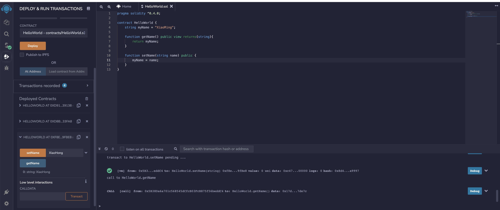

# 区块链入门与去中心化应用实战

- ## [github.com/ethereum/solidity](https://github.com/ethereum/solidity)  
- ## [github源码及youtube课程](https://github.com/willitscale/learning-solidity)  

## 区块链技术核心原理实现
- ### [solidity官方文档](https://solidity-cn.readthedocs.io/zh/develop/index.html)    
- ### [在线编辑器](https://remix.ethereum.org/)  
### solidity合约文件结构

<br>
<div align=center>
  </img>
</div>

### solidity 入门  
- ### [原培训视频地址](https://edu.51cto.com/course/14453.html)  
- ### [官方文档](https://remix-ide.readthedocs.io/en/latest/) 

<br>
<div align=center>
  </img>
</div>

<br>    

```javascript
pragma solidity ^0.4.0;

contract HelloWorld {
    string myName = "XiaoMing";

    function getName() public view returns(string){
        return myName;
    }

    function setName(string name) public {
        myName = name;
    }
}
```
<br>
<div align=center>
  </img>
</div>

<br>
<div align=center>
  </img>
</div>

<br>
<div align=center>
  </img>
</div>


### Solidity数据类型
Solidity 是一种静态类型语言， 这一章我们将深入介绍 Solidity 的数据类型。
静态类型意味着在编译时需要为每个变量（本地或状态变量）都指定类型(或至少可以推导出类型)。Solidity 的类型非常在意所占空间的大小  

- 值类型: 
- 引用类型： 数组(Array)、结构体(Struct)和映射(Mapping)


