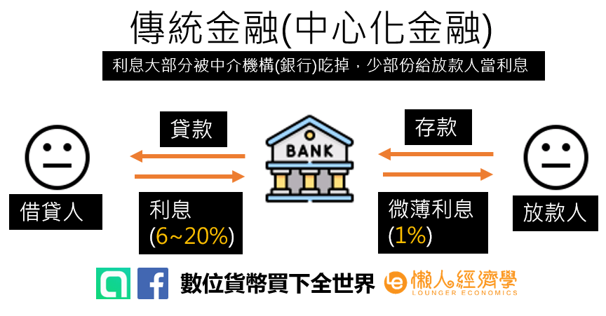
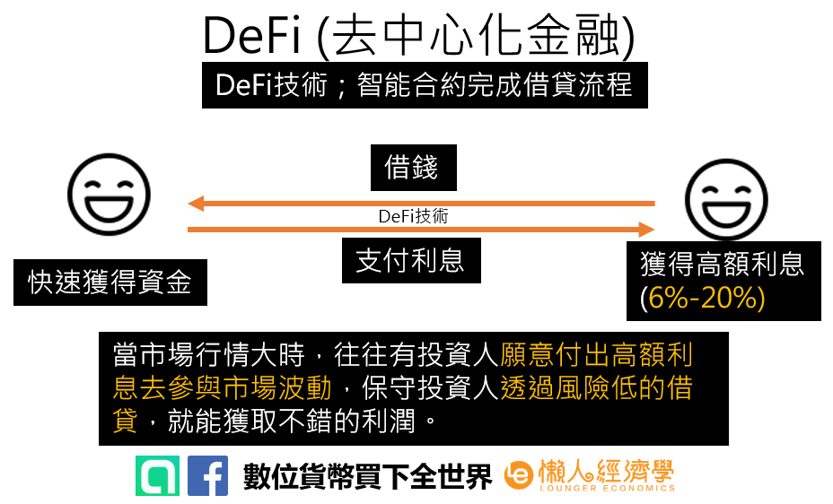
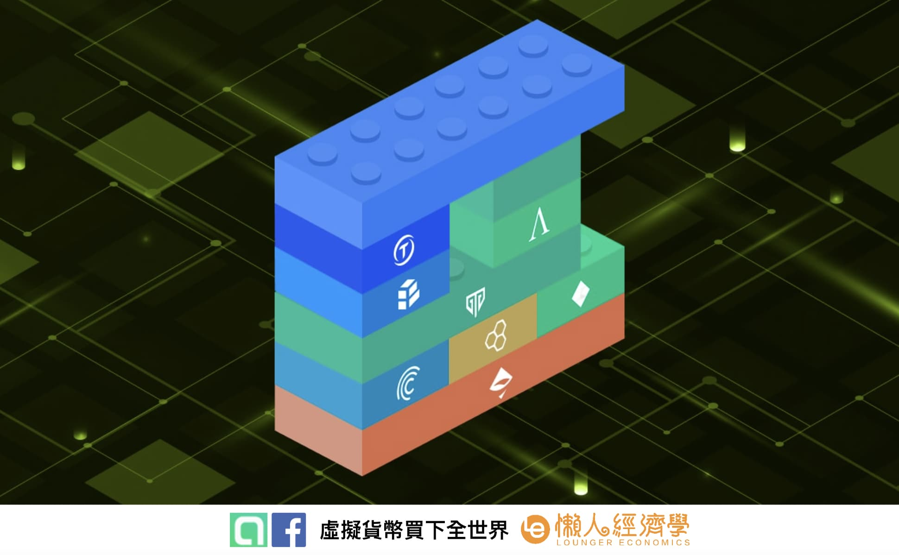
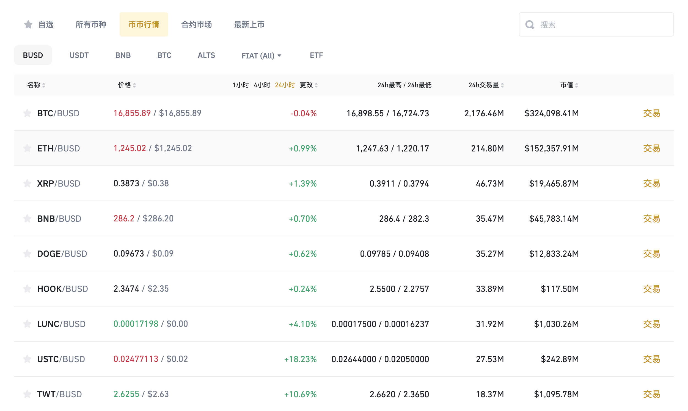
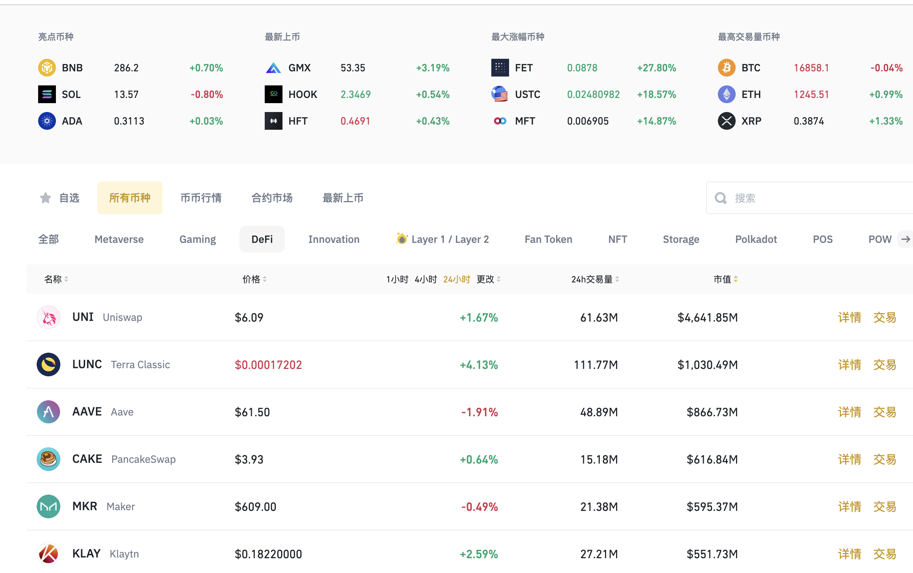
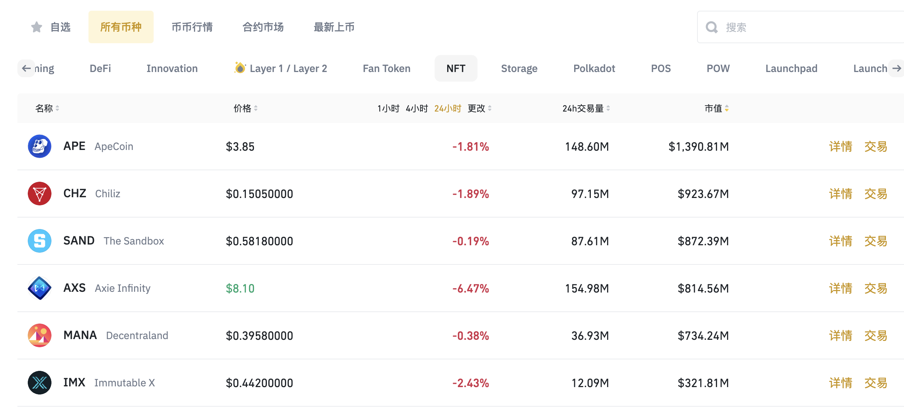

- # DeFi 

## 中心化与非中心化金融  

“中心化金融”借贷的利息远比银行存款的利息高，而借贷的钱是银行存款提供的，为何利息回馈没有回到借贷人身上？  
> 因为中间的价差就是银行（中介）的收入来源。  

 

  </img>

 

  </img>

“去中心化金融” `DeFi` 的出现，给借贷双方、或是想靠放贷获得收益的朋友一条新径径：

`DeFi` 没有具体的中介，透过 `区块链` 上的智能合约，提供多方网路共享资料库作为信任基础，进行交易与资产移转。

简单说：`DeFi` 将传统借贷的手续全部在数位货币`交易所`上完成，省去了中介机构的`手续费`，直接回馈给借贷方，这也是为什麽使用 `DeFi` 技术的产品收益率非常有竞争力的主要原因。

目前有许多交易所比如`币安`，都能藉由流动性挖矿、持仓返利、放贷等方式轻获得 `DeFi` 带给投资人的红利。

## 为什麽 DeFi 借贷这麽红？‘货币乐高’是什麽意思？  
单凭取代`银行借贷`的功能，还不足以让 `DeFi` 如此炙手可热。  

`DeFi` 借贷是透明化的开放金融，代表交易不需要第三方机构许可就能完成。  

不只借贷，`DeFi` 平台允许人们获取资金或向他人借钱，使用`衍生工具`推测一系列资产的价格变动，交易加密`货币`，并在帐户中赚取利息。  

DeFi 又被称作`货币乐高`，因为其去中心化、透明化的特性，用户能根据自己的需求，让智能合约组装出各种不同的`资产形式`、`合约`以及`协议`，产生新的`产品`和`服务`，不再受制于中介机构提出的方案。  

 

  </img>

## 如何参与 DeFi 币的投资机会？  

比如，在 [Binance](https://www.binance.com/zh-CN) 币安的流动性挖矿中，你可以通过投入不同的货币对（常见的有 BUSD/USDT、BNB/BTC 等），为市场提供流动性。  

而交易所则会给予奖励，提供你相应的平台代币以及做市盈亏作为奖励 。  

> 货币对交易是指在外汇市场或加密货币市场上，以一种货币（基础货币）与另一种货币（计价货币）的`比率`进行交易。例如，在外汇市场上，EUR/USD是指欧元兑美元的比率，而在加密货币市场上，BTC/USD是指比特币兑美元的比率。

> 货币对交易通常涉及到对市场趋势、技术分析和基本面分析的研究和预测。交易者尝试根据市场分析和预测，购买`相对较强`的货币并卖出`相对较弱`的货币，从而在价格变动时获得利润。例如，如果交易者认为欧元将比美元表现更强，他们可能会购买EUR/USD货币对，并在价格上涨时卖出以获得利润。

> 货币对交易通常使用`杠杆`来进行交易，这意味着交易者可以用较少的资金进行更大规模的交易，但同时也存在着较大的风险。此外，货币对交易也可能受到全球政治和经济事件的影响，因此交易者需要时刻关注市场动态以及全球新闻和事件。

 

  </img>

你也可以直接购买具有 DeFi 元素的代币，例如 AAVE、UNI、CAKE、SUSHI、AVAX、SOL、MATIC、LDO、CRV 等。 
 

  </img>

NFT  
 

  </img>

不过你必须留意，有些 DeFi 代币的功能只有质押 -> 获取利息的功能，没有实质盈利能力，在没有竞争力的情况下，只会被冠上所谓的资金盘，你赚它的息，它要你的本！  

## 踏入 DeFi 第一步：选择稳定安全的加密货币平台

对 `DeFi` 有了基本的认识后，便可以开始做初步的尝试囉！

作为投资人，我们要做的其实非常简单，那就是先从大平台如币安作为进入加密货币市场的第一步，风险低的项目开始小额实验。

如果有任何问题，都可以加入我们的读者 Line 社群 `数位货币买下全世界` 发问，裡面有许多资深的群友，也有各大交易所的资深用户，都会很热心回答你的疑问。

以币安来说，币安拥有多层和多丛集体系结构，具有高度标准的安全性，且币安支援的加密货币种类多元，进行加密货币交易非常快速又安全，堪称进入加密货币平台的第一选择。

除此之外，币安也拥有自己的公链 `Binance Smart Chain`，币安智能链（BSC），在那上面也有丰富的项目生态，BSC 链上最知名的 DeFi 网站当属 PancakeSwap 莫属，拥有最高的锁仓量。  

## 其他
### Uniswap

Uniswap到底是什么？  
官方介绍摘要：  
Uniswap是一种自动流动性协议，由恒定的产品公式提供支持， 并在以太坊区块链上的不可升级智能合约系统中实施。它消除了对受信任的中介机构的需要，并优先考虑了权力下放，审查制度限制和安全性。

每个Uniswap智能合约或一对智能合约都管理由`两个ERC-20代币`的储备组成的流动资金池。

任何人都可以通过存入每个基础代币的等值来换取池代币，从而成为池的流动性提供者—即LP（liquidity provider）。这些代币跟踪总储备中按比例分配的LP份额，并可随时赎回相关资产。

简单地说，Uniswap是一个真正意义上的去中心化交易引擎。不同于CEX（中心化交易所）的订单薄交易模式（即发起挂单需求，撮合交易），在Uniswap的机制下，用户不需要经过CEX作为中间商（不会出现 插针 宕机 盗币的问题），用户可以直接使用钱包在在链上进行交易。  

### aave

一种允许用户借入加密资产并从存款中获利的开源协议。  

Aave本质上是为`去中心化`的金融部门释放流动性。它让所有加密货币用户都有机会从加密货币存款中赚取利息，或以虚拟货币为抵押借款，将他们的资金转变为活跃状态。

Aave允许用户借贷约20种加密货币。Aave最突出的产品之一是“闪贷”，这是DeFi行业的首个无担保贷款解决方案。

然而，无担保贷款的能力需要权衡：闪贷必须在相同的金融操作中偿还，这意味着它们只发行几分钟甚至几秒钟。  

不过，闪贷在套利、抵押品闪兑或债务交换方面还是有用的。

除了闪贷，Aave还提供传统的借贷业务。用户可以向协议提供加密货币，收取利息，或以其资产为抵押借款。

- 使用Aave有哪些风险?  
  
没有一个DeFi平台是完全没有风险的。Aave平台也不例外。与Aave相关的最常见风险包括`智能合约风险`（或协议代码漏洞风险）和`清算风险`。后者意味着，如果用户用于借贷资产的`抵押品`价值大幅下降，抵押品可能会被清算，用户将损失资金。  

 

