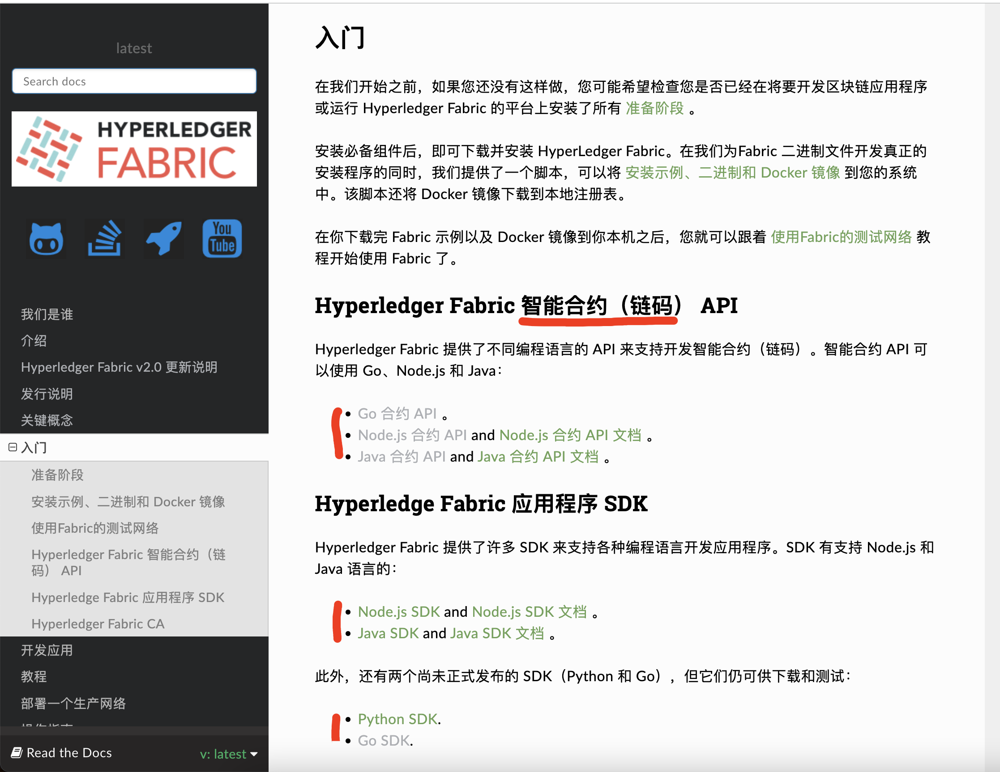

# 目录  
- [区块链2.0 Ethereum](#区块链20-ethereum)
  - [Dapp](#dapp)
  - [Dapp 第一个应用程序](#dapp-第一个应用程序)
- [Hyperledger(超级账本[ˈledʒə(r)])](#hyperledger超级账本ˈledʒər)
- [第一个应用程序](#第一个应用程序)
  - [安装编译环境:](#安装编译环境)
  - [设置区块链网络](#设置区块链网络)
  - [创建一个通道](#创建一个通道)
  - [在通道启动一个链码](#在通道启动一个链码)
  - [与网络交互](#与网络交互)
  - [关停网络](#关停网络)

## 区块链2.0 Ethereum 
### Dapp 
`Decentralized Application` 去中心化应用  

<br>
<div align=center>
  </img>  
</div>

<br>
<div align=center>
  </img>  
</div>

<br>
<div align=center>
  </img>  
</div>

[回到目录](#目录)    

### Dapp 第一个应用程序  

[回到目录](#目录)  

## Hyperledger(超级账本[ˈledʒə(r)])  
fabric [ˈfæbrɪk] n. 布料，织物；构造，结构；  

- ### [官方文档](https://hyperledger-fabric.readthedocs.io/zh_CN/latest/)  


<br>
<div align=center>
  </img>
</div>

<br>
整体架构:  
<div align=center>
  </img>  
</div>

## 第一个应用程序  
关于 FabCar  

FabCar例子演示了如何查询保存在账本上的Car（我们业务对象例子），以及如何更新账本（向账本添加新的Car）。 它包含以下两个组件:  

1. 示例应用程序：调用区块链网络，调用智能合约中实现的交易。
2. 智能合约：实现了涉及与账本交互的交易。  

我们将按照以下三个步骤进行：

1. 搭建开发环境。 我们的应用程序需要和网络交互，所以我们需要一个智能合约和 应用程序使用的基础网络。

2. 浏览一个示例智能合约。 我们将查看示例智能合约 Fabcar 来学习他们的交易，还有应用程序是怎么使用他们来进行查询和更新账本的。

3. 使用示例应用程序和智能合约交互。 我们的应用程序将使用 FabCar 智能合约来查询和更新账本上的汽车资产。我们将进入到应用程序的代码和他们创建的交易，包括查询一辆汽车，查询一批汽车和创建一辆新车。

在完成这个教程之后，你将基本理解一个应用是如何通过编程关联智能合约来和 Fabric 网络上的多个节点的账本的进行交互的。 

这里使用ubuntu系统搭建:  

[回到目录](#目录)  

### 安装编译环境: 
```shell
sudo apt install build-essential  
```

安装go
```shell
wget https://go.dev/dl/go1.16.9.linux-amd64.tar.gz
tar -zxvf go1.16.9.linux-amd64.tar.gz -C /usr/local/
rm -fr /usr/bin/go && ln -s /usr/local/go/bin/go /usr/bin/go
go version 
```

[回到目录](#目录)  

### 设置区块链网络  
首选安装docker
```shell
curl -sSL https://get.daocloud.io/docker | sh

# docker-compose
curl -SL https://github.com/docker/compose/releases/download/v2.6.1/docker-compose-linux-x86_64 -o /usr/local/bin/docker-compose
chmod +x /usr/local/bin/docker-compose
sudo ln -s /usr/local/bin/docker-compose /usr/bin/docker-compose
```

安装hyperledger 
```
curl -sSL https://bit.ly/2ysbOFE | bash -s -- 2.2.0 1.4.7
```

安装成功日志: 
```shell
===> List out hyperledger docker images
hyperledger/fabric-tools     2.2       5eb2356665e7   23 months ago   519MB
hyperledger/fabric-tools     2.2.0     5eb2356665e7   23 months ago   519MB
hyperledger/fabric-tools     latest    5eb2356665e7   23 months ago   519MB
hyperledger/fabric-peer      2.2       760f304a3282   23 months ago   54.9MB
hyperledger/fabric-peer      2.2.0     760f304a3282   23 months ago   54.9MB
hyperledger/fabric-peer      latest    760f304a3282   23 months ago   54.9MB
hyperledger/fabric-orderer   2.2       5fb8e97da88d   23 months ago   38.4MB
hyperledger/fabric-orderer   2.2.0     5fb8e97da88d   23 months ago   38.4MB
hyperledger/fabric-orderer   latest    5fb8e97da88d   23 months ago   38.4MB
hyperledger/fabric-ccenv     2.2       aac435a5d3f1   23 months ago   586MB
hyperledger/fabric-ccenv     2.2.0     aac435a5d3f1   23 months ago   586MB
hyperledger/fabric-ccenv     latest    aac435a5d3f1   23 months ago   586MB
hyperledger/fabric-baseos    2.2       aa2bdf8013af   23 months ago   6.85MB
hyperledger/fabric-baseos    2.2.0     aa2bdf8013af   23 months ago   6.85MB
hyperledger/fabric-baseos    latest    aa2bdf8013af   23 months ago   6.85MB
hyperledger/fabric-ca        1.4       743a758fae29   2 years ago     154MB
hyperledger/fabric-ca        1.4.7     743a758fae29   2 years ago     154MB
hyperledger/fabric-ca        latest    743a758fae29   2 years ago     154MB
```

这是也会下载`fabric-samples`文件，查看`fabric-samples`的`bin`和`config`文件夹下
```shell
root@matrix:~/work/fabric-samples# ls -l bin/
total 208192
-rwxr-xr-x 1 1001 1001 20521776 Jul  9  2020 configtxgen
-rwxr-xr-x 1 1001 1001 17012791 Jul  9  2020 configtxlator
-rwxr-xr-x 1 1001 1001 13192504 Jul  9  2020 cryptogen
-rwxr-xr-x 1 1001 1001 17452108 Jul  9  2020 discover
-rwxr-xr-x 1 1001 1001 22950608 May 15  2020 fabric-ca-client
-rwxr-xr-x 1 1001 1001 30278008 May 15  2020 fabric-ca-server
-rwxr-xr-x 1 1001 1001 12197048 Jul  9  2020 idemixgen
-rwxr-xr-x 1 1001 1001 31417504 Jul  9  2020 orderer
-rwxr-xr-x 1 1001 1001 48145696 Jul  9  2020 peer
      
root@matrix:~/work/fabric-samples# ls -l config/
total 80
-rw-r--r-- 1 1001 lxd 25421 Jul  9  2020 configtx.yaml
-rw-r--r-- 1 1001 lxd 32829 Jul  9  2020 core.yaml
-rw-r--r-- 1 1001 lxd 14879 Jul  9  2020 orderer.yaml
```

编译运行: 
```
cd test-network

# 帮助信息
./network.sh -h 

# 开启
./network.sh up

# 关闭
./network.sh down
```

帮助
```shell
Usage: 
  network.sh <Mode> [Flags]
    Modes:
      up - Bring up Fabric orderer and peer nodes. No channel is created
      up createChannel - Bring up fabric network with one channel
      createChannel - Create and join a channel after the network is created
      deployCC - Deploy a chaincode to a channel (defaults to asset-transfer-basic)
      down - Bring down the network

 Possible Mode and flag combinations
   up -ca -r -d -s -i -cai -verbose
   up createChannel -ca -c -r -d -s -i -cai -verbose
   createChannel -c -r -d -verbose
   deployCC -ccn -ccl -ccv -ccs -ccp -cci -r -d -verbose
```

> `./network.sh down` 该命令将停止并删除节点和链码容器，删除组织加密材料，并从Docker Registry移除链码镜像。 该命令还删除之前运行的通道项目和docker卷。  

网络开启后的容器列表
```shell
hyperledger/fabric-tools:latest
hyperledger/fabric-peer:latest            
hyperledger/fabric-orderer:latest
```

与`Fabric`网络互动的每个节点和用户都必须属于一个网络成员的组织。 Fabric网络成员的所有组织通常称为联盟(consortium)。 测试网络有两个联盟成员，Org1和Org2。 该网络还包括一个维护网络排序服务的排序组织。

`Peer` 节点 是任何`Fabric`网络的基本组件。 对等节点存储区块链账本并在进行交易之前对其进行验证。 同行运行包含业务用于管理区块链账本的智能合约上的业务逻辑。

网络中的每个对等方都必须属于该联盟的成员。 在测试网络里，每个组织各自运营一个对等节点， `peer0.org1.example.com`和`peer0.org2.example.com`.  


### 创建一个通道  
我们可以使用脚本创建用于在Org1和Org2之间进行交易的Fabric通道。 通道是特定网络成员之间的专用通信层。通道只能由被邀请加入通道的组织使用，并且对网络的其他成员不可见。 每个通道都有一个单独的区块链账本。被邀请的组织“加入”他们的对等节点来存储其通道账本并验证交易。  

```shell
./network.sh createChannel -c channel1  
```

或者直接启动使用:  
```shell
./network.sh up createChannel -c channel1  
```

[回到目录](#目录)  

### 在通道启动一个链码  

创建通道后，您可以开始使用智能合约与通道账本交互。 智能合约包含管理区块链账本上资产的业务逻辑。 由成员运行的应用程序网络可以在账本上调用智能合约创建，更改和转让这些资产。 应用程序还通过智能合约查询，以在分类帐上读取数据。  

```shell
./network.sh deployCC -c channel1 -ccn basic -ccp ../asset-transfer-basic/chaincode-go -ccl go
```  

`deployCC`子命令将在`peer0.org1.example.com`和p`eer0.org2.example.com`上安装 asset-transfer (basic) 链码。 然后在使用通道标志（或mychannel如果未指定通道）的通道上部署指定的通道的链码。 如果您第一次部署一套链码，脚本将安装链码的依赖项。默认情况下，脚本安装Go版本的 asset-transfer (basic) 链码。 但是您可以使用语言便签 `-l`，用于安装 `Java` 或 `javascript` 版本的链码。 您可以在 `fabric-samples` 目录的 `asset-transfer-basic` 文件夹中找到 `asset-transfer (basic)` 链码。 此目录包含作为案例和用来突显 Fabric 特征的样本链码。  


日志输出
```shell
deploying chaincode on channel 'mychannel'
executing with the following
- CHANNEL_NAME: mychannel
- CC_NAME: basic
- CC_SRC_PATH: ../asset-transfer-basic/chaincode-go
- CC_SRC_LANGUAGE: go
- CC_VERSION: 1.0
- CC_SEQUENCE: 1
- CC_END_POLICY: NA
- CC_COLL_CONFIG: NA
- CC_INIT_FCN: NA
- DELAY: 3
- MAX_RETRY: 5
- VERBOSE: false

# 第一次提示没有 mychannel(默认)，通过-c指定后，提示
Error: chaincode install failed with status: 500 - failed to invoke backing implementation of 'InstallChaincode': chaincode already successfully installed
Chaincode installation on peer0.org1 has failed
Deploying chaincode failed

`./network.sh down` 重新来过 
```

[回到目录](#目录)  

### 与网络交互
在您启用测试网络后，可以使用peer CLI与您的网络进行交互。 peer CLI允许您调用已部署的智能合约，更新通道，或安装和部署新的智能合约。  

确保您正在从test-network目录进行操作
```shell
export PATH=${PWD}/../bin:$PATH

export FABRIC_CFG_PATH=$PWD/../config/
```

现在，您可以设置环境变量，以允许您作为Org1操作peer CLI：  
```shell
export CORE_PEER_TLS_ENABLED=true
export CORE_PEER_LOCALMSPID="Org1MSP"
export CORE_PEER_TLS_ROOTCERT_FILE=${PWD}/organizations/peerOrganizations/org1.example.com/peers/peer0.org1.example.com/tls/ca.crt
export CORE_PEER_MSPCONFIGPATH=${PWD}/organizations/peerOrganizations/org1.example.com/users/Admin@org1.example.com/msp
export CORE_PEER_ADDRESS=localhost:7051
```

运行以下命令用一些资产来初始化账本
```
peer chaincode invoke -o localhost:7050 --ordererTLSHostnameOverride orderer.example.com --tls --cafile ${PWD}/organizations/ordererOrganizations/example.com/orderers/orderer.example.com/msp/tlscacerts/tlsca.example.com-cert.pem -C channel1 -n basic --peerAddresses localhost:7051 --tlsRootCertFiles ${PWD}/organizations/peerOrganizations/org1.example.com/peers/peer0.org1.example.com/tls/ca.crt --peerAddresses localhost:9051 --tlsRootCertFiles ${PWD}/organizations/peerOrganizations/org2.example.com/peers/peer0.org2.example.com/tls/ca.crt -c '{"function":"InitLedger","Args":[]}'
```

返回结果
```shell
2022-06-26 19:43:28.251 CST [chaincodeCmd] chaincodeInvokeOrQuery -> INFO 001 Chaincode invoke successful. result: status:200   
```

现在你可以用你的 CLI 工具来查询账本。运行以下指令来获取添加到通道账本的资产列表：
```shell
peer chaincode query -C channel1 -n basic -c '{"Args":["GetAllAssets"]}'
```

返回值
```json
[
    {
        "ID":"asset1",
        "color":"blue",
        "size":5,
        "owner":"Tomoko",
        "appraisedValue":300
    },
    {
        "ID":"asset2",
        "color":"red",
        "size":5,
        "owner":"Brad",
        "appraisedValue":400
    },
    {
        "ID":"asset3",
        "color":"green",
        "size":10,
        "owner":"Jin Soo",
        "appraisedValue":500
    },
    {
        "ID":"asset4",
        "color":"yellow",
        "size":10,
        "owner":"Max",
        "appraisedValue":600
    },
    {
        "ID":"asset5",
        "color":"black",
        "size":15,
        "owner":"Adriana",
        "appraisedValue":700
    },
    {
        "ID":"asset6",
        "color":"white",
        "size":15,
        "owner":"Michel",
        "appraisedValue":800
    }
]
```

当一个网络成员希望在账本上转一些或者改变一些资产，链码会被调用。使用以下的指令来通过调用 asset-transfer (basic) 链码改变账本上的资产所有者：  
```shell
peer chaincode invoke -o localhost:7050 --ordererTLSHostnameOverride orderer.example.com --tls --cafile ${PWD}/organizations/ordererOrganizations/example.com/orderers/orderer.example.com/msp/tlscacerts/tlsca.example.com-cert.pem -C channel1 -n basic --peerAddresses localhost:7051 --tlsRootCertFiles ${PWD}/organizations/peerOrganizations/org1.example.com/peers/peer0.org1.example.com/tls/ca.crt --peerAddresses localhost:9051 --tlsRootCertFiles ${PWD}/organizations/peerOrganizations/org2.example.com/peers/peer0.org2.example.com/tls/ca.crt -c '{"function":"TransferAsset","Args":["asset6","Christopher"]}'  
```

返回值: 
```shell
2022-06-26 19:46:04.276 CST [chaincodeCmd] chaincodeInvokeOrQuery -> INFO 001 Chaincode invoke successful. result: status:200 
```

因为 asset-transfer (basic) 链码的背书策略需要交易同时被 Org1 和 Org2 签名，链码调用指令需要使用 --peerAddresses 标签来指向 peer0.org1.example.com 和 peer0.org2.example.com。因为网络的 TLS 被开启，指令也需要用 --tlsRootCertFiles 标签指向每个 peer 节点的 TLS 证书。  


调用链码之后，我们可以使用另一个查询来查看调用如何改变了区块链账本的资产。因为我们已经查询了 Org1 的 peer，我们可以把这个查询链码的机会通过 Org2 的 peer 来运行。设置以下的环境变量来操作 Org2：  

```shell
# Environment variables for Org2

export CORE_PEER_TLS_ENABLED=true
export CORE_PEER_LOCALMSPID="Org2MSP"
export CORE_PEER_TLS_ROOTCERT_FILE=${PWD}/organizations/peerOrganizations/org2.example.com/peers/peer0.org2.example.com/tls/ca.crt
export CORE_PEER_MSPCONFIGPATH=${PWD}/organizations/peerOrganizations/org2.example.com/users/Admin@org2.example.com/msp
export CORE_PEER_ADDRESS=localhost:9051
```

你可以查询运行在 peer0.org2.example.com asset-transfer (basic) 链码：
```shell
peer chaincode query -C channel1 -n basic -c '{"Args":["ReadAsset","asset6"]}'
```

返回值
```shell
{"ID":"asset6","color":"white","size":15,"owner":"Christopher","appraisedValue":800}
```

[回到目录](#目录)  

### 关停网络
使用完测试网络后，您可以使用以下命令关闭网络：
```shell
./network.sh down
```

该命令将停止并删除节点和链码容器，删除组织加密材料，并从Docker Registry移除链码镜像。 该命令还删除之前运行的通道项目和docker卷。如果您遇到任何问题，还允许您再次运行 `./network.sh up`。  

[回到目录](#目录)  


