- # 从EVM操作码的角度学习solidity

- [EVM](#evm)
  - [介绍](#介绍)
  - [常用操作码](#常用操作码)
  - [图说](#图说)
- [Solidity进阶](#solidity进阶)
  - [关键字总结](#关键字总结)
  - [实例](#实例)
    - [Constants](#constants)
    - [Immutable](#immutable)
    - [Reading and Writing to a State Variable](#reading-and-writing-to-a-state-variable)
    - [Mapping](#mapping)
    - [Array](#array)
    - [Enum](#enum)
    - [Structs](#structs)
    - [Data Locations - Storage, Memory and Calldata](#data-locations---storage-memory-and-calldata)
    - [Function Modifier](#function-modifier)
    - [Import](#import)
  - [数据存储位置](#数据存储位置)
    - [存储（Storage）](#存储storage)
    - [内存（Memory）](#内存memory)
    - [调用数据（Calldata）](#调用数据calldata)
    - [堆栈（Stack）](#堆栈stack)
    - [代码（Code）](#代码code)
  - [状态变量储存结构](#状态变量储存结构)
    - [映射和动态数组](#映射和动态数组)
  - [Solidity 汇编](#solidity-汇编)
  - [继承](#继承)
  - [接口](#接口)
  - [调用其他合约](#调用其他合约)
    - [通过接口调用](#通过接口调用)
    - [使用call，delegatecall](#使用calldelegatecall)
  - [Using For](#using-for)


## EVM 
### 介绍  
ETHEREUM VIRTUAL MACHINE (EVM)  

- ### [官方EVM说明](https://ethereum.org/zh/developers/docs/evm/)  

- ### [详细的EVM说明](../res/files/ethereum_evm_illustrated.pdf)  

[以太坊黄皮书](https://ethereum.github.io/yellowpaper/paper.pdf)  
[虚拟机操作码](https://www.ethervm.io/)  


- 以太坊状态转换函数

EVM 的行为就像一个数学函数：在给定输入的情况下，它会产生确定性的输出。 因此，将以太坊更正式地描述为具有状态转换函数非常有帮助：  

```sh
Y(S, T)= S'
```

给定一个旧的有效状态 （S）> 和一组新的有效交易 （T），以太坊状态转换函数 Y（S，T） 产生新的有效输出状态 S'

 
 - EVM 实现

EVM 的所有实现都必须遵守以太坊黄皮书中描述的规范。

在以太坊 7 年历史中，以太坊虚拟机经历了几次修订，并且还出现了用各种编程语言编写的多种以太坊虚拟机实现。  

所有以太坊客户端都包含一个 EVM 实现。

| 客户端 | 语言 | 操作系统  | 网络 | 同步策略 | 状态缓冲 | 
| ----- | ---- | ------ | ------| ------ | ------ |
 | Geth | Go | Linux、Windows、macOS | 主网、Sepolia、Görli、Ropsten、Rinkeby | 快照、完全 | Archive、Pruned  | 
 | Nethermind | C#、.NET | Linux、Windows、macOS | 主网、Sepolia、Görli、Ropsten、Rinkeby 等 | 快照（不提供服务）、快速、完全 | Archive、Pruned | 
 | Besu | Java | Linux、Windows、macOS | 主网、Sepolia、Görli、Ropsten、Rinkeby 等 | 快速、完全 | Archive、Pruned | 
 | Erigon | Go | Linux、Windows、macOS | 主网、Sepolia、Görli、Rinkeby、Ropsten 等 | 完全 | Archive、Pruned   | 

此外，还有多个独立的实现方法，包括：
- Py-EVM↗ - Python  
- evmone↗ - C++  
- ethereumjs-vm↗ - JavaScript  
- eEVM↗ - C++  

### 常用操作码

| Stack Name | Gas Initial Stack | Resulting Stack |  Mem / Storage |  Notes  | 
| ---- |  ---- |  ---- |  ---- |  ---- | 
| 01 ADD | 3   a, b | a + b |  | (u)int256 addition modulo 2**256  | 
| 38  CODESIZE  |  2   .  | len(this.code)   | |   length of executing contract's code, in bytes  | 
|3D  RETURNDATASIZE | 2   .  | size     | |   size of returned data from last external call, in bytes | 
| 51  MLOAD   | 3* ost |  mem[ost:ost+32]     read word from memory at offset ost  |
| 52  MSTORE  | 3* ost, val    .   mem[ost:ost+32] := val  write a word to memory |  
| 53  MSTORE8 | 3* ost, val    .   mem[ost] := val && 0xFF write a single byte to memory  | 
| 54  SLOAD   | A6 key storage[key]        read word from storage | 
| 55  SSTORE  | A7 key, val    .   storage[key] := val write word to storage  | 

### 图说
<br>
<div align=center>
  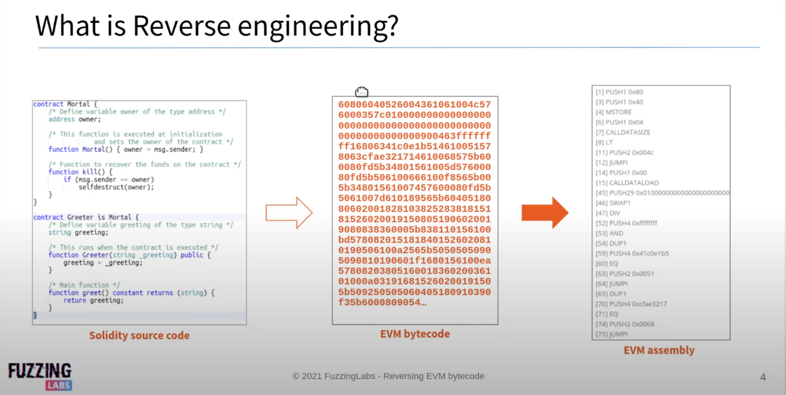</img>
</div>

<br>
<div align=center>
  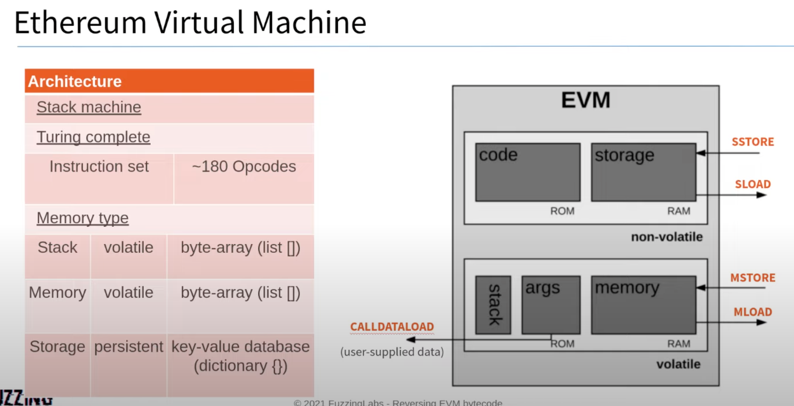</img>
</div>

<br>
<div align=center>
  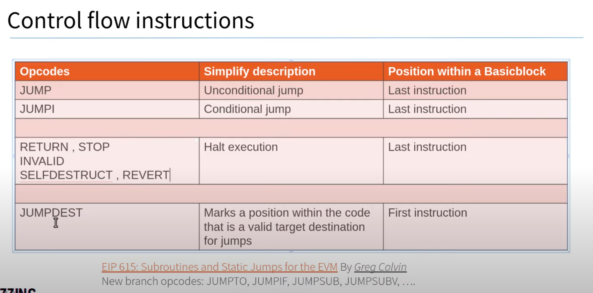</img>
</div>


<br>
<div align=center>
  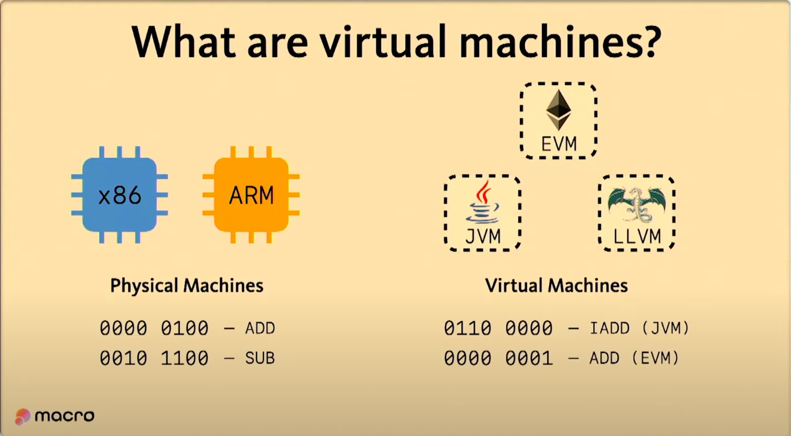</img>
</div>

<br>
<div align=center>
  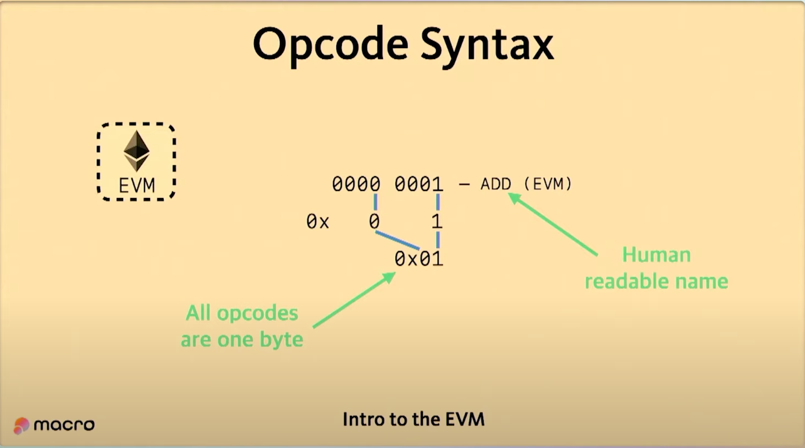</img>
</div>


<br>
<div align=center>
  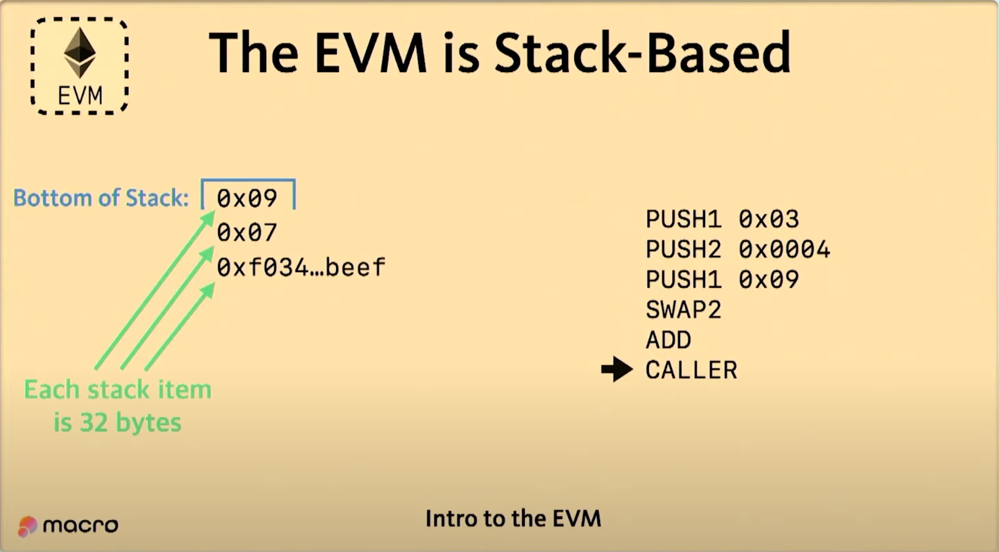</img>
</div>


<br>
<div align=center>
  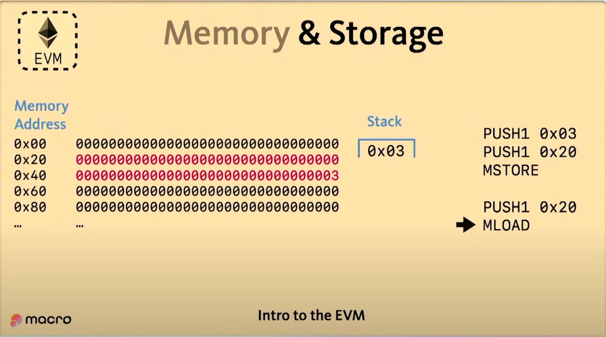</img>
</div>


<br>
<div align=center>
  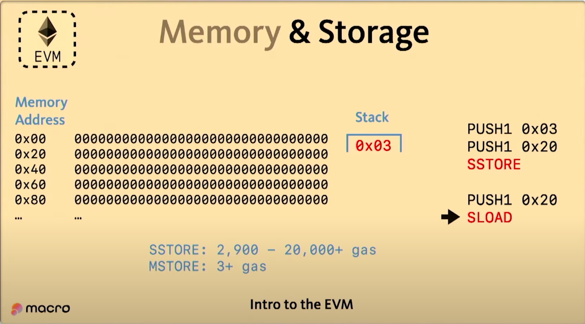</img>
</div>


<br>
<div align=center>
  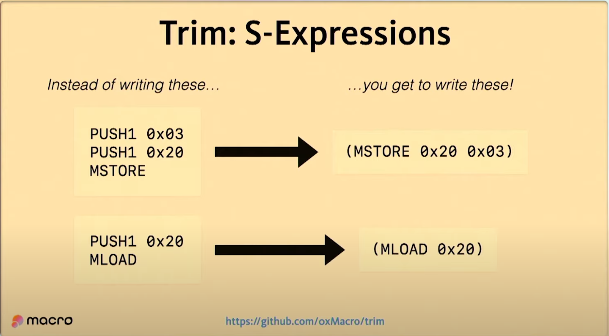</img>
</div>


<br>
<div align=center>
  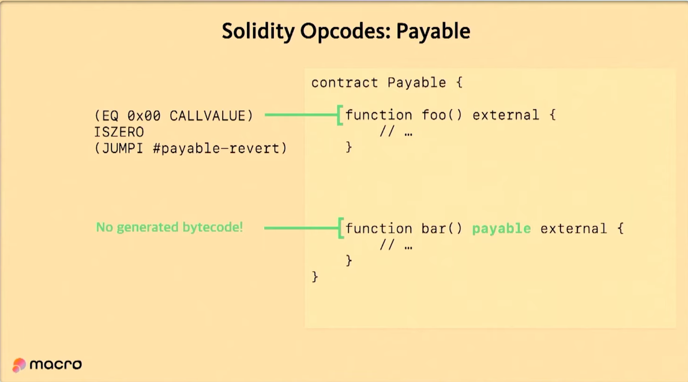</img>
</div>


<br>
<div align=center>
  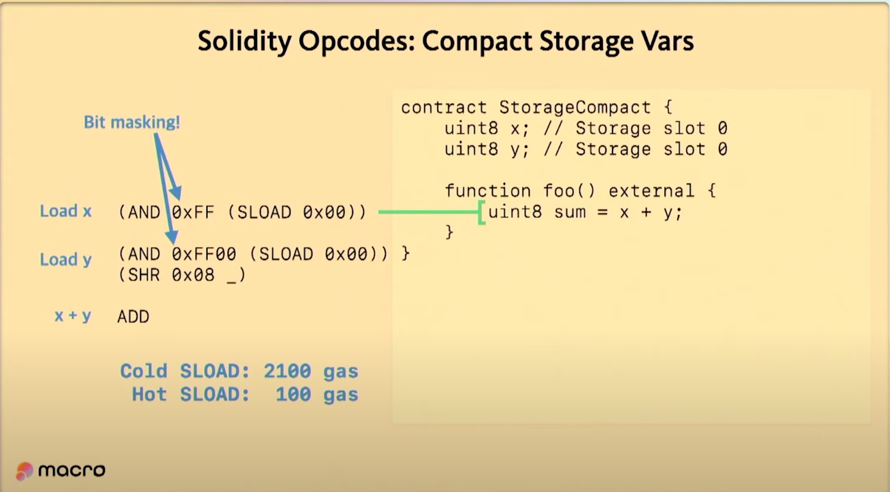</img>
</div>


<br>
<div align=center>
  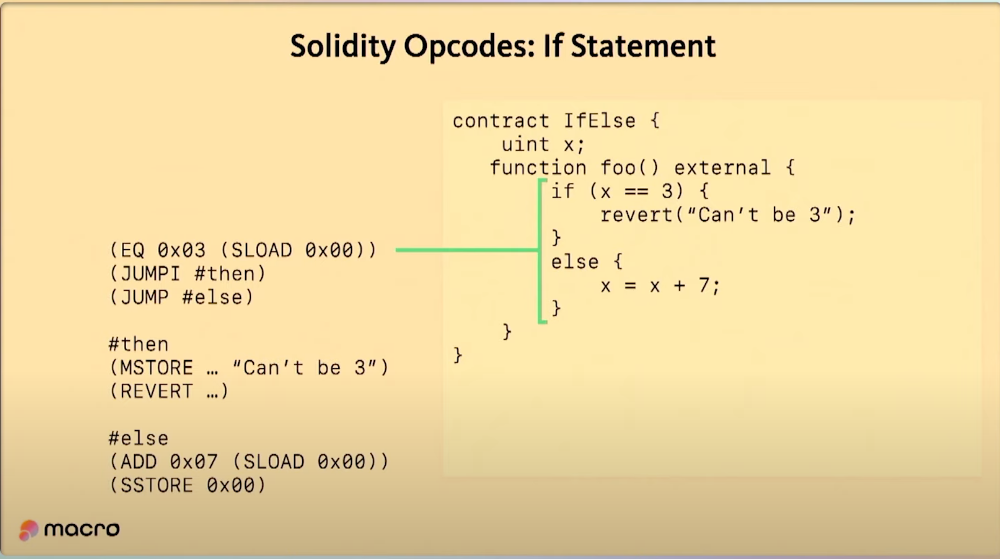</img>
</div>


<br>
<div align=center>
  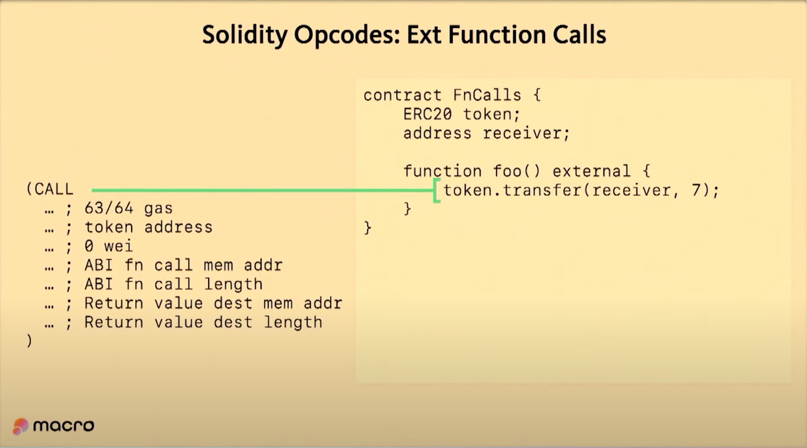</img>
</div>

## Solidity进阶

[变量类型](https://solidity-cn.readthedocs.io/zh/develop/types.html)  

### 关键字总结

public/private/internal/external 函数可见性分析  

- public ： 任意访问（合约中函数默认）；公共函数是合约接口的一部分,可以通过内部调用或通过消息调用。对公共状态变量而言，会有的自动访问限制符的函数生成。
- private ：仅当前合约内；私有函数和状态变量仅仅在定义该合约中可见， 在派生的合约中不可见，可防止其他合约访问和修改信息。
- internal ：仅当前合约及所继承的合约（状态变量声明时默认）
- external ： 仅外部访问（在内部也只能用外部访问方式访问）；外部函数是合约接口的一部分,这意味着它们可以从其他合约调用, 也可以通过事务调用。外部函数f不能被内部调用(即 f()不执行,但this.f()执行)。外部函数，当他们接收大数组时，更有效。  


pure/constant/view/payable 函数的限制访问  

constant、view、pure三个函数修饰词的作用是告诉编译器，`函数不改变`/`不读取状态变量`，这样函数执行就可以不消耗gas了，因为不需要矿工来验证。  

在Solidity v4.17之前，只有constant，后续版本将constant拆成了view和pure。  


一个函数要进行货币操作必须要带上`payable`关键字。  


### 示例
- ### [solidity-by-example](https://solidity-by-example.org/)
#### Constants

Constants are variables that cannot be modified.

Their value is hard coded and using constants can save gas cost. 


```js
// SPDX-License-Identifier: MIT
pragma solidity ^0.8.17;

contract Constants {
    // coding convention to uppercase constant variables
    address public constant MY_ADDRESS = 0x777788889999AaAAbBbbCcccddDdeeeEfFFfCcCc;
    uint public constant MY_UINT = 123;
}

```


#### Immutable
`/ɪˈmjuːtəb(ə)l/`  永恒的，不可改变的  

Immutable variables are like constants. Values of immutable variables can be set inside the constructor but cannot be modified afterwards.

```js
// SPDX-License-Identifier: MIT
pragma solidity ^0.8.17;

contract Immutable {
    // coding convention to uppercase constant variables
    address public immutable MY_ADDRESS;
    uint public immutable MY_UINT;

    constructor(uint _myUint) {
        MY_ADDRESS = msg.sender;
        MY_UINT = _myUint;
    }
}
```

#### Reading and Writing to a State Variable

```js
// SPDX-License-Identifier: MIT
pragma solidity ^0.8.17;

contract SimpleStorage {
    // State variable to store a number
    uint public num;

    // You need to send a transaction to write to a state variable.
    function set(uint _num) public {
        num = _num;
    }

    // You can read from a state variable without sending a transaction.
    function get() public view returns (uint) {
        return num;
    }
}
```


#### Mapping
Maps are created with the syntax mapping(keyType => valueType).

The keyType can be any built-in value type, bytes, string, or any contract.

valueType can be any type including another mapping or an array.

Mappings are not iterable.  

```js
// SPDX-License-Identifier: MIT
pragma solidity ^0.8.17;

contract Mapping {
    // Mapping from address to uint
    mapping(address => uint) public myMap;

    function get(address _addr) public view returns (uint) {
        // Mapping always returns a value.
        // If the value was never set, it will return the default value.
        return myMap[_addr];
    }

    function set(address _addr, uint _i) public {
        // Update the value at this address
        myMap[_addr] = _i;
    }

    function remove(address _addr) public {
        // Reset the value to the default value.
        delete myMap[_addr];
    }
}

contract NestedMapping {
    // Nested mapping (mapping from address to another mapping)
    mapping(address => mapping(uint => bool)) public nested;

    function get(address _addr1, uint _i) public view returns (bool) {
        // You can get values from a nested mapping
        // even when it is not initialized
        return nested[_addr1][_i];
    }

    function set(address _addr1, uint _i, bool _boo) public {
        nested[_addr1][_i] = _boo;
    }

    function remove(address _addr1, uint _i) public {
        delete nested[_addr1][_i];
    }
}
```

<br>
<div align=center>
  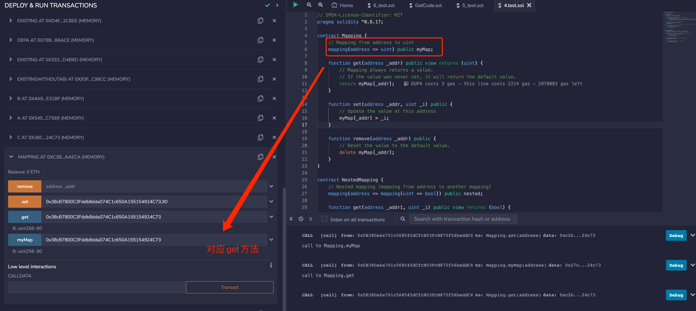</img>
</div>

<br>
<div align=center>
  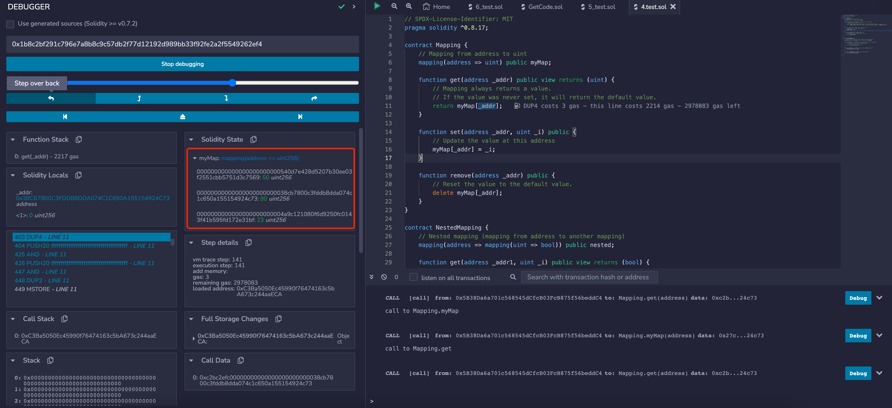</img>
</div>


#### Array

Array can have a compile-time fixed size or a dynamic size. 


```js
// SPDX-License-Identifier: MIT
pragma solidity ^0.8.17;

contract Array {
    // Several ways to initialize an array
    uint[] public arr;
    uint[] public arr2 = [1, 2, 3];
    // Fixed sized array, all elements initialize to 0
    uint[10] public myFixedSizeArr;

    function get(uint i) public view returns (uint) {
        return arr[i];
    }

    // Solidity can return the entire array.
    // But this function should be avoided for
    // arrays that can grow indefinitely in length.
    function getArr() public view returns (uint[] memory) {
        return arr;
    }

    function push(uint i) public {
        // Append to array
        // This will increase the array length by 1.
        arr.push(i);
    }

    function pop() public {
        // Remove last element from array
        // This will decrease the array length by 1
        arr.pop();
    }

    function getLength() public view returns (uint) {
        return arr.length;
    }

    function remove(uint index) public {
        // Delete does not change the array length.
        // It resets the value at index to it's default value,
        // in this case 0
        delete arr[index];
    }

    function examples() external {
        // create array in memory, only fixed size can be created
        uint[] memory a = new uint[](5);
    }
}
```


#### Enum

Solidity supports enumerables and they are useful to model choice and keep track of state.

Enums can be declared outside of a contract.


```js
// SPDX-License-Identifier: MIT
pragma solidity ^0.8.17;

contract Enum {
    // Enum representing shipping status
    enum Status {
        Pending,
        Shipped,
        Accepted,
        Rejected,
        Canceled
    }

    // Default value is the first element listed in
    // definition of the type, in this case "Pending"
    Status public status;

    // Returns uint
    // Pending  - 0
    // Shipped  - 1
    // Accepted - 2
    // Rejected - 3
    // Canceled - 4
    function get() public view returns (Status) {
        return status;
    }

    // Update status by passing uint into input
    function set(Status _status) public {
        status = _status;
    }

    // You can update to a specific enum like this
    function cancel() public {
        status = Status.Canceled;
    }

    // delete resets the enum to its first value, 0
    function reset() public {
        delete status;
    }
}
```

#### Structs

You can define your own type by creating a struct.

They are useful for grouping together related data.

Structs can be declared outside of a contract and imported in another contract.

```js
// SPDX-License-Identifier: MIT
pragma solidity ^0.8.17;

contract Todos {
    struct Todo {
        string text;
        bool completed;
    }

    // An array of 'Todo' structs
    Todo[] public todos;

    function create(string calldata _text) public {
        // 3 ways to initialize a struct
        // - calling it like a function
        todos.push(Todo(_text, false));

        // key value mapping
        todos.push(Todo({text: _text, completed: false}));

        // initialize an empty struct and then update it
        Todo memory todo;
        todo.text = _text;
        // todo.completed initialized to false

        todos.push(todo);
    }

    // Solidity automatically created a getter for 'todos' so
    // you don't actually need this function.
    function get(uint _index) public view returns (string memory text, bool completed) {
        Todo storage todo = todos[_index];
        return (todo.text, todo.completed);
    }

    // update text
    function updateText(uint _index, string calldata _text) public {
        Todo storage todo = todos[_index];
        todo.text = _text;
    }

    // update completed
    function toggleCompleted(uint _index) public {
        Todo storage todo = todos[_index];
        todo.completed = !todo.completed;
    }
}
```

<br>
<div align=center>
  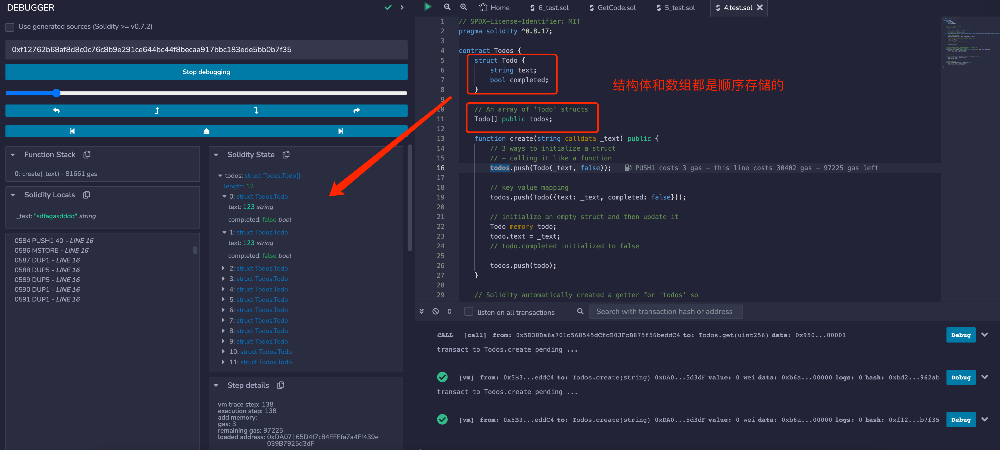</img>
</div>

#### Data Locations - Storage, Memory and Calldata

Variables are declared as either storage, memory or calldata to explicitly specify the location of the data.

- storage - variable is a state variable (store on blockchain)
- memory - variable is in memory and it exists while a function is being called
- calldata - special data location that contains function arguments

```js
// SPDX-License-Identifier: MIT
pragma solidity ^0.8.17;

contract DataLocations {
    uint[] public arr;
    mapping(uint => address) map;
    struct MyStruct {
        uint foo;
    }
    mapping(uint => MyStruct) myStructs;

    function f() public {
        // call _f with state variables
        _f(arr, map, myStructs[1]);

        // get a struct from a mapping
        MyStruct storage myStruct = myStructs[1];
        // create a struct in memory
        MyStruct memory myMemStruct = MyStruct(0);
    }

    function _f(
        uint[] storage _arr,
        mapping(uint => address) storage _map,
        MyStruct storage _myStruct
    ) internal {
        // do something with storage variables
    }

    // You can return memory variables
    function g(uint[] memory _arr) public returns (uint[] memory) {
        // do something with memory array
    }

    function h(uint[] calldata _arr) external {
        // do something with calldata array
    }
}
```

#### Function Modifier

Modifiers are code that can be run before and / or after a function call.

Modifiers can be used to:

- Restrict access
- Validate inputs
- Guard against reentrancy hack

```js
// SPDX-License-Identifier: MIT
pragma solidity ^0.8.17;

contract FunctionModifier {
    // We will use these variables to demonstrate how to use
    // modifiers.
    address public owner;
    uint public x = 10;
    bool public locked;

    constructor() {
        // Set the transaction sender as the owner of the contract.
        owner = msg.sender;
    }

    // Modifier to check that the caller is the owner of
    // the contract.
    modifier onlyOwner() {
        require(msg.sender == owner, "Not owner");
        // Underscore is a special character only used inside
        // a function modifier and it tells Solidity to
        // execute the rest of the code.
        _;
    }

    // Modifiers can take inputs. This modifier checks that the
    // address passed in is not the zero address.
    modifier validAddress(address _addr) {
        require(_addr != address(0), "Not valid address");
        _;
    }

    function changeOwner(address _newOwner) public onlyOwner validAddress(_newOwner) {
        owner = _newOwner;
    }

    // Modifiers can be called before and / or after a function.
    // This modifier prevents a function from being called while
    // it is still executing.
    modifier noReentrancy() {
        require(!locked, "No reentrancy");

        locked = true;
        _;
        locked = false;
    }

    function decrement(uint i) public noReentrancy {
        x -= i;

        if (i > 1) {
            decrement(i - 1);
        }
    }
}
```


#### Import

You can import local and external files in Solidity.

```sh
├── Import.sol
└── Foo.sol
```

`Foo.sol`
```js
// SPDX-License-Identifier: MIT
pragma solidity ^0.8.17;

struct Point {
    uint x;
    uint y;
}

error Unauthorized(address caller);

function add(uint x, uint y) pure returns (uint) {
    return x + y;
}

contract Foo {
    string public name = "Foo";
}
```

`Import.sol`  
```js
// SPDX-License-Identifier: MIT
pragma solidity ^0.8.17;

// import Foo.sol from current directory
import "./Foo.sol";

// import {symbol1 as alias, symbol2} from "filename";
import {Unauthorized, add as func, Point} from "./Foo.sol";

contract Import {
    // Initialize Foo.sol
    Foo public foo = new Foo();

    // Test Foo.sol by getting it's name.
    function getFooName() public view returns (string memory) {
        return foo.name();
    }
}
```

External
You can also import from GitHub by simply copying the url

```js
// https://github.com/owner/repo/blob/branch/path/to/Contract.sol
import "https://github.com/owner/repo/blob/branch/path/to/Contract.sol";

// Example import ECDSA.sol from openzeppelin-contract repo, release-v4.5 branch
// https://github.com/OpenZeppelin/openzeppelin-contracts/blob/release-v4.5/contracts/utils/cryptography/ECDSA.sol
import "https://github.com/OpenZeppelin/openzeppelin-contracts/blob/release-v4.5/contracts/utils/cryptography/ECDSA.sol";
```


### 数据存储位置
EVM有五个主要的数据位置：
- 存储（Storage）
- 内存（Memory）
- 调用数据（Calldata）
- 堆栈（Stack）
- 代码（Code）

#### 存储（Storage）
在以太坊中，每个特定地址的智能合约都有自己的 `存储`，由一个键值存储组成，将`256`位映射到`256`位。存储中的数据在函数调用和交易之间持续存在。

存储是所有合约状态变量所在的地方。每个合约都有自己的存储。存储中的变量在函数调用之间持续存在。然而，存储空间的使用是相当昂贵的。

由于存储指的是合约存储，它指的是`永久存储`在区块链上的数据。

你可以从/向合约存储中读取和写入。在低层，用于这样做的EVM操作码是`SSTORE`和`SLOAD`。  

```js
contract DataStorage {
    uint[] x = [1,2,3]; // 状态变量：数组 x

    function fStorage() public{
        //声明一个storage的变量 xStorage，指向x。修改xStorage也会影响x
        uint[] storage xStorage = x;
        xStorage[0] = 100;
    }
}
```
<br>
<div align=center>
  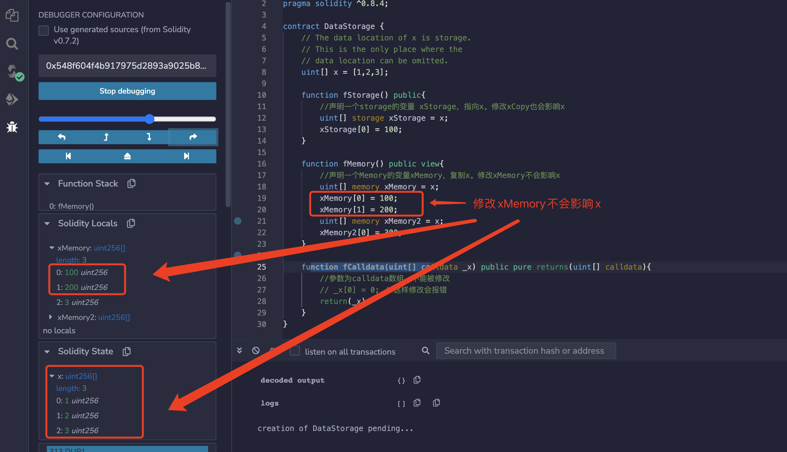</img>
</div>


#### 内存（Memory）
EVM 内存是用来保存`临时值`的，在外部函数调用之间被擦除。然而，它的使用成本比较低。

在EVM中，内存是易失性的，是特定合约（环境）的上下文。这意味着，当执行环境从一个合约变为另一个合约时，“白板/写字板”被清除。在每一个新的消息调用中，都会获得一个新的被清除的内存实例。

因此，内存变量是暂时的。它们在对其他合约的外部函数调用之间被擦除。  

你可以从/到EVM内存中读取和写入。在低层，用于从/向内存读写的EVM操作码是`MLOAD`, `MSTORE`, 和`MSTORE8`。

某些EVM操作码，如 `CALL`、`DELEGATECALL`或 `STATICCALL` 从EVM内存中消耗其参数。

storage赋值给memory，会创建独立的复本，修改其中一个不会影响另一个；反之亦然。例子：  
```js
// SPDX-License-Identifier: GPL-3.0
pragma solidity >=0.4.0 <0.8.0;
contract DataStorage {
    uint[] x = [1,2,3]; // 状态变量：数组 x
    
    function fMemory() public view{
        //声明一个Memory的变量xMemory，复制x。修改xMemory不会影响x
        uint[] memory xMemory = x;
        xMemory[0] = 100;
        xMemory[1] = 200;

        uint[] memory xMemory2 = x;
        xMemory2[0] = 300;
    }
}
```
<br>
<div align=center>
  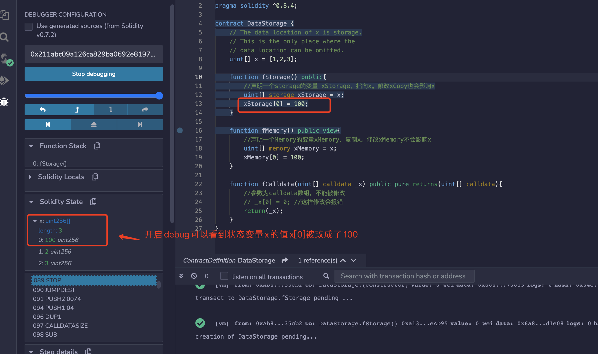</img>
</div>

#### 调用数据（Calldata）

calldata相当于从船上或卡车上取出的一个`集装箱`。这些集装箱包含送到工厂进行加工的材料。Calldata是`只读的`。

calldata是交易的`数据`或外部函数调用的`参数`所在的位置。它是一个只读的数据位置。你不能写到它。

Calldata的行为主要类似于内存，是一个可由字节编址的空间。你必须为你想读取的字节数指定一个准确的字节偏移。

在低层，可用于从calldata读取的EVM操作码是`CALLDATALOAD`, `CALLDATASIZE`和`CALLDATACOPY`。  

```sh
[
	"0x1ab06ee500000000000000000000000000000000000000000000000000000000000000030000000000000000000000000000000000000000000000000000000000000005"
]

拆分为32字节
0x1ab06ee5
0000000000000000000000000000000000000000000000000000000000000003
0000000000000000000000000000000000000000000000000000000000000005
```

#### 堆栈（Stack）

堆栈是用来存放小型局部变量的。它的使用几乎是免费的（用Gas很低），但大小有限，能容纳的项目数量也有限。

堆栈是大多数在函数内部创建的局部变量所在的地方。它是EVM的一个重要部分。

在低层，可以用来对堆栈进行操作的EVM操作码，包括`PUSH`、`POP`、`SWAP`和`DUP`指令。大多数其他的EVM操作码从堆栈中消耗数据（通过从堆栈中取出），并将结果推回堆栈中。

```js
// SPDX-License-Identifier: GPL-3.0
pragma solidity >=0.4.0 <0.8.0;
contract A {
    uint x;

    function set(uint a, uint b) public {
        uint z = a + b;
        x = z + 1;
    }

    function get() public view returns (uint) {
        return x;
    }
}
```

<br>
<div align=center>
  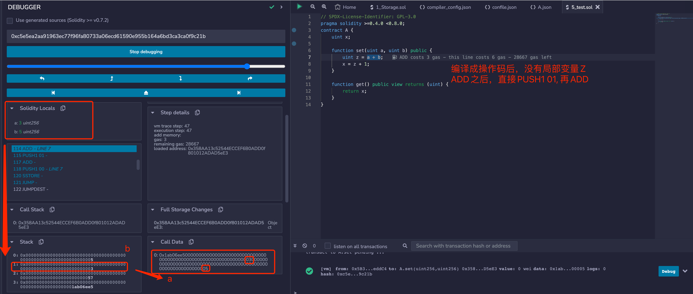</img>
</div>

#### 代码（Code）
代码指的是合约的字节码。你只能从合约字节码中读取，而不能写到它。通常是你在Solidity中定义为 `constant` 的变量。大多数的EVM操作码从堆栈中消耗它们的参数。

字节码包含了很多关于合约的信息和逻辑，包括调度器，以及合约元数据。

在低层，从智能合约的代码中读取的EVM操作码是`CODESIZE`和`CODECOPY`及操作码`EXTERNALCODESIZE`和`EXTERNALCODECOPY`。   

```js
// SPDX-License-Identifier: GPL-3.0
pragma solidity >=0.4.0 <0.8.0;
contract A {
    uint x;
    uint256 public constant MAX_VALUE = 100;

    function set(uint a, uint b) public {
        uint z = a + b;
        x = z + 1;
    }

    function get() public view returns (uint) {
        return x;
    }

    function getC() public view returns (uint) {
        return MAX_VALUE;
    }
}
```

虽然`constant`变量相当于字节码，但是运行时，仍在再状态变量区域加载

<br>
<div align=center>
  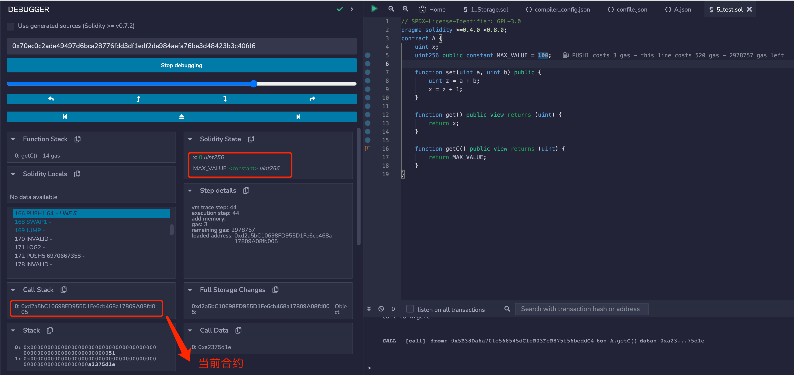</img>
</div>

### 状态变量储存结构
静态大小的`变量`（除 映射`mapping` 和`动态数组`之外的所有类型）都从位置 0 开始连续放置在 存储storage 中。如果可能的话，存储大小少于 32 字节的多个变量会被打包到一个 存储插槽`storage slot` 中，规则如下：  
- 存储插槽`storage slot`的第一项会以低位对齐（即右对齐）的方式储存。
- 基本类型仅使用存储它们所需的字节。
- 如果 存储插槽`storage slot` 中的剩余空间不足以储存一个基本类型，那么它会被移入下一个 存储插槽`storage slot` 。
- 结构体（`struct`）和`数组`数据总是会占用一整个新插槽（但结构体或数组中的各项，都会以这些规则进行打包）。  


对于使用`继承`的合约，状态变量的排序由`C3`线性化合约顺序（ 顺序从最基类合约开始）确定。如果上述规则成立，那么来自不同的合约的状态变量会共享一个 存储插槽`storage slot` 。

结构体和数组中的`成员变量`会存储在一起，就像它们在显式声明中的一样。  

#### 映射和动态数组
由于 映射`mapping` 和`动态数组`的大小是不可预知的，他们使用 `Keccak-256` 哈希计算来找到值的位置或数组的起始位置。 这些起始位置本身的数值总是会占满堆栈插槽。

映射`mapping` 或`动态数组`本身会根据上述规则来在某个位置 `p` 处占用一个（未填充的）存储中的插槽（或递归地将该规则应用到 映射`mapping` 的 映射`mapping` 或`数组`的`数组`）。 对于`动态数组`，此插槽中会存储数组中元素的数量（字节数组和字符串除外）。

`4_test.sol`  
```js
// SPDX-License-Identifier: GPL-3.0
pragma solidity >=0.4.0 <0.8.0;
contract A {
    struct S {
        uint128 a;
        uint128 b;
        uint[2] staticArray;
        uint[] dynArray;
    }

    uint x;
    uint y;
    S s;
    address addr;
    mapping (uint => mapping (address => bool)) map;
    uint[] array;
    string s1;
    bytes b1;

    function set(uint data) public {
        y = data;
    }

    function get() public view returns (uint) {
        return y;
    }
}
```

使用Remix编译时，可以通过build-info中的json文件，查看存储布局
```json
"storageLayout": {
	"storage": [
		{
			"astId": 15,
			"contract": "contracts/4.test.sol:A",
			"label": "x",
			"offset": 0,
			"slot": "0",
			"type": "t_uint256"
		},
		{
			"astId": 17,
			"contract": "contracts/4.test.sol:A",
			"label": "y",
			"offset": 0,
			"slot": "1",
			"type": "t_uint256"
		},
		{
			"astId": 19,
			"contract": "contracts/4.test.sol:A",
			"label": "s",
			"offset": 0,
			"slot": "2",
			"type": "t_struct(S)13_storage"
		},
		{
			"astId": 21,
			"contract": "contracts/4.test.sol:A",
			"label": "addr",
			"offset": 0,
			"slot": "6",
			"type": "t_address"
		},
		{
			"astId": 27,
			"contract": "contracts/4.test.sol:A",
			"label": "map",
			"offset": 0,
			"slot": "7",
			"type": "t_mapping(t_uint256,t_ma(t_address,t_bool))"
		},
		{
			"astId": 30,
			"contract": "contracts/4.test.sol:A",
			"label": "array",
			"offset": 0,
			"slot": "8",
			"type": "t_array(t_uint256)dyn_storage"
		},
		{
			"astId": 32,
			"contract": "contracts/4.test.sol:A",
			"label": "s1",
			"offset": 0,
			"slot": "9",
			"type": "t_string_storage"
		},
		{
			"astId": 34,
			"contract": "contracts/4.test.sol:A",
			"label": "b1",
			"offset": 0,
			"slot": "10",
			"type": "t_bytes_storage"
		}
	],
	"types": {
		"t_address": {
			"encoding": "inplace",
			"label": "address",
			"numberOfBytes": "20"
		},
		"t_array(t_uint256)2_storage": {
			"base": "t_uint256",
			"encoding": "inplace",
			"label": "uint256[2]",
			"numberOfBytes": "64"
		},
		"t_array(t_uint256)dyn_storage": {
			"base": "t_uint256",
			"encoding": "dynamic_array",
			"label": "uint256[]",
			"numberOfBytes": "32"
		},
		"t_bool": {
			"encoding": "inplace",
			"label": "bool",
			"numberOfBytes": "1"
		},
		"t_bytes_storage": {
			"encoding": "bytes",
			"label": "bytes",
			"numberOfBytes": "32"
		},
		"t_mapping(t_address,t_bool)": {
			"encoding": "mapping",
			"key": "t_address",
			"label": "mapping(address => bool)",
			"numberOfBytes": "32",
			"value": "t_bool"
		},
		"t_mapping(t_uint256,t_mapping(t_address,t_bool{
			"encoding": "mapping",
			"key": "t_uint256",
			"label": "mapping(uint256 => mapping(addresbool))",
			"numberOfBytes": "32",
			"value": "t_mapping(t_address,t_bool)"
		},
		"t_string_storage": {
			"encoding": "bytes",
			"label": "string",
			"numberOfBytes": "32"
		},
		"t_struct(S)13_storage": {
			"encoding": "inplace",
			"label": "struct A.S",
			"members": [
				{
					"astId": 3,
					"contract": "contracts/4.test.sol:A",
					"label": "a",
					"offset": 0,
					"slot": "0",
					"type": "t_uint128"
				},
				{
					"astId": 5,
					"contract": "contracts/4.test.sol:A",
					"label": "b",
					"offset": 16,
					"slot": "0",
					"type": "t_uint128"
				},
				{
					"astId": 9,
					"contract": "contracts/4.test.sol:A",
					"label": "staticArray",
					"offset": 0,
					"slot": "1",
					"type": "t_array(t_uint256)2_storage"
				},
				{
					"astId": 12,
					"contract": "contracts/4.test.sol:A",
					"label": "dynArray",
					"offset": 0,
					"slot": "3",
					"type": "t_array(t_uint256)dyn_storage"
				}
			],
			"numberOfBytes": "128"
		},
		"t_uint128": {
			"encoding": "inplace",
			"label": "uint128",
			"numberOfBytes": "16"
		},
		"t_uint256": {
			"encoding": "inplace",
			"label": "uint256",
			"numberOfBytes": "32"
		}
	}
},
```

通过调试查看查看内存布局:  


<br>
<div align=center>
  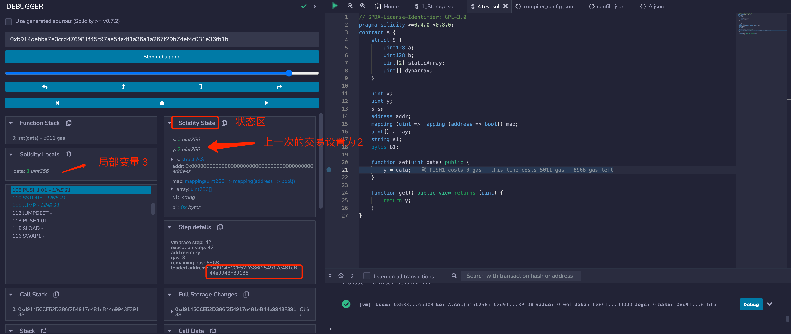</img>
</div>


### Solidity 汇编

Solidity 定义了一种`汇编语言`，在没有 Solidity 的情况下也可以使用。这种汇编语言也可以嵌入到 Solidity 源代码中当作`内联汇编`使用。 

下面例子展示了一个库合约的代码，它可以取得另一个合约的代码，并将其加载到一个 `bytes` 变量中。 这对于“常规 Solidity”来说是根本不可能的，汇编库合约则可以通过这种方式来增强语言特性。  

```js
// SPDX-License-Identifier: GPL-3.0
pragma solidity ^0.4.0;

library GetCode {
    function at(address _addr) public view returns (bytes o_code) {
        assembly {
            // 获取代码大小，这需要汇编语言
            let size := extcodesize(_addr)
            // 分配输出字节数组 – 这也可以不用汇编语言来实现
            // 通过使用 o_code = new bytes（size）
            o_code := mload(0x40)
            // 包括补位在内新的“memory end”
            mstore(0x40, add(o_code, and(add(add(size, 0x20), 0x1f), not(0x1f))))
            // 把长度保存到内存中
            mstore(o_code, size)
            // 实际获取代码，这需要汇编语言
            extcodecopy(_addr, add(o_code, 0x20), 0, size)
        }
    }
}
```

> 符号`^`代表向上兼容  

```js
// SPDX-License-Identifier: GPL-3.0
pragma solidity ^0.4.0;

import {GetCode} from "./libs/GetCode.sol";

contract AssemblyTest {
    event Log(bytes); 

    function getAddr(address addr) public {
        emit Log(GetCode.at(addr));
    }
}
```

> 编译版本 0.4.16  

打印的日志
```json
[
    {
        "logIndex":1,
        "blockNumber":5,
        "blockHash":"0x93809258f741fe17c4fc783cc8c2c68a6b731144c10fecb3155b23fc054e01c9",
        "transactionHash":"0xff54d01b80d010dab623fc52c63a813805afa0354abb0b2a3b880143c3a5ab25",
        "transactionIndex":0,
        "address":"0x7EF2e0048f5bAeDe046f6BF797943daF4ED8CB47",
        "data":"0x00000000000000000000000000000000000000000000000000000000000000200000000000000000000000000000000000000000000000000000000000000170608060405234801561001057600080fd5b506004361061002b5760003560e01c80632002899014610030575b600080fd5b61003861003a565b005b6060600080548060200260200160405190810160405280929190818152602001828054801561008857602002820191906000526020600020905b815481526020019060010190808311610074575b5050505050905060648160008151811061009e57fe5b60200260200101818152505060c8816001815181106100b957fe5b6020026020010181815250506060600080548060200260200160405190810160405280929190818152602001828054801561011357602002820191906000526020600020905b8154815260200190600101908083116100ff575b5050505050905061012c8160008151811061012a57fe5b602002602001018181525050505056fea264697066735822122046f23e434021dcde659365292cc8d3de6d692ceb9477d941e3be42371556119a64736f6c6343000600003300000000000000000000000000000000",
        "topics":[
            "0xafabcf2dd47e06a477a89e49c03f8ebe8e0a7e94f775b25bbb24227c9d0110b2"
        ],
        "id":"log_971ea4d4"
    }
]
```

### 继承  

```js
// SPDX-License-Identifier: GPL-3.0
pragma solidity ^0.4.0;

contract owned {
    function owned() public { owner = msg.sender; }
    address owner;
}

contract mortal is owned {
    function kill() public {
        if (msg.sender == owner) selfdestruct(owner);
    }
}

contract Base1 is mortal {
    function kill() public { /* 清除操作 1 */ super.kill(); }
}


contract Base2 is mortal {
    function kill() public { /* 清除操作 2 */ super.kill(); }
}

contract Final is Base1, Base2 {
}
```

如果 Base2 调用 super 的函数，它不会简单在其基类合约上调用该函数。 相反，它在最终的继承关系图谱的下一个基类合约中调用这个函数，所以它会调用 Base1.kill() （注意最终的继承序列是——从最远派生合约开始：Final, Base2, Base1, mortal, ownerd）。 在类中使用 super 调用的实际函数在当前类的上下文中是未知的，尽管它的类型是已知的。 这与普通的虚拟方法查找类似。  


### 接口

接口类似于抽象合约，但是它们不能实现任何函数。还有进一步的限制：

- 无法继承其他合约或接口。  
- 无法定义构造函数。  
- 无法定义变量。  
- 无法定义结构体  
- 无法定义枚举。  
- 将来可能会解除这里的某些限制。  

```sh
// SPDX-License-Identifier: GPL-3.0
pragma solidity ^0.4.11;

interface Token {
    function log(string addr) external;
}

contract MyToken is Token {
    event Log(string);

    function log(string addr) external{
        emit Log(addr);
    }
}

contract TokenProxy {

    function proxyLog(address proxy) public {
        Token(proxy).log("MyToken Log");
    }
}
```


打印输出, 表明调用成功了
```sh
[
	{
		"from": "0xddaAd340b0f1Ef65169Ae5E41A8b10776a75482d",
		"topic": "0xcf34ef537ac33ee1ac626ca1587a0a7e8e51561e5514f8cb36afa1c5102b3bab",
		"event": "Log",
		"args": {
			"0": "MyToken Log"
		}
	}
]
```


### 调用其他合约

#### 通过接口调用
```js
// SPDX-License-Identifier: GPL-3.0
pragma solidity ^0.4.24;

//Deployed合约的接口 
interface Deployed { 
	function seta(uint) external;
	function geta() external returns (uint);
}

contract DepA {
    uint a;
    function seta(uint _a) external{
        a = _a;
    }

    function geta() external view returns (uint){
        return a;
    }
}

contract Existing { 
	Deployed dc; 

	constructor(address t) public { 
		dc = Deployed(t); 
	}

	function getA() public returns (uint result) {
		return dc.geta();
	}

	function setA(uint _val) public {
		dc.seta(_val);
	}
}
```  


如果随便传入一个合约地址，就会报错:
```sh
CALL
[call]from: 0x5B38Da6a701c568545dCfcB03FcB875f56beddC4to: Existing.getA()data: 0xd46...300fd
call to Existing.getA errored: VM error: revert.

revert
	The transaction has been reverted to the initial state.
Note: The called function should be payable if you send value and the value you send should be less than your current balance.
Debug the transaction to get more information.
transact to Existing.setA pending ... 
transact to Existing.setA errored: VM error: revert.

revert
	The transaction has been reverted to the initial state.
Note: The called function should be payable if you send value and the value you send should be less than your current balance.
Debug the transaction to get more information.
```

如果传入的是`DepA`的地址，是可以调用正确的，这里就像Go的继承一样，没有必要声明继承关系，只要走路像鸭子就行。也就是只要方法相同，就可以直接调用。  

#### 使用call，delegatecall

| 调用方式 | 修改storage | 调用者的msg.sender | 被调用的msg.sender | 执行的上下文 | 推荐 |
| --- | --- | --- | --- | --- | --- |
| call | 修改被调用者的合约storage | 交易的发起者地址 | 调用者地址 |在被调用者里 | 是 | 
| callcode | 修改调用者的合约storage |  调用者地址 | 调用者地址 |在调用者里 | 否 | 
| delegatecall | 修改调用者的合约storage | 交易的发起者地址 | 调用者地址 | 在调用者里  |  是 | 

```js
// SPDX-License-Identifier: GPL-3.0
pragma solidity ^0.4.18;

contract ExistingWithoutABI {
    address dc;

    constructor(address _t) public {
        dc = _t;
    }

    function setASignature(uint256 val) public returns (bool success) {
        require(dc.call(bytes4(keccak256("setA(uint256)")), val));
        return true;
    }
}
```

填写`Existing`的地址，使用`setASignature`设置后，再使用`Existing`的`getA`方法查看，正确调用的。  


[Solidity by Example - delegatecall](https://solidity-by-example.org/delegatecall/)  
```js
// SPDX-License-Identifier: MIT
pragma solidity ^0.8.17;

// NOTE: Deploy this contract first
contract B {
    // NOTE: storage layout must be the same as contract A
    uint public num;
    address public sender;
    uint public value;

    function setVars(uint _num) public payable {
        num = _num;
        sender = msg.sender;
        value = msg.value;
    }
}

contract A {
    uint public num;
    address public sender;
    uint public value;

    function setVars(address _contract, uint _num) public payable {
        // A's storage is set, B is not modified.
        (bool success, bytes memory data) = _contract.delegatecall(
            abi.encodeWithSignature("setVars(uint256)", _num)
        );
    }
}
```


修改的storage都是合约A中的，一下是调试的结果  

<br>
<div align=center>
  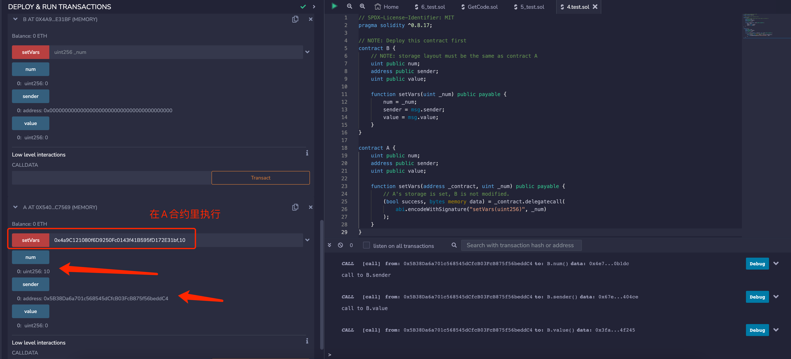</img>
</div>

### Using For

```sh
using A for B
```

> 可用于在合约的上下文中，将库函数（来自库A）`附加`到任何类型（B）  

```js
// SPDX-License-Identifier: GPL-3.0
pragma solidity ^0.4.16;

library Search {
    function indexOf(uint[] storage self, uint value)
        public
        view
        returns (uint)
    {
        for (uint i = 0; i < self.length; i++)
            if (self[i] == value) return i;
        return uint(-1);
    }
}

contract C {
    using Search for uint[];
    uint[] data;

    function append(uint value) public {
        data.push(value);
    }

    function replace(uint _old, uint _new) public {
        // 执行库函数调用
        uint index = data.indexOf(_old);
        if (index == uint(-1))
            data.push(_new);
        else
            data[index] = _new;
    }
}
```

### 交易回滚  

这里通过分析`交易回滚攻击`来学些交易回滚的知识  

- 原理分析
以太坊 EVM 支持交易回滚，合约可以使不满足条件的调用失败，从而回滚部分或者整个交易。

- 交易回滚
使用 `assert()`，`require()` 和 `revert()` 可以使不满足条件的调用失败，配合 `try`，`catch` 可以回滚部分或者整个交易。

- 回滚攻击
如果业务合约允许合约调用或者调用了第三方合约，那么合约调用和第三方合约就可以利用交易回滚，撤销不符合自己期望的执行结果，从而达成攻击的目的。

示例

这是一个简单的 NFT 合约示例，它的功能是购买 NFT。如果你看不出合约的问题，说明你正需要学习这节课。(这个合约有巨大漏洞，请不要直接使用在任何实际业务中)  

```js
// SPDX-License-Identifier: GPL-3.0
pragma solidity ^0.8.12;

import "@openzeppelin/contracts/token/ERC721/ERC721.sol";

interface INFT {
    function buyNFT() external payable;
}

contract NFT is ERC721 {
    uint256 tokenId;

    constructor() ERC721("NFT","NFT") {}

    function buyNFT() external payable {
        require(msg.value >= 1 ether, "NFT: You must pay 1 ether to buy an NFT");
        _safeMint(msg.sender, tokenId++);
    }
}

contract TransactionRollbackAttack {
    INFT nft;
    uint256 tokenId;

    constructor(address _nft) {
        nft = INFT(_nft);
    }

    function doBuyNFT(uint256 _tokenId) external payable {
        tokenId = _tokenId;
        nft.buyNFT{value: msg.value}();
    }

    function onERC721Received(
        address operator,
        address from,
        uint256 _tokenId,
        bytes calldata data
    ) external returns (bytes4) {
        require(tokenId == _tokenId, "NFT: not the correct token");
        return this.onERC721Received.selector;
    }
}
```

- TransactionRollbackAttack 部署时，把NFT作为构造函数参数  
- 选择向合约发送 1 ETH，点击 `TransactionRollbackAttack`的`doBuyNFT`方法，参数输入`0`,点击`transact`,看日志是成功购买 `tokenId` 为 `0` 的 NFT。  
- 选择向合约发送 1 ETH，点击 `TransactionRollbackAttack` 合约的 `doBuyNFT` 方法，参数输入 0，购买 tokenId 为 0 的 NFT 失败

购买tokenId=0的NFT成功日志  
```sh
[
	{
		"from": "0xd9145CCE52D386f254917e481eB44e9943F39138",
		"topic": "0xddf252ad1be2c89b69c2b068fc378daa952ba7f163c4a11628f55a4df523b3ef",
		"event": "Transfer",
		"args": {
			"0": "0x0000000000000000000000000000000000000000",
			"1": "0xd8b934580fcE35a11B58C6D73aDeE468a2833fa8",
			"2": "0",
			"from": "0x0000000000000000000000000000000000000000",
			"to": "0xd8b934580fcE35a11B58C6D73aDeE468a2833fa8",
			"tokenId": "0"
		}
	}
]
```


修复问题-`禁止合约调用`  
```js
modifier noContract() {
    require(tx.origin == msg.sender, "NFT: not contract");
}

function buyNFT() noContract external payable {
    require(msg.value >= 1 ether, "NFT: You must pay 1 ether to buy an NFT");
    _safeMint(msg.sender, tokenId++);
}
```


