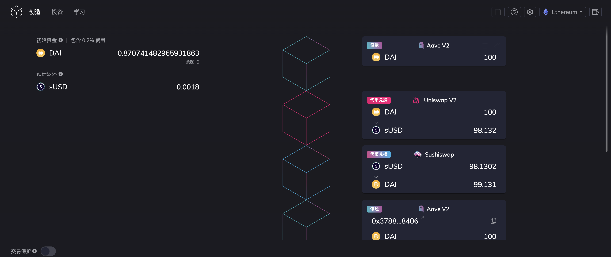

- ## flash-loan  

## 参考文章
- [aave performing a flash loan ](https://docs.aave.com/developers/v/1.0/tutorials/performing-a-flash-loan)  
- [Create Flashloan Combo on Furucombo](https://medium.com/furucombo/create-flashloan-combo-on-furucombo-c7c3b23267f0)  

## Furucombo
### [Learn](https://docs.furucombo.app/) 

`Furucombo` 从为终端用户构建的工具开始，只需通过`拖放`即可优化他们的 `DeFi` 策略，可帮助您优化您的加密财富。  
- `投资模式` 轻松探索和投资富康理财的财富管理农场，让我们帮助您充分利用您的资金。  
- `创建模式` 它将复杂的 `DeFi` 协议可视化为立方体。 用户设置输入/输出和    

### 展示
```sh
Rate difference: 20+%
1 DAI = 0.9927 sUSD on Kyberswap
1 DAI = 0.8057 sUSD on Uniswap
👉🏻 Buy low sell high: Buy sUSD on Uniswap and sell it on Kyberswap
```

现在您找到了速率差异，让我们开始创建组合。完整的组合应该是这样的：

```sh
1️⃣ Borrow 100DAI from Flashloan
2️⃣ Swap 100DAI to 122.83649sUSD on Uniswap
3️⃣ Swap 122.83649sUSD to 122.83429DAI on Kyberswap
4️⃣ Repay 100.09DAI to Flashloan
5️⃣ You keep 22.74429DAI profit.
```

<br>
<div align=center>
  </img>
</div>

## Remix Flash Loan Demo  
[Remix Flash Loan Demo](https://docs.aave.com/developers/v/1.0/tutorials/performing-a-flash-loan/...-with-remix ) 

### 编写自己的合约  
首先，你需要创建一个你将调用的新合约，它将被 `Aave` 协议的`LendingPool`合约调用。这可以是两个单独的合约，但是为了便于理解，我们将把这些功能合并到一个合约中。  

在 Remix 中，添加一个新文件并命名为 `MyFlashloanContract.sol`，并向其中添加以下代码：  

```js
pragma solidity ^0.6.6;

import "https://github.com/aave/flashloan-box/blob/Remix/contracts/aave/FlashLoanReceiverBase.sol";
import "https://github.com/aave/flashloan-box/blob/Remix/contracts/aave/ILendingPoolAddressesProvider.sol";
import "https://github.com/aave/flashloan-box/blob/Remix/contracts/aave/ILendingPool.sol";

contract Flashloan is FlashLoanReceiverBase {
    constructor(address _addressProvider) FlashLoanReceiverBase(_addressProvider) public {}

    // Rest of your code goes here
}
```


`Remix` 能够直接从 `Github` 导入 `solidity` 源文件。在前 3 行中，我们导入了与 `Aave` 协议交互所必需的文件。您可以通过直接在 Github 中访问这些文件来单独查看它们。  

在第 8 行，我们将构造函数参数传递给继承的`FlashLoanReceiverBase`合约，它确定`LendingPoolAddressProvider`在部署合约的网络上使用哪个。  

您将在`LendingPoolAddressProvider`通过 `Remix` 部署插件在部署时传递相关值。


### 调用您的闪贷功能  

`flashloan` 将开启闪电贷流程，并确保只有所有者才能调用该函数。  

```js
pragma solidity ^0.6.6;

import "https://github.com/aave/flashloan-box/blob/Remix/contracts/aave/FlashLoanReceiverBase.sol";
import "https://github.com/aave/flashloan-box/blob/Remix/contracts/aave/ILendingPoolAddressesProvider.sol";
import "https://github.com/aave/flashloan-box/blob/Remix/contracts/aave/ILendingPool.sol";

contract Flashloan is FlashLoanReceiverBase {

    constructor(address _addressProvider) FlashLoanReceiverBase(_addressProvider) public {}

    /**
        Flash loan 1000000000000000000 wei (1 ether) worth of `_asset`
     */
    function flashloan(address _asset) public onlyOwner {
        bytes memory data = "";
        uint amount = 1 ether;

        ILendingPool lendingPool = ILendingPool(addressesProvider.getLendingPool());
        lendingPool.flashLoan(address(this), _asset, amount, data);
    }
}
```


### 使用闪电贷的金额执行你的操作  

现在，已经从闪电贷带出金额，相当于有存款了。

```js
pragma solidity ^0.6.6;

import "https://github.com/aave/flashloan-box/blob/Remix/contracts/aave/FlashLoanReceiverBase.sol";
import "https://github.com/aave/flashloan-box/blob/Remix/contracts/aave/ILendingPoolAddressesProvider.sol";
import "https://github.com/aave/flashloan-box/blob/Remix/contracts/aave/ILendingPool.sol";

contract Flashloan is FlashLoanReceiverBase {

    constructor(address _addressProvider) FlashLoanReceiverBase(_addressProvider) public {}

    /**
        This function is called after your contract has received the flash loaned amount
     */
    function executeOperation(
        address _reserve,
        uint256 _amount,
        uint256 _fee,
        bytes calldata _params
    )
        external
        override
    {
        require(_amount <= getBalanceInternal(address(this), _reserve), "Invalid balance, was the flashLoan successful?");

        //
        // Your logic goes here.
        // !! Ensure that *this contract* has enough of `_reserve` funds to payback the `_fee` !!
        //

        uint totalDebt = _amount.add(_fee);
        transferFundsBackToPoolInternal(_reserve, totalDebt);
    }

    /**
        Flash loan 1000000000000000000 wei (1 ether) worth of `_asset`
     */
    function flashloan(address _asset) public onlyOwner {
        bytes memory data = "";
        uint amount = 1 ether;

        ILendingPool lendingPool = ILendingPool(addressesProvider.getLendingPool());
        lendingPool.flashLoan(address(this), _asset, amount, data);
    }
}
```

> 现在`LendingPool`将会调用`executeOperation`方法，并传入参数  

在结束之前，你必须归还借入的资金，否则导致交易回滚。  

### 编译并部署你的合约  

通过Remix编译并部署合约。

### 调用你的合约  

如果已经部署合约，需要发送一定的`DAI`到你的合约地址。  

接着 `flashloan()`使用足够的gas费调用你的函数，如果成功，你的合约将成功接收并偿还闪电贷。   


### swap  
#### Uniswap 
DeFi 原理: Dex Swap 交易实现  

Uniswap V2 交换

通过 Swap 让精确数量的输入TokenA, 获得尽可能多的输出TokenB.
```js
 // SPDX-License-Identifier: MIT
pragma solidity ^0.8.13;


// 完成一个 Swap 合约, 调用 Uniswap 的 Router 合约接口实现 
contract ACswap {

    // 已经部署在 区块链上的 Router 地址: https://rinkeby.etherscan.io/address/0x7a250d5630B4cF539739dF2C5dAcb4c659F2488D
    address private constant UNISWAP_V2_ROUTER =
        0x7a250d5630B4cF539739dF2C5dAcb4c659F2488D;

    // 已经部署在 区块链上的 WETH 地址: 
    address private constant WETH = 0xc778417E063141139Fce010982780140Aa0cD5Ab;

    // 交易 Token A -> Token B
    function swap(
        address _tokenIn,
        address _tokenOut,
        uint _amountIn,
        uint _amountOutMin,
        address _to
    ) external {

        IERC20(_tokenIn).approve(address(this), _amountIn);

        // 1. 将 Token A 转入 此合约
        IERC20(_tokenIn).transferFrom(msg.sender, address(this), _amountIn);
        // 2. 授权 Token A 给 uniswap 的 router , 让其可以交换使用这部分Token A 
        IERC20(_tokenIn).approve(UNISWAP_V2_ROUTER, _amountIn);

        // 3. 交易路径设置:  最简单的路径 是  A -> WETH -> B 
        address[] memory path;
        if (_tokenIn == WETH || _tokenOut == WETH) {
            // 如果其中一个Token 是 WETH 那么, 只需要两段路由 
            path = new address[](2);
            path[0] = _tokenIn;
            path[1] = _tokenOut;

        } else {
            // 否则, 就是三段路由, 通过WETH转换 
            path = new address[](3);
            path[0] = _tokenIn;
            path[1] = WETH;
            path[2] = _tokenOut;
        }

        // 具体交易, 走 Uniswap Router 路由 
        IUniswapV2Router(UNISWAP_V2_ROUTER).swapExactTokensForTokens(
            _amountIn,
            _amountOutMin,  // 最小数量, 一般无要求 我们设置为 0 或 1
            path,
            _to,
            block.timestamp
        );
    }
}


// Router 接口 
interface IUniswapV2Router {

    // 主要交易函数 
    function swapExactTokensForTokens(
        uint amountIn,
        uint amountOutMin,
        address[] calldata path,
        address to,
        uint deadline
    ) external returns (uint[] memory amounts);
}


// ERC20 接口
interface IERC20 {
    function totalSupply() external view returns (uint);

    function balanceOf(address account) external view returns (uint);

    function transfer(address recipient, uint amount) external returns (bool);

    function allowance(address owner, address spender) external view returns (uint);

    // 授权 Token 
    function approve(address spender, uint amount) external returns (bool);

    // 转移 Token 
    function transferFrom(
        address sender,
        address recipient,
        uint amount
    ) external returns (bool);
}
```


https://docs.uniswap.org/contracts/v3/guides/swaps/multihop-swaps  


#### paraswap  

https://developers.paraswap.network/api/examples

```js
export async function getSwapTransaction({
  srcToken: srcTokenSymbol,
  destToken: destTokenSymbol,
  srcAmount: _srcAmount,
  networkID,
  slippage = SLIPPAGE,
  ...rest
}: GetSwapTxInput): Promise<TransactionParams> {
  try {
    const srcToken = getToken(srcTokenSymbol, networkID);
    const destToken = getToken(destTokenSymbol, networkID);

    const srcAmount = new BigNumber(_srcAmount)
      .times(10 ** srcToken.decimals)
      .toFixed(0);

    const ps = createSwapper(networkID, API_URL);

    const priceRoute = await ps.getRate({
      srcToken,
      destToken,
      srcAmount
    });

    const minAmount = new BigNumber(priceRoute.destAmount)
      .times(1 - slippage / 100)
      .toFixed(0);

    const transactionRequest = await ps.buildSwap({
      srcToken,
      destToken,
      srcAmount,
      minAmount,
      priceRoute,
      ...rest
    });

    console.log("TransactionRequest", transactionRequest);

    return transactionRequest;
  } catch (error) {
    console.error(error.response.data);
    throw new Error(error.response.data.error);
  }
}

export const getExampleSwapTransaction = () =>
  getSwapTransaction({
    srcAmount: "1",
    srcToken: "MATIC",
    destToken: "WBTC",
    networkID: Networks.POLYGON,
    userAddress: USER_ADDRESS
  });
```


#### sushiswap


## 疑问及拓展
### 矿池(Pools)  

矿池（英文：Mining Pool），最早指`比特币矿池`，后来泛指`POW`矿池，目前更发展出`POC`矿池。

在加密货币挖矿的背景下，挖矿池是由矿工在网络共享其处理能力的资源池，以根据他们为找到区块的可能性贡献的工作量平均分配奖励。向出示有效的部分工作量证明的矿池成员授予“份额”。当采矿的难度增加到缓慢的采矿者可能需要几个世纪才能形成块的程度时，才开始在池中采矿。

截止2021年12月，全球算力前三的比特币矿池为AntPool、F2Pool、ViaBTC。全球约七成算力在中国矿工手中。  

> POW（Proof of work工作量证明）——区块链世界最早的共识机制  
> POS（Proof of stake权益证明）——POW强有力的挑战者  
> POC（Proof of capacity容量证明）——即将成为区块链世界受众最多的共识？


