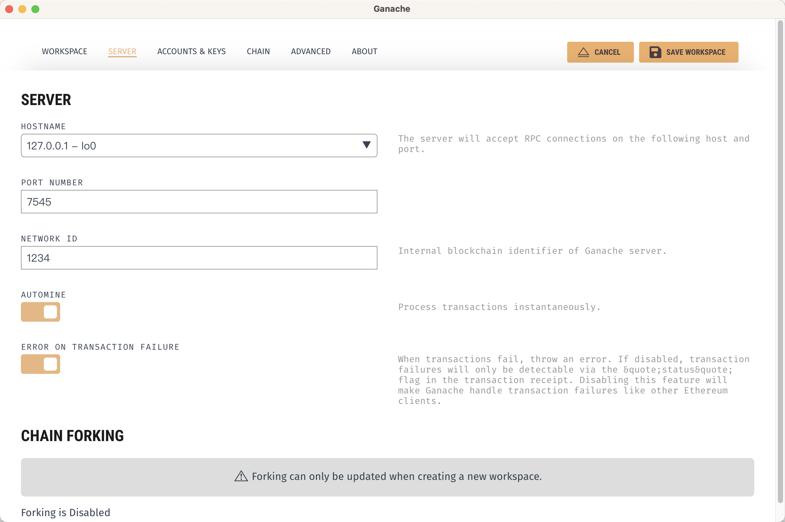
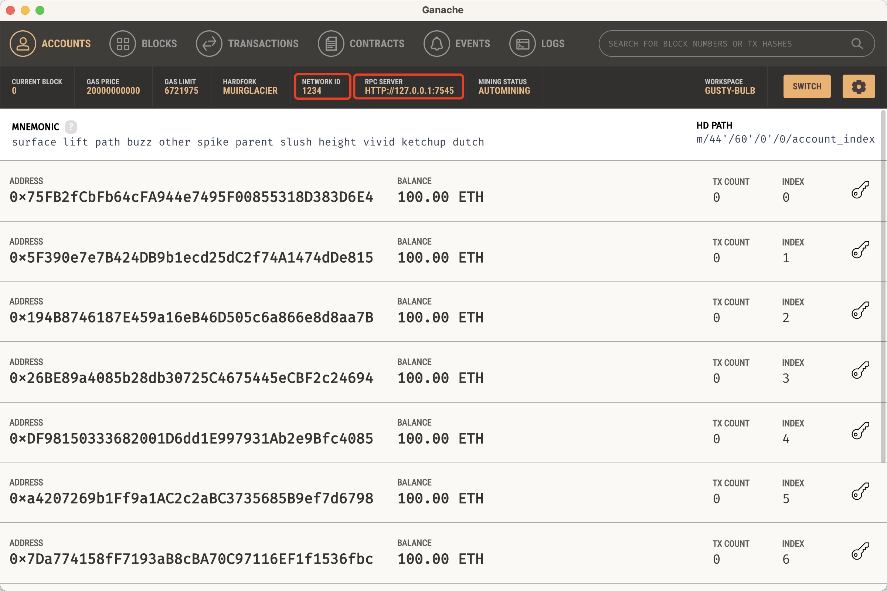
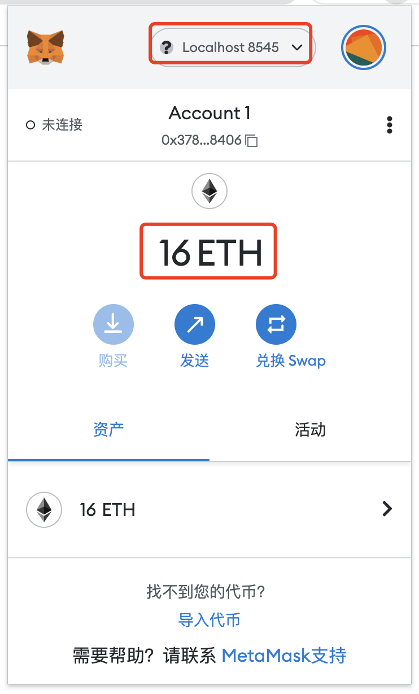
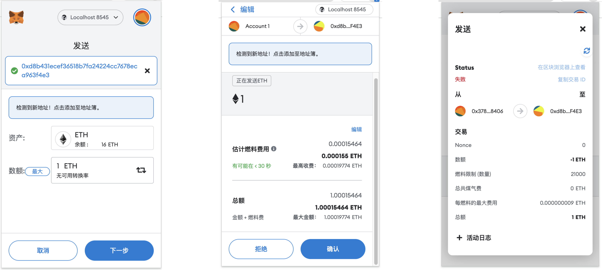
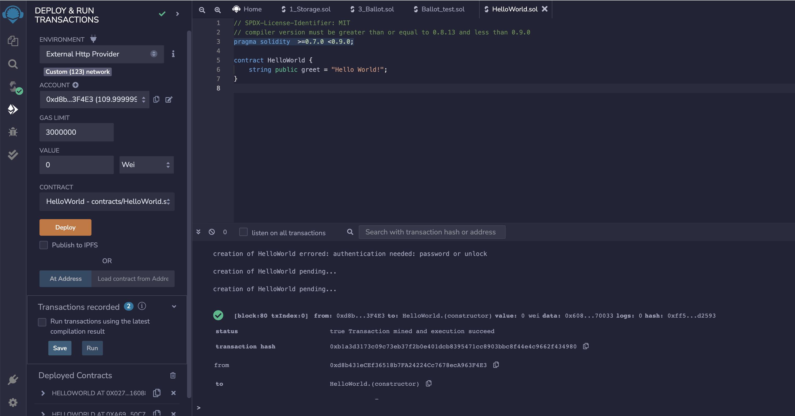
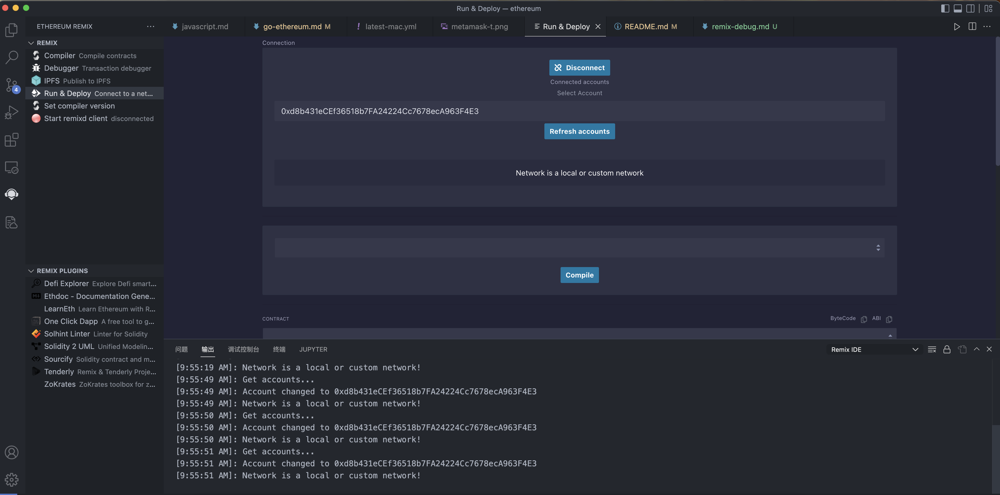
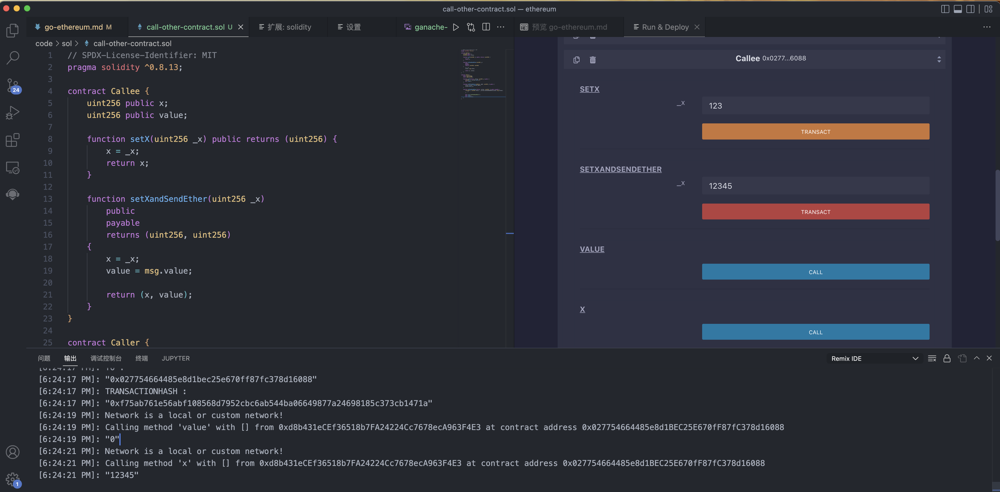

- # go-ethereum

- [安装](#安装)
  - [源码编译](#源码编译)
  - [Ubuntu via PPAs](#ubuntu-via-ppas)
  - [安装包下载](#安装包下载)
- [ganache(快速搭建)](#ganache快速搭建)
- [Geth搭建私有链](#geth搭建私有链)
  - [安装geth](#安装geth)
  - [配置`创世文件 genesis.json`](#配置创世文件-genesisjson)
  - [初始化](#初始化)
  - [创建一个集合节点](#创建一个集合节点)
  - [启动您的成员节点](#启动您的成员节点)
    - [查看账户`eth.accounts`](#查看账户ethaccounts)
    - [创建账户`personal.newAccount`](#创建账户personalnewaccount)
    - [查看账户信息`eth.getBalance`](#查看账户信息ethgetbalance)
  - [命令行操作](#命令行操作)
    - [查看区块个数`eth.blockNumber`](#查看区块个数ethblocknumber)
    - [挖矿`miner.start`](#挖矿minerstart)
    - [`admin.peers`](#adminpeers)
    - [多个节点之间交易](#多个节点之间交易)
    - [交易`eth.sendTransaction`](#交易ethsendtransaction)
  - [通过钱包管理](#通过钱包管理)
    - [Ethereum Wallet and Mist](#ethereum-wallet-and-mist)
    - [MetaMask](#metamask)
    - [Remix App](#remix-app)
    - [vscode debug](#vscode-debug)
- [Solidity及合约](#solidity及合约)
  - [本地编译Remix](#本地编译remix)
  - [合约编写](#合约编写)
  - [合约执行](#合约执行)
  - [交易信息](#交易信息)
  - [使用API调用合约](#使用api调用合约)
    - [`Application Binary Interface`文件生成](#application-binary-interface文件生成)
    - [生成go文件](#生成go文件)
  - [Sol调用其他合约](#sol调用其他合约)
  - [JavaScript Web3 调用合约](#javascript-web3-调用合约)


- #### [https://github.com/ethereum/go-ethereum](https://github.com/ethereum/go-ethereum)  Go语言实现  
- #### [https://github.com/hyperledger/fabric](https://github.com/hyperledger/fabric)  Go语言实现  


## 安装
### 源码编译
```shell
git clone git@github.com:ethereum/go-ethereum.git

# geth
make geth 

# to build the full suite of utilities 
make all
```

### Ubuntu via PPAs
```shell
sudo add-apt-repository -y ppa:ethereum/ethereum

sudo apt-get update
sudo apt-get install ethereum
```

如果已经下载需要更新版本
```bash
sudo apt-get update
sudo apt-get install ethereum
sudo apt-get upgrade geth
```

安装的bin文件
Setting up `rlpdump` (1.10.21+build27994+focal) ...  
Setting up `puppeth` (1.10.21+build27994+focal) ...  
Setting up `clef` (1.10.21+build27994+focal) ...  
Setting up `bootnode` (1.10.21+build27994+focal) ...  
Setting up `geth` (1.10.21+build27994+focal) ...  
Setting up `evm` (1.10.21+build27994+focal) ...  
Setting up `abigen` (1.10.21+build27994+focal) ...  
Setting up `ethereum` (1.10.21+build27994+focal) ...  


### 安装包下载
[https://geth.ethereum.org/downloads/](https://geth.ethereum.org/downloads/)  

## ganache(快速搭建)
[ganache官网](https://trufflesuite.com/ganache/)  

这个可以创建私有链 

<br>
<div align=center>
  </img>
</div>

<br>
<div align=center>
  </img>
</div>


## Geth搭建私有链
### 安装geth
:point_right: [安装方法](#安装)  

也可以下载离线包，添加到环境PATH即可,离线包内容为:  
```shell
COPYING  abigen   bootnode clef     evm      geth     puppeth  rlpdump
```
### 配置`创世文件 genesis.json`
```json
{
  "config": {
    "chainId": <arbitrary positive integer>,
    "homesteadBlock": 0,
    "eip150Block": 0,
    "eip155Block": 0,
    "eip158Block": 0,
    "byzantiumBlock": 0,
    "constantinopleBlock": 0,
    "petersburgBlock": 0,
    "istanbulBlock": 0,
    "berlinBlock": 0,
    "londonBlock": 0
  },
  "alloc": {},
  "coinbase": "0x0000000000000000000000000000000000000000",
  "difficulty": "0x20000",
  "extraData": "",
  "gasLimit": "0x2fefd8",
  "nonce": "0x0000000000000042",
  "mixhash": "0x0000000000000000000000000000000000000000000000000000000000000000",
  "parentHash": "0x0000000000000000000000000000000000000000000000000000000000000000",
  "timestamp": "0x00"
}
```

如果您想预先为某些帐户提供资金以便于测试，请创建帐户并`alloc`使用其地址填充该字段。

```json
"alloc": {
  "0x0000000000000000000000000000000000000001": {
    "balance": "111111111"
  },
  "0x0000000000000000000000000000000000000002": {
    "balance": "222222222"
  }
}
```

最终配置文件如下:
```json
{
	"config": {
		"chainId": 123,
		"homesteadBlock": 0,
		"eip150Block": 0,
		"eip155Block": 0,
		"eip158Block": 0,
		"byzantiumBlock": 0,
		"constantinopleBlock": 0,
		"petersburgBlock": 0,
		"istanbulBlock": 0,
		"berlinBlock": 0,
		"londonBlock": 0
	},
	"alloc": {},
	"coinbase": "0x0000000000000000000000000000000000000000",
	"difficulty": "0x20000",
	"extraData": "",
	"gasLimit": "0x2fefd8",
	"nonce": "0x0000000000000042",
	"mixhash": "0x0000000000000000000000000000000000000000000000000000000000000000",
	"parentHash": "0x0000000000000000000000000000000000000000000000000000000000000000",
	"timestamp": "0x00"
}
```

### 初始化
```shell
geth --datadir data init genesis.json
```

初始化输出
```shell
INFO [08-12|17:30:43.367] Maximum peer count                       ETH=50 LES=0 total=50
INFO [08-12|17:30:43.369] Smartcard socket not found, disabling    err="stat /run/pcscd/pcscd.comm: no such file or directory"
INFO [08-12|17:30:43.376] Set global gas cap                       cap=50,000,000
INFO [08-12|17:30:43.378] Allocated cache and file handles         database=/root/.ethereum/geth/chaindata cache=16.00MiB handles=16
INFO [08-12|17:30:43.415] Opened ancient database                  database=/root/.ethereum/geth/chaindata/ancient readonly=false
INFO [08-12|17:30:43.416] Writing custom genesis block 
INFO [08-12|17:30:43.416] Persisted trie from memory database      nodes=3 size=399.00B time="70.652µs" gcnodes=0 gcsize=0.00B gctime=0s livenodes=1 livesize=0.00B
INFO [08-12|17:30:43.417] Freezer shutting down 
INFO [08-12|17:30:43.417] Successfully wrote genesis state         database=chaindata                              hash=6ab19c..97db44
INFO [08-12|17:30:43.417] Allocated cache and file handles         database=/root/.ethereum/geth/lightchaindata    cache=16.00MiB handles=16
INFO [08-12|17:30:43.434] Opened ancient database                  database=/root/.ethereum/geth/lightchaindata/ancient readonly=false
INFO [08-12|17:30:43.435] Writing custom genesis block 
INFO [08-12|17:30:43.435] Persisted trie from memory database      nodes=3 size=399.00B time="54.665µs" gcnodes=0 gcsize=0.00B gctime=0s livenodes=1 livesize=0.00B
INFO [08-12|17:30:43.435] Successfully wrote genesis state         database=lightchaindata                         hash=6ab19c..97db44
```

初始化并创建数据库

> 如果本地已经创建，可以删除数据`geth removedb`  

```shell
$ geth removedb                                  
INFO [08-14|11:42:39.420] Maximum peer count                       ETH=50 LES=0 total=50
INFO [08-14|11:42:39.422] Set global gas cap                       cap=50,000,000
Remove full node state database (/Users/ymm/Library/Ethereum/geth/chaindata)? [y/n] y
Remove full node state database (/Users/ymm/Library/Ethereum/geth/chaindata)? [y/n] y
INFO [08-14|11:42:42.620] Database successfully deleted            path=/Users/ymm/Library/Ethereum/geth/chaindata elapsed=4.043ms
Remove full node ancient database (/Users/ymm/Library/Ethereum/geth/chaindata/ancient)? [y/n] y
Remove full node ancient database (/Users/ymm/Library/Ethereum/geth/chaindata/ancient)? [y/n] y
INFO [08-14|11:42:45.504] Database successfully deleted            path=/Users/ymm/Library/Ethereum/geth/chaindata/ancient elapsed=5.639ms
INFO [08-14|11:42:45.504] Light node database missing              path=/Users/ymm/Library/Ethereum/geth/lightchaindata
```

### 创建一个集合节点

```shell
bootnode --genkey=boot.key
bootnode --nodekey=boot.key
```

查看`boot.ket`
```shell
4ebf6df1dd94b40f6e7486a558531c0b2ddca05b34e9bc46640fd95553c3afa6
```

启动日志
```shell
# bootnode --nodekey=boot.key
enode://644204e69a456937bafce4fe7a7609c485d8902e571bb8ea86f73108ecb7e0ea430865669bf8e62c3cb138bbd91194bca8b924898ac1382b4443015b1866f4d9@127.0.0.1:0?discport=30301
Note: you're using cmd/bootnode, a developer tool.
We recommend using a regular node as bootstrap node for production deployments.
INFO [08-12|17:33:43.570] New local node record                    seq=1,660,296,823,568 id=cc7190d45564ac73 ip=<nil> udp=0 tcp=0
```

当 bootnode 在线时，它将显示一个`enode` `URL` ，其他节点可以使用它来连接它并交换对等点信息。确保将显示的 IP 地址信息（很可能[::]）替换为您的外部可访问 IP 以获取实际`enodeURL`。  

> 您也可以使用成熟的geth节点作为引导节点，但这是不太推荐的方式。  

这里的url就是`enode://644204e69a456937bafce4fe7a7609c485d8902e571bb8ea86f73108ecb7e0ea430865669bf8e62c3cb138bbd91194bca8b924898ac1382b4443015b1866f4d9@127.0.0.1:0?discport=30301`  


### 启动您的成员节点
在引导节点可操作且外部可访问的情况下（您可以尝试 `telnet <ip> <port>`确保它确实可访问），启动 `geth` 指向引导节点的每个后续节点以通过`--bootnodes`标志进行对等发现。可能还需要将您的专用网络的数据目录分开，因此还要指定一个自定义`--datadir`标志。

```shell
geth --datadir=path/to/custom/data/folder --bootnodes=<bootnode-enode-url-from-above>
```

也可以使用
```shell
geth --datadir=path/to/custom/data/folder --networkid=  
```

执行指令
```shell
geth --datadir data/ --networkid 123 --port 3100 --nodiscover
```

启动rpc
```shell
geth --datadir data/ --networkid 123 --port 3100 --nodiscover --http --http.api web3,eth,debug,personal,net --vmdebug --allow-insecure-unlock 
```

增加链浏览器
```shell
geth --datadir data/ --networkid 123 --port 3100 --nodiscover --http --http.api web3,eth,debug,personal,net --vmdebug --allow-insecure-unlock --http.corsdomain "http://localhost:8000"
```

geth版本变更时，参数变更:
```shell
--rpc => --http
--rpcapi => --http.api
--rpccorsdomain => --http.corsdomain
```

变更结果`INFO [08-25|15:14:52.435] HTTP server started                      endpoint=127.0.0.1:8545 auth=false prefix= cors=http://localhost:8000 vhosts=localhost`

> `console`  命令行启动,可以直接交互  
> 如果不是交互模式，找到`data/geth.ipc`, 通过`geth attach ipc:data/geth.ipc`,可以使用的模块有:  

- admin
- debug
- engine
- eth
- ethash
- miner
- personal
- rpc
- txpool
- web3

> 交互控制就是JS控制台  

attach日志
```shell
# geth attach ipc:node1/geth.ipc
Welcome to the Geth JavaScript console!

instance: Geth/v1.10.21-stable-67109427/linux-amd64/go1.18.4
at block: 0 (Thu Jan 01 1970 08:00:00 GMT+0800 (CST))
 datadir: /root/work/ethereum/node1
 modules: admin:1.0 debug:1.0 engine:1.0 eth:1.0 ethash:1.0 miner:1.0 net:1.0 personal:1.0 rpc:1.0 txpool:1.0 web3:1.0

To exit, press ctrl-d or type exit
```

启动日志
```shell
INFO [08-13|17:02:17.746] Starting Geth on Ethereum mainnet... 
INFO [08-13|17:02:17.747] Bumping default cache on mainnet         provided=1024 updated=4096
INFO [08-13|17:02:17.748] Maximum peer count                       ETH=50 LES=0 total=50
INFO [08-13|17:02:17.751] Smartcard socket not found, disabling    err="stat /run/pcscd/pcscd.comm: no such file or directory"
WARN [08-13|17:02:17.757] Sanitizing cache to Go's GC limits       provided=4096 updated=1308
INFO [08-13|17:02:17.758] Set global gas cap                       cap=50,000,000
INFO [08-13|17:02:17.759] Allocated trie memory caches             clean=196.00MiB dirty=327.00MiB
INFO [08-13|17:02:17.761] Allocated cache and file handles         database=/root/work/ethereum/data/geth/chaindata cache=653.00MiB handles=524,288
INFO [08-13|17:02:17.788] Opened ancient database                  database=/root/work/ethereum/data/geth/chaindata/ancient readonly=false
INFO [08-13|17:02:17.788] Writing default main-net genesis block 
INFO [08-13|17:02:18.176] Persisted trie from memory database      nodes=12356 size=1.78MiB time=71.751864ms gcnodes=0 gcsize=0.00B gctime=0s livenodes=1 livesize=0.00B
```

然后循环提示一下信息
```shell
INFO [08-13|17:07:59.453] State sync in progress                   synced=0.00% state=3.99MiB   accounts=1376@331.22KiB slots=13681@2.72MiB   codes=629@966.38KiB eta=8456h2m13.746s
INFO [08-13|17:08:01.569] Imported new block headers               count=192 elapsed=42.729ms  number=4416 hash=25a7e2..a7d61a age=7y1mo2w
INFO [08-13|17:08:01.571] Imported new block receipts              count=47  elapsed=38.743ms  number=410  hash=d83833..7aa4ff age=7y1mo2w  size=20.97KiB
INFO [08-13|17:08:03.166] Looking for peers                        peercount=1 tried=31 static=0
```

data目录结构
```shell
├── data
│   ├── geth
│   │   ├── chaindata
│   │   │   ├── 000001.log
│   │   │   ├── ancient
│   │   │   │   ├── bodies.0000.cdat
│   │   │   │   ├── bodies.cidx
│   │   │   │   ├── bodies.meta
│   │   │   │   ├── diffs.0000.rdat
│   │   │   │   ├── diffs.meta
│   │   │   │   ├── diffs.ridx
│   │   │   │   ├── FLOCK
│   │   │   │   ├── hashes.0000.rdat
│   │   │   │   ├── hashes.meta
│   │   │   │   ├── hashes.ridx
│   │   │   │   ├── headers.0000.cdat
│   │   │   │   ├── headers.cidx
│   │   │   │   ├── headers.meta
│   │   │   │   ├── receipts.0000.cdat
│   │   │   │   ├── receipts.cidx
│   │   │   │   └── receipts.meta
│   │   │   ├── CURRENT
│   │   │   ├── LOCK
│   │   │   ├── LOG
│   │   │   └── MANIFEST-000000
│   │   ├── ethash
│   │   │   ├── cache-R23-0000000000000000
│   │   │   └── cache-R23-290decd9548b62a8
│   │   ├── jwtsecret
│   │   ├── LOCK
│   │   ├── nodekey
│   │   ├── nodes
│   │   │   ├── 000001.log
│   │   │   ├── CURRENT
│   │   │   ├── LOCK
│   │   │   ├── LOG
│   │   │   └── MANIFEST-000000
│   │   ├── transactions.rlp
│   │   └── triecache
│   │       ├── data.0.bin
│   │       ├── data.1.bin
│   │       └── metadata.bin
│   └── keystore
```

#### 查看账户`eth.accounts`
```shell
> eth.accounts
[]
```

#### 创建账户`personal.newAccount`

```shell
# 创建账户, 123456是密码
> personal.newAccount("123456")
INFO [08-13|17:34:41.328] Looking for peers                        peercount=0 tried=6  static=0
INFO [08-13|17:34:41.377] Your new key was generated               address=0x160781b56FF6E366e8B41F1ef910Eb3c90B46D13
WARN [08-13|17:34:41.377] Please backup your key file!             path=/root/work/ethereum/data/keystore/UTC--2022-08-13T09-34-39.377406787Z--160781b56ff6e366e8b41f1ef910eb3c90b46d13
WARN [08-13|17:34:41.377] Please remember your password! 
"0x160781b56ff6e366e8b41f1ef910eb3c90b46d13"
```

keyfile
```json
{
	"address": "160781b56ff6e366e8b41f1ef910eb3c90b46d13",
	"crypto": {
		"cipher": "aes-128-ctr",
		"ciphertext": "c420c847549b683a60f12558dd8a16466479fe7a6aee51973896bf12d00d7796",
		"cipherparams": {
			"iv": "3ef50abb93c294729bd3a36e28d08474"
		},
		"kdf": "scrypt",
		"kdfparams": {
			"dklen": 32,
			"n": 262144,
			"p": 1,
			"r": 8,
			"salt": "126d5d3a2d7fa1cd6678d90b141121cdd2c099c5a8cdc0899945d601e583003f"
		},
		"mac": "c3a1e4eae1910bb024ab722b735cee3058f6e97e975734433e631fd5ad696636"
	},
	"id": "1a2af59f-0857-4159-a573-72cfdb6c49fc",
	"version": 3
}
```

最后是公钥`0x160781b56ff6e366e8b41f1ef910eb3c90b46d13`  

#### 查看账户信息`eth.getBalance`
```shell
> eth.getBalance("0x160781b56ff6e366e8b41f1ef910eb3c90b46d13")
0
```


### 命令行操作 
#### 查看区块个数`eth.blockNumber`
```shell
> eth.blockNumber
0
```

#### 挖矿`miner.start`
```shell
> miner.start()

# 过一会手动停止
> miner.stop()
```

打印信息
```shell
INFO [08-14|17:52:12.096] Commit new sealing work                  number=1 sealhash=2ebac1..19cd2e uncles=0 txs=0 gas=0 fees=0 elapsed="542.164µs"
INFO [08-14|17:52:12.096] Commit new sealing work                  number=1 sealhash=2ebac1..19cd2e uncles=0 txs=0 gas=0 fees=0 elapsed="829.805µs"
INFO [08-14|17:52:12.749] Successfully sealed new block            number=1 sealhash=2ebac1..19cd2e hash=08637f..dea52c elapsed=652.847ms
INFO [08-14|17:52:12.749] 🔨 mined potential block                  number=1 hash=08637f..dea52c
INFO [08-14|17:52:12.749] Commit new sealing work                  number=2 sealhash=fddd08..6e292f uncles=0 txs=0 gas=0 fees=0 elapsed="353.867µs"
INFO [08-14|17:52:12.750] Commit new sealing work                  number=2 sealhash=fddd08..6e292f uncles=0 txs=0 gas=0 fees=0 elapsed="945.385µs"
INFO [08-14|17:52:13.127] Successfully sealed new block            number=2 sealhash=fddd08..6e292f hash=ed4b07..d61838 elapsed=378.047ms
INFO [08-14|17:52:13.128] 🔨 mined potential block                  number=2 hash=ed4b07..d61838
INFO [08-14|17:52:13.129] Commit new sealing work                  number=3 sealhash=bc06ea..75efbe uncles=0 txs=0 gas=0 fees=0 elapsed="446.811µs"
INFO [08-14|17:52:13.130] Commit new sealing work                  number=3 sealhash=bc06ea..75efbe uncles=0 txs=0 gas=0 fees=0 elapsed=1.085ms
INFO [08-14|17:52:15.336] Successfully sealed new block            number=3 sealhash=bc06ea..75efbe hash=67c33d..a45c84 elapsed=2.207s
INFO [08-14|17:52:15.336] 🔨 mined potential block                  number=3 hash=67c33d..a45c84
INFO [08-14|17:52:15.337] Commit new sealing work                  number=4 sealhash=1cd772..ac1ff2 uncles=0 txs=0 gas=0 fees=0 elapsed="297.746µs"
INFO [08-14|17:52:15.337] Commit new sealing work                  number=4 sealhash=1cd772..ac1ff2 uncles=0 txs=0 gas=0 fees=0 elapsed="468.251µs"
INFO [08-14|17:52:17.583] Successfully sealed new block            number=4 sealhash=1cd772..ac1ff2 hash=652926..0d449e elapsed=2.245s
INFO [08-14|17:52:17.583] 🔨 mined potential block                  number=4 hash=652926..0d449e
INFO [08-14|17:52:17.583] Commit new sealing work                  number=5 sealhash=d54b1e..5a9eeb uncles=0 txs=0 gas=0 fees=0 elapsed="250.564µs"
INFO [08-14|17:52:17.584] Commit new sealing work                  number=5 sealhash=d54b1e..5a9eeb uncles=0 txs=0 gas=0 fees=0 elapsed="709.186µs"
INFO [08-14|17:52:18.580] Looking for peers                        peercount=2 tried=130 static=0
INFO [08-14|17:52:20.664] Successfully sealed new block            number=5 sealhash=d54b1e..5a9eeb hash=b2534e..41cca9 elapsed=3.080s
INFO [08-14|17:52:20.664] 🔨 mined potential block                  number=5 hash=b2534e..41cca9
INFO [08-14|17:52:20.664] Commit new sealing work                  number=6 sealhash=041235..662389 uncles=0 txs=0 gas=0 fees=0 elapsed="206.314µs"
INFO [08-14|17:52:20.665] Commit new sealing work                  number=6 sealhash=041235..662389 uncles=0 txs=0 gas=0 fees=0 elapsed="501.492µs"
INFO [08-14|17:52:20.712] Successfully sealed new block            number=6 sealhash=041235..662389 hash=081f4c..980c6c elapsed=48.142ms
INFO [08-14|17:52:20.712] 🔨 mined potential block                  number=6 hash=081f4c..980c6c
INFO [08-14|17:52:20.713] Commit new sealing work                  number=7 sealhash=64135e..91e586 uncles=0 txs=0 gas=0 fees=0 elapsed="205.802µs"
INFO [08-14|17:52:20.713] Commit new sealing work                  number=7 sealhash=64135e..91e586 uncles=0 txs=0 gas=0 fees=0 elapsed="482.088µs"
INFO [08-14|17:52:25.895] Successfully sealed new block            number=7 sealhash=64135e..91e586 hash=087452..42e15f elapsed=5.181s
INFO [08-14|17:52:25.895] 🔨 mined potential block                  number=7 hash=087452..42e15f
INFO [08-14|17:52:25.895] Commit new sealing work                  number=8 sealhash=b1c024..a9da80 uncles=0 txs=0 gas=0 fees=0 elapsed="188.795µs"
INFO [08-14|17:52:25.896] Commit new sealing work                  number=8 sealhash=b1c024..a9da80 uncles=0 txs=0 gas=0 fees=0 elapsed="834.275µs"
INFO [08-14|17:52:26.988] Successfully sealed new block            number=8 sealhash=b1c024..a9da80 hash=ffb84d..794d30 elapsed=1.092s
INFO [08-14|17:52:26.988] 🔗 block reached canonical chain          number=1 hash=08637f..dea52c
INFO [08-14|17:52:26.988] 🔨 mined potential block                  number=8 hash=ffb84d..794d30
```

查看区块信息:
```shell
> eth.blockNumber
8
> eth.accounts
["0xa32662696e6d7c3a3348141daaf642605c7e8fca"]
> eth.getBalance(eth.accounts[0])
16000000000000000000
# 转换成ether
> web3.fromWei(16000000000000000000,'ether')
"16"
```

####  `admin.peers`
```shell
> admin.peers
[{
    caps: ["diff/1", "eth/65", "eth/66", "eth/67", "snap/1"],
    enode: "enode://eb57103f1ddd58cb13d40d5b45b6c05a91e6748b195c9886c390e123fd1643ace03a4b0ce04bfc1cdb9a997ff670c0980a8005aa0449a2b784085d9425857dd0@54.155.229.0:30311",
    id: "3cd20ccf82586affc7ec52652a7bd2e659c2001567a18a0103792992af075497",
    name: "Geth/v1.1.11-70d08a57/linux-amd64/go1.16.10",
    network: {
      inbound: false,
      localAddress: "10.211.55.10:44354",
      remoteAddress: "54.155.229.0:30311",
      static: false,
      trusted: false
    },
    protocols: {
      eth: "handshake",
      snap: "handshake"
    }
}]
> admin.peers
[]
```

#### 多个节点之间交易  
创建另个一节点:  
```shell
geth --datadir data2 init genesis.json
```

输出日志
```shell
root@matrix:~/work/ethereum# geth --datadir data2 init genesis.json
INFO [08-14|18:52:06.151] Maximum peer count                       ETH=50 LES=0 total=50
INFO [08-14|18:52:06.153] Smartcard socket not found, disabling    err="stat /run/pcscd/pcscd.comm: no such file or directory"
INFO [08-14|18:52:06.156] Set global gas cap                       cap=50,000,000
INFO [08-14|18:52:06.158] Allocated cache and file handles         database=/root/work/ethereum/data2/geth/chaindata cache=16.00MiB handles=16
INFO [08-14|18:52:06.198] Opened ancient database                  database=/root/work/ethereum/data2/geth/chaindata/ancient readonly=false
INFO [08-14|18:52:06.198] Writing custom genesis block 
INFO [08-14|18:52:06.199] Persisted trie from memory database      nodes=3 size=399.00B time="59.575µs" gcnodes=0 gcsize=0.00B gctime=0s livenodes=1 livesize=0.00B
INFO [08-14|18:52:06.200] Successfully wrote genesis state         database=chaindata                                hash=6ab19c..97db44
INFO [08-14|18:52:06.200] Allocated cache and file handles         database=/root/work/ethereum/data2/geth/lightchaindata cache=16.00MiB handles=16
INFO [08-14|18:52:06.226] Opened ancient database                  database=/root/work/ethereum/data2/geth/lightchaindata/ancient readonly=false
INFO [08-14|18:52:06.226] Writing custom genesis block 
INFO [08-14|18:52:06.227] Persisted trie from memory database      nodes=3 size=399.00B time="72.35µs"  gcnodes=0 gcsize=0.00B gctime=0s livenodes=1 livesize=0.00B
INFO [08-14|18:52:06.227] Successfully wrote genesis state         database=lightchaindata                           hash=6ab19c..97db44
```

启动第二个节点
```shell
geth --datadir data2/ --networkid 123 --port 3200 --nodiscover --authrpc.port 8552 --verbosity 5
```

macos指令`geth --datadir data2/ --networkid 123 --port 3200 --nodiscover --verbosity 5`  

启动日志
```shell
INFO [08-14|19:01:23.168] Disk storage enabled for ethash caches   dir=/root/work/ethereum/data2/geth/ethash count=3
INFO [08-14|19:01:23.168] Disk storage enabled for ethash DAGs     dir=/root/.ethash                         count=2
INFO [08-14|19:01:23.168] Initialising Ethereum protocol           network=123 dbversion=8
INFO [08-14|19:01:23.169] Loaded most recent local header          number=0 hash=6ab19c..97db44 td=131,072 age=53y4mo2w
INFO [08-14|19:01:23.169] Loaded most recent local full block      number=0 hash=6ab19c..97db44 td=131,072 age=53y4mo2w
INFO [08-14|19:01:23.169] Loaded most recent local fast block      number=0 hash=6ab19c..97db44 td=131,072 age=53y4mo2w
INFO [08-14|19:01:23.170] Loaded local transaction journal         transactions=0 dropped=0
INFO [08-14|19:01:23.170] Regenerated local transaction journal    transactions=0 accounts=0
INFO [08-14|19:01:23.170] Gasprice oracle is ignoring threshold set threshold=2
WARN [08-14|19:01:23.170] Unclean shutdown detected                booted=2022-08-14T18:53:52+0800 age=7m31s
WARN [08-14|19:01:23.170] Unclean shutdown detected                booted=2022-08-14T18:55:35+0800 age=5m48s
WARN [08-14|19:01:23.170] Unclean shutdown detected                booted=2022-08-14T18:55:52+0800 age=5m31s
WARN [08-14|19:01:23.170] Unclean shutdown detected                booted=2022-08-14T18:57:22+0800 age=4m1s
WARN [08-14|19:01:23.170] Engine API enabled                       protocol=eth
WARN [08-14|19:01:23.170] Engine API started but chain not configured for merge yet 
INFO [08-14|19:01:23.170] Starting peer-to-peer node               instance=Geth/v1.10.21-stable-67109427/linux-amd64/go1.18.4
INFO [08-14|19:01:23.188] New local node record                    seq=1,660,474,432,570 id=088c3bc19542e630 ip=127.0.0.1 udp=0 tcp=3101
INFO [08-14|19:01:23.188] Started P2P networking                   self="enode://febe674e1415e8c2ae949ba06f4dad43da28905161e1e48c636de97c473605b6cb939f9dadaf0f61fe587ae9bce16115df6ae41601fc23f09f9deb340748027e@127.0.0.1:3101?discport=0"
INFO [08-14|19:01:23.189] IPC endpoint opened                      url=/root/work/ethereum/data2/geth.ipc
INFO [08-14|19:01:23.189] Loaded JWT secret file                   path=/root/work/ethereum/data2/geth/jwtsecret crc32=0x5ed23a5d
INFO [08-14|19:01:23.191] WebSocket enabled                        url=ws://127.0.0.1:8552
INFO [08-14|19:01:23.191] HTTP server started                      endpoint=127.0.0.1:8552 auth=true prefix= cors=localhost vhosts=localhost
INFO [08-14|19:01:25.340] Mapped network port                      proto=tcp extport=3101 intport=3101 interface="UPNP IGDv1-IP1"
```

连接节点2
```shell
geth attach ipc:data2/geth.ipc
```

创建两个账户:
```shell
> personal.newAccount("12345678")
"0xd8b431ecef36518b7fa24224cc7678eca963f4e3"
personal.newAccount("12345678")
"0x3efe9c1fea0dd7a4632874f75566a884a00a8a70"
> admin.nodeInfo
{
  enode: "enode://3c68cc389b9600da8d5f8ff2cfe60b2fdc774f676bbcdf63cada90a489ad6a36fcefcf5844c6dbe4cd5b08c9935a0edc25299ad2d11e19a3f99fd273a5bbcae4@127.0.0.1:3200?discport=0",
  enr: "enr:-Jy4QLg-V7KmDw7uZiy2cWliYSC6l_m6N-b8qjVra4J3JIeRaJJ73b6TDAzGaLyghaQMjs9pLuQjf2PXQDLCTOSn1lOGAYKhO-RYg2V0aMfGhG3BCFmAgmlkgnY0gmlwhH8AAAGJc2VjcDI1NmsxoQI8aMw4m5YA2o1fj_LP5gsv3HdPZ2u832PK2pCkia1qNoRzbmFwwIN0Y3CCDIA",
  id: "6d3e60e32c78f95ab5ac19c0c8a642d18f0ef415658abcd22af51fb3a33f98b1",
  ip: "127.0.0.1",
  listenAddr: "[::]:3200",
  name: "Geth/v1.10.16-stable-20356e57/darwin-amd64/go1.17.5",
  ports: {
    discovery: 0,
    listener: 3200
  },
  protocols: {
    eth: {
      config: {
        berlinBlock: 0,
        byzantiumBlock: 0,
        chainId: 123,
        constantinopleBlock: 0,
        eip150Block: 0,
        eip150Hash: "0x0000000000000000000000000000000000000000000000000000000000000000",
        eip155Block: 0,
        eip158Block: 0,
        homesteadBlock: 0,
        istanbulBlock: 0,
        londonBlock: 0,
        petersburgBlock: 0
      },
      difficulty: 131072,
      genesis: "0x6ab19c9fed11060a0bd11534a277e4e60e8c831c6953b196fc95c867bc97db44",
      head: "0x6ab19c9fed11060a0bd11534a277e4e60e8c831c6953b196fc95c867bc97db44",
      network: 123
    },
    snap: {}
  }
}
```

可以看到data2的节点信息为:`enode://3c68cc389b9600da8d5f8ff2cfe60b2fdc774f676bbcdf63cada90a489ad6a36fcefcf5844c6dbe4cd5b08c9935a0edc25299ad2d11e19a3f99fd273a5bbcae4@127.0.0.1:3200?discport=0`  

可以到`data`中添加`data2`节点  

```shell
> admin.addPeer("enode://3c68cc389b9600da8d5f8ff2cfe60b2fdc774f676bbcdf63cada90a489ad6a36fcefcf5844c6dbe4cd5b08c9935a0edc25299ad2d11e19a3f99fd273a5bbcae4@127.0.0.1:3200?discport=0")
true
> admin.peers
[{
    caps: ["eth/66", "snap/1"],
    enode: "enode://3c68cc389b9600da8d5f8ff2cfe60b2fdc774f676bbcdf63cada90a489ad6a36fcefcf5844c6dbe4cd5b08c9935a0edc25299ad2d11e19a3f99fd273a5bbcae4@127.0.0.1:3200?discport=0",
    id: "6d3e60e32c78f95ab5ac19c0c8a642d18f0ef415658abcd22af51fb3a33f98b1",
    name: "Geth/v1.10.16-stable-20356e57/darwin-amd64/go1.17.5",
    network: {
      inbound: false,
      localAddress: "127.0.0.1:50904",
      remoteAddress: "127.0.0.1:3200",
      static: true,
      trusted: false
    },
    protocols: {
      eth: {
        difficulty: 131072,
        head: "0x6ab19c9fed11060a0bd11534a277e4e60e8c831c6953b196fc95c867bc97db44",
        version: 66
      },
      snap: {
        version: 1
      }
    }
}]
```

> `data2`虽然不能被发现，但是可以被手动添加  

添加成功后，但是`admin.peers`还是为空，增加日志等级`--verbosity 5`,查看错误信息 

```shell
DEBUG[08-14|19:15:52.491] Served admin_addPeer                     reqid=33 duration="214.025µs"
TRACE[08-14|19:15:52.491] Adding static node                       id=088c3bc19542e630 ip=192.168.1.4 added=false
TRACE[08-14|19:15:59.562] Dial error                               id=088c3bc19542e630 addr=192.168.1.4:3101 conn=staticdial err="i/o timeout"
```

> 网上说没有进行`geth init`，直接运行导致。重试`init`也不行  
> macos是可以的，但是没有增加`--authrpc.port 8552`参数启动  

`data`增加`data2`节点后，区块的信息也同步了，账户信息没有同步  

```shell
# data2日志
DEBUG[08-15|19:28:55.809] Inserted new block                       number=3  hash=502b40..5352c6 uncles=0 txs=0 gas=0 elapsed=5.543ms     root=57ddd8..6f7888
DEBUG[08-15|19:28:55.811] Inserted new block                       number=4  hash=278f8c..cbabb8 uncles=0 txs=0 gas=0 elapsed="696.501µs" root=07ab74..0a6853
DEBUG[08-15|19:28:55.811] Inserted new block                       number=5  hash=a68d25..d133d4 uncles=0 txs=0 gas=0 elapsed="330.975µs" root=f70a29..78c584
DEBUG[08-15|19:28:55.811] Inserted new block                       number=6  hash=ecda91..44c4cb uncles=0 txs=0 gas=0 elapsed="298.77µs"  root=ef3869..c54bce
DEBUG[08-15|19:28:55.812] Inserted new block                       number=7  hash=984380..2d5a89 uncles=0 txs=0 gas=0 elapsed="250.667µs" root=cff26d..9dfff7
DEBUG[08-15|19:28:55.812] Inserted new block                       number=8  hash=066aa7..ad2a2a uncles=0 txs=0 gas=0 elapsed="326.279µs" root=3899c3..6abf74
DEBUG[08-15|19:28:55.813] Inserted new block                       number=9  hash=3859de..8b8d0b uncles=0 txs=0 gas=0 elapsed="246.388µs" root=256d02..d70fb6
DEBUG[08-15|19:28:55.813] Inserted new block                       number=10 hash=36ebd9..339bf6 uncles=0 txs=0 gas=0 elapsed="564.083µs" root=2d6ebf..a23316
DEBUG[08-15|19:28:55.814] Inserted new block                       number=11 hash=42b279..322223 uncles=0 txs=0 gas=0 elapsed="326.804µs" root=9fa69c..3b7a2c
DEBUG[08-15|19:28:55.814] Inserted new block                       number=12 hash=192959..0cfd17 uncles=0 txs=0 gas=0 elapsed="413.579µs" root=c8d1e7..c476be
DEBUG[08-15|19:28:55.815] Inserted new block                       number=13 hash=988cfd..c2e562 uncles=0 txs=0 gas=0 elapsed="382.953µs" root=bb4132..7c85cf
DEBUG[08-15|19:28:55.815] Inserted new block                       number=14 hash=15075b..a57623 uncles=0 txs=0 gas=0 elapsed="690.699µs" root=82d1c3..1cc988
DEBUG[08-15|19:28:55.816] Inserted new block                       number=15 hash=77f275..f3d296 uncles=0 txs=0 gas=0 elapsed="376.22µs"  root=6601eb..8da04d
DEBUG[08-15|19:28:55.817] Inserted new block                       number=16 hash=f211c6..a501e9 uncles=0 txs=0 gas=0 elapsed="322.077µs" root=c42f11..fe4b8f
DEBUG[08-15|19:28:55.817] Inserted new block                       number=17 hash=d69556..a7b118 uncles=0 txs=0 gas=0 elapsed="386.215µs" root=552fec..23a1ec
INFO [08-15|19:28:55.817] Imported new chain segment               blocks=15 txs=0 mgas=0.000 elapsed=25.621ms    mgasps=0.000 number=17 hash=d69556..a7b118 dirty=8.06KiB

> eth.blockNumber
18
```

#### 交易`eth.sendTransaction`  
目前`data`节点中有`"0x3741ca16fae9ede70b22e9057c06050de4276ff0"`账户, `data2`中有`"0xd8b431ecef36518b7fa24224cc7678eca963f4e3"` 账号，现在`data`账户向`data2`转账  

```shell
# data
> eth.coinbase
"0x3741ca16fae9ede70b22e9057c06050de4276ff0"

# data
> eth.getBalance("0x3741ca16fae9ede70b22e9057c06050de4276ff0")
36000000000000000000

# data2
> eth.getBalance("0xd8b431ecef36518b7fa24224cc7678eca963f4e3")
0

# data
eth.sendTransaction({
    from: '0x3741ca16fae9ede70b22e9057c06050de4276ff0',
    to: '0xd8b431ecef36518b7fa24224cc7678eca963f4e3',
    value: '16000000000000000000'
})
Error: authentication needed: password or unlock
	at web3.js:6365:37(47)
	at send (web3.js:5099:62(35))
	at <eval>:1:20(10)

# data 需要用密码解锁账户
> personal.unlockAccount("0x3741ca16fae9ede70b22e9057c06050de4276ff0")
Unlock account 0x3741ca16fae9ede70b22e9057c06050de4276ff0
Passphrase:  # 之前创建账号的密码 123456
true
> eth.sendTransaction({
......     from: '0x3741ca16fae9ede70b22e9057c06050de4276ff0',
......     to: '0xd8b431ecef36518b7fa24224cc7678eca963f4e3',
......     value: '16000000000000000000'
...... })
"0xbef9c785f44e37ff82f26b711086461e3bfd6b7b2407fa1c8aef66ef810476f7"

# data 查看交易状态 处于pending状态, 需要挖矿
> txpool.status
{
  pending: 1,
  queued: 0
}
> miner.start()
null
> miner.stop()
null
> eth.blockNumber
30
> txpool.status
{
  pending: 0,
  queued: 0
}

# data2 交易成功
> eth.getBalance("0xd8b431ecef36518b7fa24224cc7678eca963f4e3")
16000000000000000000

# data 扣除一部分手续费
> eth.getBalance("0x3741ca16fae9ede70b22e9057c06050de4276ff0")
43999998338989733000
```

> 之前挖矿的奖励属于当前主账号的`eth.coinbase`  


### 通过钱包管理
#### Ethereum Wallet and Mist
- Ethereum-Wallet-macosx-0-11-1.dmg
- Mist-macosx-0-11-1.dmg


[https://github.com/ethereum/mist](https://github.com/ethereum/mist)  

`geth --datadir data2/ --networkid 123 --port 3200 --nodiscover  --ipcpath /Users/ymm/Library/Ethereum/geth.ipc`  

增加`--ipcpath /Users/ymm/Library/Ethereum/geth.ipc`,  可以通过ipc路径连接  

启动日志
```shell
INFO [08-15|22:12:35.340] IPC endpoint opened                      url=/Users/ymm/Library/Ethereum/geth.ipc
```

启动`Ethereum Wallet`,一直在加载，查看日志`tail -n 200 -f /Users/ymm/Library/Application\ Support/Ethereum\ Wallet/logs/all.log`

命令行启动
```shell
/Applications/Ethereum\ Wallet.app/Contents/MacOS/Ethereum\ Wallet --rpc ~/Library/Ethereum/geth.ipc
```

错误日志
```shell
[2022-08-16T14:44:39.515] [ERROR] main - Couldn't infer if computer automatically syncs time. Error: checkEnabled is not supported on this operating system
    at Object.checkEnabled (/Applications/Ethereum Wallet.app/Contents/Resources/app.asar/node_modules/os-timesync/index.js:97:30)
    at checkTimeSync (/Applications/Ethereum Wallet.app/Contents/Resources/app.asar/main.js:283:14)
    at onReady (/Applications/Ethereum Wallet.app/Contents/Resources/app.asar/main.js:207:3)
    at App.<anonymous> (/Applications/Ethereum Wallet.app/Contents/Resources/app.asar/main.js:168:5)
    at Generator.next (<anonymous>)
    at step (/Applications/Ethereum Wallet.app/Contents/Resources/app.asar/main.js:25:191)
    at /Applications/Ethereum Wallet.app/Contents/Resources/app.asar/main.js:25:361
    at <anonymous>
[2022-08-16T14:44:42.549] [ERROR] ClientBinaryManager - Sanity check failed for Geth Error: Unable to find "1.8.23" in Geth output
    at Promise.resolve.then.then.then (/Applications/Ethereum Wallet.app/Contents/Resources/app.asar/node_modules/ethereum-client-binaries/src/index.js:632:17)
    at <anonymous>
    at process._tickCallback (internal/process/next_tick.js:188:7)
[2022-08-16T14:44:43.615] [INFO] Sockets/2 - Connect to {"path":"/Users/ymm/Library/Ethereum/geth.ipc"}
[2022-08-16T14:44:43.616] [INFO] Sockets/2 - Connected!
[2022-08-16T14:44:45.323] [INFO] (ui: popupWindow) - Meteor starting up...
[2022-08-16T14:44:45.364] [INFO] (ui: popupWindow) - Meteor starting up...
```

> 最新的版本是2018的，已经停止维护了  

#### MetaMask 

启用`http`
```shell
geth --datadir data2/ --networkid 123 --port 3200 --nodiscover --http
```

或者启动后，执行`> admin.startRPC()`  

启动日志:
```shell
WARN [08-16|21:07:15.983] Deprecation warning                      method=admin.StartRPC use-instead=admin.StartHTTP
INFO [08-16|21:07:16.046] HTTP server started                      endpoint=127.0.0.1:8545 prefix= cors= vhosts=localhost
```

使用metamask连接本地网络，使用账户`0x3788C63f6E20FB8acE690d37486d59D3e17d8406`  

从`data`向metamask账户转账  

```shell
> personal.unlockAccount("0x3741ca16fae9ede70b22e9057c06050de4276ff0")
Unlock account 0x3741ca16fae9ede70b22e9057c06050de4276ff0
Passphrase: 
true
> eth.sendTransaction({
    from: '0x3741ca16fae9ede70b22e9057c06050de4276ff0',
    to: '0x3788C63f6E20FB8acE690d37486d59D3e17d8406',
    value: '16000000000000000000'
})
"0x7453ac03d5c5b89880a7492d1bee54a3c22d21fa1ef8999a5fed5452b4cb2c9f"
> miner.start()
null
> miner.stop()
null
```

<br>
<div align=center>
  </img>
</div>

从`MetaMask`节点向`data`账户转账, 但是失败了，我猜可能是`MetaMask`节点没有挖矿的原因  

<br>
<div align=center>
  </img>
</div>


#### Remix App 

[remix-desktop](https://github.com/ethereum/remix-desktop/releases)  

没有权限打开  
```shell
sudo chmod -R 755 /Applications/Remix\ IDE.app
```

启动之后闪退，不知什么原因，使用命令行启动`/Applications/Remix\ IDE.app/Contents/MacOS/Remix\ IDE`  

```shell
dyld: Library not loaded: @rpath/Electron Framework.framework/Electron Framework
  Referenced from: /Applications/Remix IDE.app/Contents/MacOS/Remix IDE
  Reason: no suitable image found.  Did find:
	/Applications/Remix IDE.app/Contents/MacOS/../Frameworks/Electron Framework.framework/Electron Framework: file too short
[1]    32243 abort      /Applications/Remix\ IDE.app/Contents/MacOS/Remix\ IDE
```

解决办法`https://github.com/electron-userland/electron-builder/issues/3674`  

使用解压工具的问题，使用默认工具:`It appears that this only happens if the .zip file is extracted using The Unarchiver.`,换成`Better Zip`就行了:sweat_smile:  

示例
```shell
geth --http --http.corsdomain="https://remix.ethereum.org" --http.api web3,eth,debug,personal,net --vmdebug --datadir <path/to/local/folder/for/test/chain> --dev console
```

修改启动参数
```shell
geth --datadir data2/ --networkid 123 --port 3200 --nodiscover --http --http.api web3,eth,debug,personal,net --vmdebug --allow-insecure-unlock
```

测试合约
```shell
// SPDX-License-Identifier: MIT
// compiler version must be greater than or equal to 0.8.13 and less than 0.9.0
pragma solidity  >=0.7.0 <0.9.0;

contract HelloWorld {
    string public greet = "Hello World!";
}
```

```shell
creation of ReceiverPays errored: authentication needed: password or unlock
```

手动解锁
```shell
> personal.unlockAccount("0xd8b431ecef36518b7fa24224cc7678eca963f4e3")
Unlock account 0xd8b431ecef36518b7fa24224cc7678eca963f4e3
Passphrase: 
GoError: Error: account unlock with HTTP access is forbidden at web3.js:6365:37(47)
	at github.com/ethereum/go-ethereum/internal/jsre.MakeCallback.func1 (native)
	at <eval>:1:24(3)
```

需要增加参数`--allow-insecure-unlock`

在Remix点击`Deploy`, 显示正在等待`creation of HelloWorld pending...`  


查看状态并挖矿    
```shell
> txpool
{
  content: {
    pending: {
      0xd8b431eCEf36518b7FA24224Cc7678ecA963F4E3: {
        0: {...},
        1: {...}
      }
    },
    queued: {}
  },
  inspect: {
    pending: {
      0xd8b431eCEf36518b7FA24224Cc7678ecA963F4E3: {
        0: "contract creation: 0 wei + 200601 gas × 2500052640 wei",
        1: "contract creation: 0 wei + 200601 gas × 2500052640 wei"
      }
    },
    queued: {}
  },
  status: {
    pending: 2,
    queued: 0
  },
  contentFrom: function(),
  getContent: function(callback),
  getInspect: function(callback),
  getStatus: function(callback)
}
> miner.start()
null
> miner.stop()
```

remix部署成功
```shell

[block:80 txIndex:0]from: 0xd8b...3F4E3to: HelloWorld.(constructor)value: 0 weidata: 0x608...70033logs: 0hash: 0xff5...d2593
status	true Transaction mined and execution succeed
transaction hash	0xb1a3d3173c09c73eb37f2b0e401dcb8395471cc8903bbc8f44e4c9662f434980
from	0xd8b431eCEf36518b7FA24224Cc7678ecA963F4E3
to	HelloWorld.(constructor)
gas	200601 gas
transaction cost	200601 gas 
input	0x608...70033
decoded input	{}
decoded output	 - 
logs	[]
val	0 wei
```

<br>
<div align=center>
  </img>
</div>

#### vscode debug

下载`Ethereum Remix`,`solidity`,`solidity debug`插件，点击`Run & Deploy`, 连接本地地址`http://127.0.0.1:8545`  

<br>
<div align=center>
  </img>
</div>


## Solidity及合约 
### 本地编译Remix 
[remix-project](git@github.com:ethereum/remix-project.git)  

install yarn  
```shell
npm install --global yarn

# yarn --version
1.22.19
```

```shell
yarn global add nx
```

编译
```shell
cd remix-project
yarn install
yarn run build:libs // Build remix libs
nx build
nx serve
```

> 编译node版本低,通过安装nvm管理node版本    

安装[nvm](https://github.com/nvm-sh/nvm#troubleshooting-on-macos)  
```shell
curl -o https://raw.githubusercontent.com/nvm-sh/nvm/v0.39.1/install.sh | bash

执行结果:
```shell
$ curl -o- https://raw.githubusercontent.com/nvm-sh/nvm/v0.39.1/install.sh | bash
  % Total    % Received % Xferd  Average Speed   Time    Time     Time  Current
                                 Dload  Upload   Total   Spent    Left  Speed
100 15037  100 15037    0     0   7036      0  0:00:02  0:00:02 --:--:--  7036
=> Downloading nvm from git to '/Users/ymm/.nvm'
=> 正克隆到 '/Users/ymm/.nvm'...
remote: Enumerating objects: 355, done.
remote: Counting objects: 100% (355/355), done.
remote: Compressing objects: 100% (302/302), done.
remote: Total 355 (delta 39), reused 170 (delta 28), pack-reused 0
接收对象中: 100% (355/355), 228.98 KiB | 70.00 KiB/s, 完成.
处理 delta 中: 100% (39/39), 完成.
* （头指针在 FETCH_HEAD 分离）
  master
=> Compressing and cleaning up git repository

=> Appending nvm source string to /Users/ymm/.zshrc
=> Appending bash_completion source string to /Users/ymm/.zshrc
=> You currently have modules installed globally with `npm`. These will no
=> longer be linked to the active version of Node when you install a new node
=> with `nvm`; and they may (depending on how you construct your `$PATH`)
=> override the binaries of modules installed with `nvm`:

/usr/local/lib
├── corepack@0.12.1
├── cross-env@7.0.3
├── ganache-cli@6.12.2
├── grunt-cli@1.4.3
├── pm2@5.1.2
├── solc@0.8.15
├── truffle@5.5.19
└── yarn@1.22.19
=> If you wish to uninstall them at a later point (or re-install them under your
=> `nvm` Nodes), you can remove them from the system Node as follows:

     $ nvm use system
     $ npm uninstall -g a_module

=> Close and reopen your terminal to start using nvm or run the following to use it now:

export NVM_DIR="$HOME/.nvm"
[ -s "$NVM_DIR/nvm.sh" ] && \. "$NVM_DIR/nvm.sh"  # This loads nvm
[ -s "$NVM_DIR/bash_completion" ] && \. "$NVM_DIR/bash_completion"  # This loads nvm bash_completion
```

查看版本
```shell
$ source ~/.bashrc 
$ nvm --version            
0.39.1
```

使用系统自带的
```shell
$ nvm use system
System version of node not found.
```

查看版本
```shell
$ nvm list-remote
v12.22.2   (LTS: Erbium)
v14.17.6   (LTS: Fermium)
...

$ nvm install v10.24.1
$ nvm install v12.22.2
$ nvm install v14.17.6

# 切换版本 tag
$ nvm use v14.17.6
```

```shell
yarn install v1.22.19
[1/5] 🔍  Validating package.json...
error remix-project@0.26.0-dev: The engine "node" is incompatible with this module. Expected version "^14.17.6". Got "12.22.12"
error Found incompatible module.
info Visit https://yarnpkg.com/en/docs/cli/install for documentation about this command.
```

```shell
# 切换版本 tag
$ nvm use v14.17.6
```

编译版本输出
```shell
>  NX  Running target build for 10 project(s):

  - remix-url-resolver
  - remix-ws-templates
  - remix-astwalker
  - remix-lib
  - remix-simulator
  - remix-analyzer
  - remix-solidity
  - remix-debug
  - remix-tests
  - remixd
```

构建
```shell
yarn run build:production
cd remix-project/dist/apps/remix-ide
yarn run serve:production
```

Open `http://127.0.0.1:8080 `in your browser to load Remix IDE locally.  


### 合约编写
[源文件](../code/sol/first-dapp.sol)   

```js
// SPDX-License-Identifier: MIT
pragma solidity >=0.7.0 <0.9.0;

contract Counter {
    uint public count;

    // Function to get the current count
    function get() public view returns (uint) {
        return count;
    }

    // Function to increment count by 1
    function inc() public {
        count += 1;
    }

    // Function to decrement count by 1
    function dec() public {
        // This function will fail if count = 0
        count -= 1;
    }
}
```

部署合约`0x8b3A1C22E6ADFCa111fF07Ab0a06e29B273717b0`  
```shell
11:13:15 AM]: Deploying contract Counter started!
[11:13:15 AM]: Network is a local or custom network!
[11:13:15 AM]: Gas estimate 198390
[11:14:55 AM]: Contract deployed at 0x8b3A1C22E6ADFCa111fF07Ab0a06e29B273717b0
[11:14:55 AM]: Deploying ...
[11:14:55 AM]: Network is a local or custom network!
```

### 合约执行

执行`INC`
输出日志
```shell
[11:24:41 AM]: Send data to method 'inc' with [] from 0xd8b431eCEf36518b7FA24224Cc7678ecA963F4E3 at contract address 0x8b3A1C22E6ADFCa111fF07Ab0a06e29B273717b0
[11:25:09 AM]: BLOCKHASH :
[11:25:09 AM]: "0x4a203269c332d92dc0011d859f02b7d333ebe6fb0ccec6f2909dcbf3ac8e6855"
[11:25:09 AM]: CUMULATIVEGASUSED :
[11:25:09 AM]: 43529
[11:25:09 AM]: EFFECTIVEGASPRICE :
[11:25:09 AM]: "0x3b9aca26"
[11:25:09 AM]: FROM :
[11:25:09 AM]: "0xd8b431ecef36518b7fa24224cc7678eca963f4e3"
[11:25:09 AM]: GASUSED :
[11:25:09 AM]: 43529
[11:25:09 AM]: TO :
[11:25:09 AM]: "0x8b3a1c22e6adfca111ff07ab0a06e29b273717b0"
[11:25:09 AM]: TRANSACTIONHASH :
[11:25:09 AM]: "0x0a393d4eafd4be957179c4e11b736cf7779db317c98b080e647cd3dacf19bd50"
```

执行`GET`
```shell
[11:27:21 AM]: Get accounts...
[11:27:21 AM]: Network is a local or custom network!
[11:27:29 AM]: Calling method 'get' with [] from 0xd8b431eCEf36518b7FA24224Cc7678ecA963F4E3 at contract address 0x8b3A1C22E6ADFCa111fF07Ab0a06e29B273717b0
[11:27:29 AM]: "1"
```

### 交易信息
查看`INC`交易信息`0x0a393d4eafd4be957179c4e11b736cf7779db317c98b080e647cd3dacf19bd50`

```shell
> eth.getTransaction("0x0a393d4eafd4be957179c4e11b736cf7779db317c98b080e647cd3dacf19bd50")
{
  blockHash: "0x4a203269c332d92dc0011d859f02b7d333ebe6fb0ccec6f2909dcbf3ac8e6855",
  blockNumber: 130,
  from: "0xd8b431ecef36518b7fa24224cc7678eca963f4e3",
  gas: 3000000,
  gasPrice: 1000000038,
  hash: "0x0a393d4eafd4be957179c4e11b736cf7779db317c98b080e647cd3dacf19bd50",
  input: "0x371303c0",
  nonce: 3,
  r: "0xd8036070ac10f953db57bbb495846a5b37cce9b05771ed776a385797368ea942",
  s: "0xea32f248a192380b060af329996036362dfd0ccba20b2f041dd5c81a27e082",
  to: "0x8b3a1c22e6adfca111ff07ab0a06e29b273717b0",
  transactionIndex: 0,
  type: "0x0",
  v: "0x11a",
  value: 0
}
```

查看交易的区块信息`0x4a203269c332d92dc0011d859f02b7d333ebe6fb0ccec6f2909dcbf3ac8e6855`
```shell
> eth.getBlockByHash("0x4a203269c332d92dc0011d859f02b7d333ebe6fb0ccec6f2909dcbf3ac8e6855")
{
  baseFeePerGas: "0x22",
  difficulty: "0x20000",
  extraData: "0xd983010a10846765746888676f312e31372e358664617277696e",
  gasLimit: "0x366b56",
  gasUsed: "0xaa09",
  hash: "0x4a203269c332d92dc0011d859f02b7d333ebe6fb0ccec6f2909dcbf3ac8e6855",
  logsBloom: "0x00000000000000000000000000000000000000000000000000000000000000000000000000000000000000000000000000000000000000000000000000000000000000000000000000000000000000000000000000000000000000000000000000000000000000000000000000000000000000000000000000000000000000000000000000000000000000000000000000000000000000000000000000000000000000000000000000000000000000000000000000000000000000000000000000000000000000000000000000000000000000000000000000000000000000000000000000000000000000000000000000000000000000000000000000000000",
  miner: "0xd8b431ecef36518b7fa24224cc7678eca963f4e3",      # 矿工就是挖矿的账户  
  mixHash: "0x82f1630091d3ba8a5a766e84ad92daca8af802fe1429f8c4c91aa60942ed5ace",
  nonce: "0x394d073617c89d6f",
  number: "0x82",
  parentHash: "0xdeb7fbebb87b5d9cd5244d9f17bce063fe767473347f8ad357fc81b4338e741a",
  receiptsRoot: "0x564dcfa71b015c5ce9be2a71644dd9369280e14da30f67df23bfd63173484963",
  sha3Uncles: "0x1dcc4de8dec75d7aab85b567b6ccd41ad312451b948a7413f0a142fd40d49347",
  size: "0x289",
  stateRoot: "0x41fe952f0fa18ad4882765d4eae84e418faa3745c5363ea48fd13d64da9ed11e",
  timestamp: "0x62fdb113",
  totalDifficulty: "0x1072646",
  transactions: ["0x0a393d4eafd4be957179c4e11b736cf7779db317c98b080e647cd3dacf19bd50"],    # 每个区块会记录交易信息
  transactionsRoot: "0xe828c49736b97bb6bf7620cb96232cbff0138d8f1f961b740994c16edc17d997",
  uncles: []
}
```

### 使用API调用合约  

#### `Application Binary Interface`文件生成 
生成`first-dapp.sol`的`abi`文件  

使用 npm 可以便捷地安装Solidity编译器solcjs  
```shell
npm install -g solc
```

```shell
solcjs --abi --bin first-dapp.sol
```

输出目录
```shell
-rw-r--r--  1 xiaoming  staff   453  8 18 11:49 first-dapp_sol_Counter.abi
-rw-r--r--  1 xiaoming  staff  1106  8 18 11:49 first-dapp_sol_Counter.bin
```

first-dapp_sol_Counter.abi文件内容
```json
[{
	"inputs": [],
	"name": "count",
	"outputs": [{
		"internalType": "uint256",
		"name": "",
		"type": "uint256"
	}],
	"stateMutability": "view",
	"type": "function"
}, {
	"inputs": [],
	"name": "dec",
	"outputs": [],
	"stateMutability": "nonpayable",
	"type": "function"
}, {
	"inputs": [],
	"name": "get",
	"outputs": [{
		"internalType": "uint256",
		"name": "",
		"type": "uint256"
	}],
	"stateMutability": "view",
	"type": "function"
}, {
	"inputs": [],
	"name": "inc",
	"outputs": [],
	"stateMutability": "nonpayable",
	"type": "function"
}]
```

#### 生成go文件 

```shell
abigen --abi first-dapp_sol_Counter.abi --pkg counter --type Counter --out Counter.go
```

- –abi表示abi文件名
- –pkg表示生成文件的所属包
- –type表示生成数据结构的名称，不填就默认是包名
- –out表示生成的文件名

- #### [官方参考文档](https://geth.ethereum.org/docs/dapp/native-bindings)  

[main.go](code/go/first-dapp/main.go)  
```go
package main

import (
	"context"
	counterSol "counter/sol"
	"fmt"

	"github.com/ethereum/go-ethereum/accounts/abi/bind"
	"github.com/ethereum/go-ethereum/common"
	"github.com/ethereum/go-ethereum/ethclient"
)

func main() {
	fmt.Println("Hello Sol")

	conn, err := ethclient.Dial("http://127.0.0.1:8545")
	if err != nil {
		fmt.Println("Dial Error", err.Error())
		return
	}
	defer conn.Close()

	accountAddress := common.HexToAddress("0xd8b431ecef36518b7fa24224cc7678eca963f4e3")
	contractAddress := common.HexToAddress("0x8b3A1C22E6ADFCa111fF07Ab0a06e29B273717b0")

	counterObj, err := counterSol.NewCounter(contractAddress, conn)
	if err != nil {
		fmt.Println("NewCounter Error", err.Error())
		return
	}

	getParam := &bind.CallOpts{
		Pending: false,
		From:    accountAddress,
		Context: context.Background(),
	}
	counterVal, err := counterObj.CounterCaller.Get(getParam)
	if err != nil {
		fmt.Println("Get Error ", err.Error())
		return
	}

	fmt.Println("counterVal:", counterVal)
}
```

输出
```shell
Hello Sol
counterVal: 1
```

### Sol调用其他合约  

[solidity-by-example](https://solidity-by-example.org/)

https://solidity-by-example.org/delegatecall

```shell
// SPDX-License-Identifier: MIT
pragma solidity ^0.8.13;

contract Callee {
    uint public x;
    uint public value;

    function setX(uint _x) public returns (uint) {
        x = _x;
        return x;
    }

    function setXandSendEther(uint _x) public payable returns (uint, uint) {
        x = _x;
        value = msg.value;
        return (x, value);
    }
}

contract Caller {
    function setX(Callee _callee, uint _x) public {
        uint x = _callee.setX(_x);
    }

    function setXFromAddress(address _addr, uint _x) public {
        Callee callee = Callee(_addr);
        callee.setX(_x);
    }

    function setXandSendEther(Callee _callee, uint _x) public payable {
        (uint x, uint value) = _callee.setXandSendEther{value: msg.value}(_x);
    }
}
```

`Callee`合约地址`0x027754664485e8d1BEC25E670fF87fC378d16088`

设置为`12345`
```shell
Network is a local or custom network!
[6:24:15 PM]: Send data to method 'setXandSendEther' with ["12345"] from 0xd8b431eCEf36518b7FA24224Cc7678ecA963F4E3 at contract address 0x027754664485e8d1BEC25E670fF87fC378d16088
[6:24:17 PM]: BLOCKHASH :
[6:24:17 PM]: "0xfc61dd8bde38a6125183e7a44124019d76b49f94796ca81f34937d644f564468"
[6:24:17 PM]: CUMULATIVEGASUSED :
[6:24:17 PM]: 29376
[6:24:17 PM]: EFFECTIVEGASPRICE :
[6:24:17 PM]: "0x3b9b957c"
[6:24:17 PM]: FROM :
[6:24:17 PM]: "0xd8b431ecef36518b7fa24224cc7678eca963f4e3"
[6:24:17 PM]: GASUSED :
[6:24:17 PM]: 29376
[6:24:17 PM]: TO :
[6:24:17 PM]: "0x027754664485e8d1bec25e670ff87fc378d16088"
[6:24:17 PM]: TRANSACTIONHASH :
[6:24:17 PM]: "0xf75ab761e56abf108568d7952cbc6ab544ba06649877a24698185c373cb1471a"
```

获取值`12345`  
```shell
[6:24:21 PM]: Calling method 'x' with [] from 0xd8b431eCEf36518b7FA24224Cc7678ecA963F4E3 at contract address 0x027754664485e8d1BEC25E670fF87fC378d16088
[6:24:21 PM]: "12345"
```

<br>
<div align=center>
  </img>
</div>


### JavaScript Web3 调用合约
[官方文档](https://ethereum.org/zh/developers/tutorials/calling-a-smart-contract-from-javascript/)

```js
const web3 = new Web3("http://localhost:8545")
const daiToken = new web3.eth.Contract(ERC20TransferABI, DAI_ADDRESS)

const senderAddress = "0x4d10ae710Bd8D1C31bd7465c8CBC3add6F279E81"
const receiverAddress = "0x19dE91Af973F404EDF5B4c093983a7c6E3EC8ccE"

daiToken.methods.balanceOf(senderAddress).call(function (err, res) {
  if (err) {
    console.log("An error occured", err)
    return
  }
  console.log("The balance is: ", res)
})

daiToken.methods
  .transfer(receiverAddress, "100000000000000000000")
  .send({ from: senderAddress }, function (err, res) {
    if (err) {
      console.log("An error occured", err)
      return
    }
    console.log("Hash of the transaction: " + res)
  })
```


