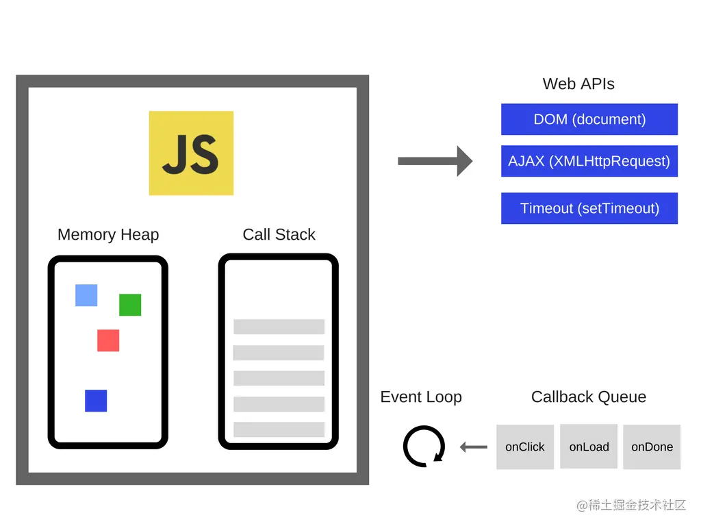

# JavaScript  
- ### [github 30天学习JavaScript](https://github.com/ymm135/30-Days-Of-JavaScript)  

## [JavaScript 运行原理解析](https://juejin.cn/post/6844903551009816589)    
说到JavaScript的运行原理，自然绕不开JS引擎，运行上下文，单线程，事件循环，事件驱动，回调函数等概念。  

为了更好的理解JavaScript如何工作的，首先要理解以下几个概念。

- JS Engine（JS引擎）  
- Runtime（运行上下文）  
- Call Stack (调用栈)  
- Event Loop（事件循环）  
- Callback (回调)  

### JS Engine  
简单来说，JS引擎主要是对JS代码进行词法、语法等分析，通过编译器将代码编译成可执行的机器码让计算机去执行。
目前最流行的JS引擎非V8莫属了，Chrome浏览器和Node.js采用的引擎就是V8引擎。引擎的结构可以简单由下图表示：  

<br>
<div align=center>
  </img>  
</div>

就如JVM虚拟机一样，JS引擎中也有堆(Memory Heap)和栈(Call Stack)的概念。


- 栈。用来存储方法调用的地方，以及基础数据类型(如var a = 1)也是存储在栈里面的，会随着方法调用结束而自动销毁掉(入栈-->方法调用后-->出栈)。


- 堆。JS引擎中给对象分配的内存空间是放在堆中的。如`var foo = {name: 'foo'}` 那么这个foo所指向的对象是存储在堆中的。 

此外，JS中存在闭包的概念，对于基本类型变量如果存在与闭包当中，那么也将存储在堆中。  

### RunTime

JS在浏览器中可以调用浏览器提供的API，如window对象，DOM相关API等。这些接口并不是由V8引擎提供的，是存在与浏览器当中的。因此简单来说，对于这些相关的外部接口，可以在运行时供JS调用，以及JS的事件循环(Event Loop)和事件队列(Callback Queue)，把这些称为RunTime。有些地方也把JS所用到的core lib核心库也看作RunTime的一部分。

<br>
<div align=center>
  </img>  
</div>

同样，在Node.js中，可以把Node的各种库提供的API称为RunTime。所以可以这么理解，Chrome和Node.js都采用相同的V8引擎，但拥有不同的运行环境(RunTime Environments)  

### Call Stack

JS被设计为`单线程`运行的，这是因为JS主要用来实现很多交互相关的操作，如DOM相关操作，如果是多线程会造成复杂的`同步`问题。因此JS自诞生以来就是单线程的，而且主线程都是用来进行界面相关的渲染操作 (为什么说是主线程，因为HTML5 提供了`Web Worker`，独立的一个后台JS，用来处理一些耗时数据操作。因为不会修改相关DOM及页面元素，因此不影响页面性能)，如果有阻塞产生会导致浏览器卡死。  

如果一个递归调用没有终止条件，是一个死循环的话，会导致调用栈内存不够而溢出，如：  

```js
function foo() {
    foo();
}
foo();
```

例子中foo函数循环调用其本身，且没有终止条件，浏览器控制台输出调用栈达到最大调用次数。

JS线程如果遇到比较耗时操作，如读取文件，AJAX请求操作怎么办？这里JS用到了Callback回调函数来处理。
对于Call Stack中的每个方法调用，都会形成它自己的一个执行上下文Execution Context，关于执行上下文的详细阐述请看[这篇文章](https://juejin.cn/post/6844903551546720270)  

### Event Loop & Callback  

JS通过回调的方式，异步处理耗时的任务。一个简单的例子： 

```js
var result = ajax('...');
console.log(result);
```

此时并不会得到result的值，result是undefined。这是因为ajax的调用是异步的，当前线程并不会等到ajax请求到结果后才执行console.log语句。而是调用ajax后请求的操作交给回调函数，自己是立刻返回。正确的写法应该是：  

```js
ajax('...', function(result) {
    console.log(result);
})
```

此时才能正确输出请求返回的结果。

JS引擎其实并不提供异步的支持，异步支持主要依赖于运行环境(浏览器或Node.js)。 

```
So, for example, when your JavaScript program makes an Ajax request to fetch some data from the server, you set up the “response” code in a function (the “callback”), and the JS Engine tells the hosting environment:
“Hey, I’m going to suspend execution for now, but whenever you finish with that network request, and you have some data, please call this function back.”
```
```
The browser is then set up to listen for the response from the network, and when it has something to return to you, it will schedule the callback function to be executed by inserting it into the event loop.
```

上面这两段话摘自于[How JavaScript works](https://blog.sessionstack.com/how-javascript-works-event-loop-and-the-rise-of-async-programming-5-ways-to-better-coding-with-2f077c4438b5?gi=e4cac462c9cf)，以通俗的方式解释了JS如何调用回调函数实现异步处理。  

所以什么是Event Loop?  

Event Loop只做一件事情，负责监听Call Stack和Callback Queue。当Call Stack里面的调用栈运行完变成空了，Event Loop就把Callback Queue里面的第一条事件(其实就是回调函数)放到调用栈中并执行它，后续不断循环执行这个操作。

一个setTimeout的例子以及对应的Event Loop动态图：

```js
console.log('Hi');
setTimeout(function cb1() { 
    console.log('cb1');
}, 5000);
console.log('Bye');
```  

<br>
<div align=center>
  </img>  
</div>

setTimeout有个要注意的地方，如上述例子延迟5s执行，不是严格意义上的5s，正确来说是至少5s以后会执行。因为Web API会设定一个5s的定时器，时间到期后将回调函数加到队列中，此时该回调函数还不一定会马上运行，因为队列中可能还有之前加入的其他回调函数，而且还必须等到Call Stack空了之后才会从队列中取一个回调执行。

所以常见的setTimeout(callback, 0) 的做法就是为了在常规的调用介绍后马上运行回调函数。

```js
console.log('Hi');
setTimeout(function() {
    console.log('callback');
}, 0);
console.log('Bye');
// 输出
// Hi
// Bye
// callback
```

### 总结
最后总结一下，JS的运行原理主要有以下几个方面：  

- JS引擎主要负责把JS代码转为机器能执行的机器码，而JS代码中调用的一些WEB API则由其运行环境提供，这里指的是浏览器。


- JS是单线程运行，每次都从调用栈出取出代码进行调用。如果当前代码非常耗时，则会阻塞当前线程导致浏览器卡顿。


- 回调函数是通过加入到事件队列中，等待Event Loop拿出并放到调用栈中进行调用。只有Event Loop监听到调用栈为空时，才会从事件队列中从队头拿出回调函数放进调用栈里。  


## [V8引擎](https://github.com/v8/v8) 
- ### [V8源码](https://github.com/v8/v8) 

### ubuntu 编译

如果虚拟机不能科学上网，那就只能设置git代理了。  

安装依赖库
```shell
sudo apt-get install -y pkg-config 
pip3 install sh 
```

安装depot_tools
```shell
git clone https://chromium.googlesource.com/chromium/tools/depot_tools.git
echo 'export PATH=$PATH:"/path/to/depot_tools"' >> ~/.bashrc
# clone depot_tools，并且把depot_tools的目录加到PATH环境变量，
# /path/to/depot_tools改成depot_tools的目录
# 因为git加了代理所以第一个命令可以成功clone了
```

安装ninja
```shell
git clone https://github.com/ninja-build/ninja.git
cd ninja && ./configure.py --bootstrap && cd ..
# clone并且configure
echo 'export PATH=$PATH:"/path/to/ninja"' >> ~/.bashrc
# /path/to/ninja改成ninja的目录
```

编译v8
```shell
bash
# 重新开一个bash，这样新的环境变量才会被加载
fetch v8
# 下载v8的repo，这个也是需要git代理才能成功下载的
cd v8
git reset --hard [commit hash with vulnerability]
# 如果编译最新版的话，就不用这行命令
# 如果是要调洞的话，就要在这里切到有漏洞的那个commit
gclient sync
# gclient sync 用来下载一些其他需要的东西，
# 这个还需要curl的代理，之前也已经在环境变量配置了
tools/dev/v8gen.py x64.debug
ninja -C out.gn/x64.debug
# 编译
```

运行:
```shell
# 启动interactive d8 shell
./out.gn/x64.debug/d8

# 运行test.js
./out.gn/x64.debug/d8 test.js
```

test.js
```js
// the hello world program
console.log('Hello World');
```

```shell
~/work/v8# ./out.gn/x64.debug/d8 test.js 
Hello World
```


### vscode debug 

`launch.json`
```json
{
    "version": "0.2.0",
    "configurations": [
        {
            "name": "v8 gdb 调试",
            "type": "cppdbg",
            "request": "launch",
            "program": "${workspaceFolder}/out.gn/x64.debug/d8",
            "args": ["${workspaceFolder}/test.js"],
            "stopAtEntry": false,
            "cwd": "${fileDirname}",
            "environment": [],
            "externalConsole": false,
            "MIMode": "gdb",
            "setupCommands": [
                {
                    "description": "为 gdb 启用整齐打印",
                    "text": "-enable-pretty-printing",
                    "ignoreFailures": true
                },
                {
                    "description":  "将反汇编风格设置为 Intel",
                    "text": "-gdb-set disassembly-flavor intel",
                    "ignoreFailures": true
                }
            ]
        }
    ]
}
```

vscode调试`src/d8/d8.cc:Main`
<br>
<div align=center>
  </img>  
</div>

> v8 引擎无法编译`solidity`合约文件  


### vscode debug chrome javascript 
我们的调试器通过其`Chrome 调试器`协议连接到 `Chrome` 来工作，我们将浏览器中加载的文件映射到 Visual Studio Code 中打开的文件。这意味着开发人员现在可以直接在其源代码中设置断点，设置变量以在调试时观察和查看完整的调用堆栈——所有这些都无需离开编辑器。  

[官方文档](https://code.visualstudio.com/docs/nodejs/browser-debugging)  

安装`Debugger for Chrome`插件(已废弃)，现使用`JavaScript Debugger`  

#### 直接对页面进行调试

```html
<body>
    <h1>Hello World!</h1>
    <script>
        debugger
    </script>
</body>
```

配置文件
```json
        {
            "name": "Launch Chrome",
            "request": "launch",
            "type": "chrome",
            "file": "${workspaceFolder}/code/web/debug/index.html"
        },      
```

#### 网站调试

```json
{
  "version": "0.2.0",
  "configurations": [
    {
      "type": "msedge",
      "request": "launch",
      "name": "Launch my cool app",
      "url": "http://localhost:8000"
    }
  ]
}
```


#### attach调试

```json
{
  "version": "0.2.0",
  "configurations": [
    {
      "type": "chrome",
      "request": "attach",
      "name": "Attach to browser",
      "host": "192.168.0.1"
      "port": 9222
    }
  ]
}
```


