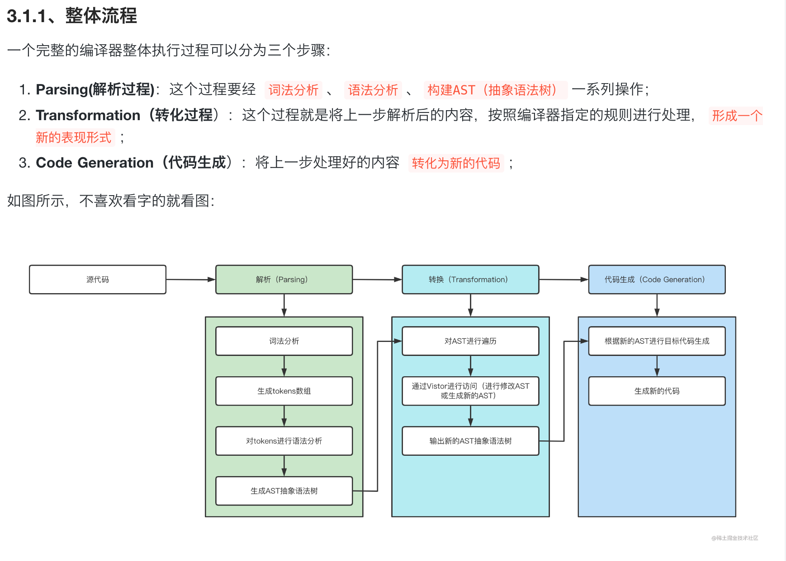

- # Learn JavaScript&TypeScript

https://www.freecodecamp.org/chinese/learn  
https://www.freecodecamp.org/chinese/learn/javascript-algorithms-and-data-structures/
https://github.com/TheAlgorithms/JavaScript (javascript学习)  

https://ts.xcatliu.com/ (TypeScript 入门教程)  
https://github.com/zhongsp/TypeScript  
https://github.com/jkchao/typescript-book-chinese  

<!-- TOC -->
* [JavaScript](#javascript)
  * [运行原理](#运行原理)
  * [数据类型](#数据类型)
    * [JavaScript 拥有动态类型](#javascript-拥有动态类型)
    * [JavaScript 对象](#javascript-对象)
    * [Undefined 和 Null](#undefined-和-null)
    * [声明变量类型](#声明变量类型)
* [TypeScript](#typescript)
<!-- TOC -->

# JavaScript 
## 运行原理  

[运行原理介绍](javascript.md)   

## 数据类型
值类型(基本类型)：
- 字符串（`String`）
- 数字(`Number`)
- 布尔(`Boolean`)
- 空（`Null`）
- 未定义（`Undefined`）
- `Symbol`  

> Symbol 是 ES6 引入了一种新的原始数据类型，表示独一无二的值。

引用数据类型（对象类型）：
- 对象(`Object`)
- 数组(`Array`)
- 函数(`Function`)

还有两个特殊的对象：
- 正则（`RegExp`） 
- 日期（`Date`）  

### JavaScript 拥有动态类型
JavaScript 拥有动态类型。这意味着相同的变量可用作不同的类型：  
```javascript
var x;               // x 为 undefined
var x = 5;           // 现在 x 为数字
var x = "John";      // 现在 x 为字符串
```

变量的数据类型可以使用 typeof 操作符来查看：
```js
typeof "John"                // 返回 string
typeof 3.14                  // 返回 number
typeof false                 // 返回 boolean
typeof [1,2,3,4]             // 返回 object
typeof {name:'John', age:34} // 返回 object
```

### JavaScript 对象
对象由花括号分隔。在括号内部，对象的属性以名称和值对的形式 (name : value) 来定义。属性由逗号分隔：  
`var person={firstname:"John", lastname:"Doe", id:5566};`    
对象 (person) 有三个属性：firstname、lastname 以及 id。  

对象属性有两种寻址方式：  
```javascript
name=person.lastname;
name=person["lastname"];
```

### Undefined 和 Null
Undefined 这个值表示变量不含有值。
可以通过将变量的值设置为 null 来清空变量。  

```javascript
cars=null;
person=null;
```

### 声明变量类型  
当您声明新变量时，可以使用关键词 "new" 来声明其类型：  

```javascript
var carname=new String;
var x=      new Number;
var y=      new Boolean;
var cars=   new Array;
var person= new Object;
```

## Object
JavaScript作为一个基于对象(没有类的概念)的语言，从入门到精通到放弃一直会被对象这个问题围绕。  
> 对象可以看做是属性的无序集合！！  

创建对象:
- 字面量的方式,就是new Object()的语法糖，一样一样的.
```javascript
var myHonda = {color: "red", wheels: 4, engine: {cylinders: 4, size: 2.2}}
```

- 工厂模式
```javascript
function createCar(){
  var oTemp = new Object();
  oTemp.name = arguments[0];
  //直接给对象添加属性，每个对象都有直接的属性  
  oTemp.age = arguments[1];
  oTemp.showName = function () {
    alert(this.name);
  };//每个对象都有一个 showName 方法版本  
  return oTemp;
};
var myHonda = createCar('honda', 5)
```

> 只是给new Object()包了层皮，方便量产，并没有本质区别，姑且算作创建对象的一种方式。  

- 构造函数 
```javascript
function Person(name, age, sex) {
  this.name = name;
  this.age = age;
  this.sex = sex;
  this.getName = function() {
    return this.name;
  };
}
var rand = new Person("Rand McKinnon", 33, "M");
```  

上面构造函数的 `getName` 方法，每次实例化都会新建该函数对象，还形成了在当前情况下并没有卵用的闭包，所以构造函数添加方法用下面方式处理，工厂模式给对象添加方法的时候也应该用下面的方式避免重复构造函数对象  

```javascript
function Person(name, age, sex) {
  this.name = name;
  this.age = age;
  this.sex = sex;
  this.getName = getName
}
function getName() {
  return this.name;
};
```

构造函数创建对象的过程和工厂模式又是半斤八两，相当于隐藏了创建新对象和返回该对象这两步，构造函数内 this 指向新建对象，没什么不同。  
最大不同点: 构造函数创造出来的对象 constructor 属性指向该构造函数，工厂模式指向 function Object(){...}  

- 原型模式  

```javascript
function Car(){} 
//用空构造函数设置类名
Car.prototype.color = "blue";//每个对象都共享相同属性
Car.prototype.doors = 3;
Car.prototype.drivers = new Array("Mike","John");
Car.prototype.showColor = function(){        
  alert(this.color);
};//每个对象共享一个方法版本，省内存。

//构造函数的原型属性可以通过字面量来设置，别忘了通过 Object.defineProperty()设置 constructor 为该构造函数
function Car(){} 
Car.prototype = {
  color:"blue",
  doors:3,
  showColor:function(){        
    alert(this.color);
  }
}

Object.defineProperty(Car.prototype, "constructor", { enumerable:false, value:Car })
//(不设置 constructor 会导致 constructor 不指向构造函数，直接设置 constructor 会导致 constructor 可枚举)
```

使用原型模式注意动态性，通过构造函数实例化出的对象，他的原型对象是构造函数的 `prototype` ，如果在他的原型对象上增加或删除一些方法，该对象会继承这些修改。例如，先通过构造函数 A 实例化出对象 a ，然后再给 A.prototype 添加一个方法，a 是可以继承这个方法的。但是给 A.prototype 设置一个新的对象，a 是不会继承这个新对象的属性和方法的。  

- Object.create()  

传入要创建对象实例的原型对象，和原型模式几乎是一个意思也是相当于在原型链上加了一环，区别在于这种方式创建的对象没有构造函数。这种方式相当于:  

```javascript
function object(o){
    function F(){}
    F.prototype = o;
    return new F()
}
```

相当于构造函数只短暂的存在了一会，创建出来的对象的 constructor 指向 原型对象 o 的 constructor ！  

继承与原型链  
当访问一个对象的属性时，如果在对象本身找不到，就会去搜索对象的原型，原型的原型，直到原型链的尽头 null，那原型链是怎么链起来的？


## Arrays

```javascript
// syntax
const arr = Array()
// or
// let arr = new Array()
console.log(arr) // []

// syntax
// This the most recommended way to create an empty list
const arr = []
console.log(arr)
```

Creating static values with fill  
```javascript
const arr = Array() // creates an an empty array
console.log(arr)

const eightXvalues = Array(8).fill('X') // it creates eight element values filled with 'X'
console.log(eightXvalues) // ['X', 'X','X','X','X','X','X','X']
```

Adding item to an array using push  
```javascript
// syntax
const arr  = ['item1', 'item2','item3']
arr.push('new item')
console.log(arr)
// ['item1', 'item2','item3','new item']
```

数组的对象及接口学习 `test.js` :  
```javascript
const arr  = Array()
arr.push('new item')
arr.push('new item1')
arr.pop()
console.log(arr)
```

点击 `Array`对象查看详情，进入`/Applications/IntelliJ IDEA.app/Contents/plugins/javascript-impl/jsLanguageServicesImpl/external/lib.es5.d.ts`文件  
```typescript
interface ArrayConstructor {
    new(arrayLength?: number): any[];
    new <T>(arrayLength: number): T[];
    new <T>(...items: T[]): T[];
    (arrayLength?: number): any[];
    <T>(arrayLength: number): T[];
    <T>(...items: T[]): T[];
    isArray(arg: any): arg is any[];
    readonly prototype: any[];
}

declare var Array: ArrayConstructor;
```

array方法  
```typescript
interface Array<T> {
  /**
   * Gets or sets the length of the array. This is a number one higher than the highest index in the array.
   */
  length: number;

  /**
   * Returns a string representation of an array.
   */
  toString(): string;
}
```


# TypeScript
- ### https://jkchao.github.io/typescript-book-chinese/  
## 编译原理    
```shell
npm install ts-node --save-dev 
npm install typescript --save-dev 
npm install  @types/node --save-dev 
```

> IDEA运行TS需要安装的插件  

TypeScript 编译器源文件位于 `src/compiler` 目录下
它分为以下几个关键部分：  
- Scanner 扫描器（`scanner.ts`）
- Parser 解析器（`parser.ts`）
- Binder 绑定器（`binder.ts`）
- Checker 检查器（`checker.ts`）
- Emitter 发射器（`emitter.ts`）


<br>
<div align=center>
  </img>
</div>

## 类型注解  
初识类型注解  
```typescript
let bar: boolean = 'TS'; // Error: Type 'string' is not assignable to type 'boolean'.ts(2322)
```

语法: `: Type`  如: `: boolean`
作用: 约定变量的数据类型。如约定 bar 为布尔值  
好处: 静态编译时检查类型。类型操作不合理时，编译器会警告，作为文档。在 VSCode 中将光标移到 bar 上时，会提示 let bar: boolean  

### 原始类型  
```typescript
let num: number;
let str: string;
let bool: boolean;

num = 123;
num = 123.456;
num = '123'; // Error

str = '123';
str = 123; // Error

bool = true;
bool = false;
bool = 'false'; // Error
```

### 数组
TypeScript 为数组提供了专用的类型语法，因此你可以很轻易的注解数组。它使用后缀 []  

```typescript
let boolArray: boolean[];

boolArray = [true, false];
console.log(boolArray[0]); // true
console.log(boolArray.length); // 2

boolArray[1] = true;
boolArray = [false, false];

boolArray[0] = 'false'; // Error
boolArray = 'false'; // Error
boolArray = [true, 'false']; // Error
```  

### 接口
接口是 TypeScript 的一个核心知识，它能合并众多类型声明至一个类型声明：
```typescript
interface Name {
  first: string;
  second: string;
}

let name: Name;
name = {
  first: 'John',
  second: 'Doe'
};

name = {
  // Error: 'Second is missing'
  first: 'John'
};

name = {
  // Error: 'Second is the wrong type'
  first: 'John',
  second: 1337
};
```

### 内联类型注解
与创建一个接口不同，你可以使用内联注解语法注解任何内容：`:{ /*Structure*/ }`
```typescript
let name: {
  first: string;
  second: string;
};

name = {
  first: 'John',
  second: 'Doe'
};

name = {
  // Error: 'Second is missing'
  first: 'John'
};

name = {
  // Error: 'Second is the wrong type'
  first: 'John',
  second: 1337
};
```

any类型: 
```typescript
let power: any;

// 赋值任意类型
power = '123';
power = 123;

// 它也兼容任何类型
let num: number;
power = num;
num = power;
```

## 接口和类    
```typescript
// 示例 A
declare const myPoint: { x: number; y: number };

// 示例 B
interface Point {
  x: number;
  y: number;
}
declare const myPoint: Point;
```

示例 B 的好处在于，如果有人创建了一个基于 myPoint 的库来添加新成员, 那么他可以轻松将此成员添加到 myPoint 的现有声明中:  
```typescript
// Lib a.d.ts
interface Point {
  x: number,
  y: number
}
declare const myPoint: Point

// Lib b.d.ts
interface Point {
  z: number
}

// Your code
myPoint.z // Allowed!
```

TypeScript 接口是开放式的，这是 TypeScript 的一个重要原则，它允许你使用接口来模仿 JavaScript 的可扩展性。

### 类可以实现接口  

如果你希望在类中使用必须要被遵循的接口（类）或别人定义的对象结构，可以使用 `implements` 关键字来确保其兼容性：  

```typescript
interface Point {
  x: number;
  y: number;
}

class MyPoint implements Point {
  x: number;
  y: number; // Same as Point
}
```

## 泛型  
设计泛型的关键目的是在成员之间提供有意义的约束，这些成员可以是：

- 类的实例成员
- 类的方法
- 函数参数
- 函数返回值

```typescript
// 创建一个泛型类
class Queue<T> {
  private data: T[] = [];
  push = (item: T) => this.data.push(item);
  pop = (): T | undefined => this.data.shift();
}

// 简单的使用
const queue = new Queue<number>();
queue.push(0);
queue.push('1'); // Error：不能推入一个 `string`，只有 number 类型被允许
```

配合 axios 使用  
通常情况下，我们会把后端返回数据格式单独放入一个 interface 里：  
```typescript
// 请求接口数据
export interface ResponseData<T = any> {
  /**
   * 状态码
   * @type { number }
   */
  code: number;

  /**
   * 数据
   * @type { T }
   */
  result: T;

  /**
   * 消息
   * @type { string }
   */
  message: string;
}
```

当我们把 API 单独抽离成单个模块时：  

```typescript
// 在 axios.ts 文件中对 axios 进行了处理，例如添加通用配置、拦截器等
import Ax from './axios';

import { ResponseData } from './interface.ts';

export function getUser<T>() {
  return Ax.get<ResponseData<T>>('/somepath')
    .then(res => res.data)
    .catch(err => console.error(err));
}
```

接着我们写入返回的数据类型 `User`，这可以让 `TypeScript` 顺利推断出我们想要的类型：  
```typescript
interface User {
  name: string;
  age: number;
}

async function test() {
  // user 被推断出为
  // {
  //  code: number,
  //  result: { name: string, age: number },
  //  message: string
  // }
  const user = await getUser<User>();
}
```

