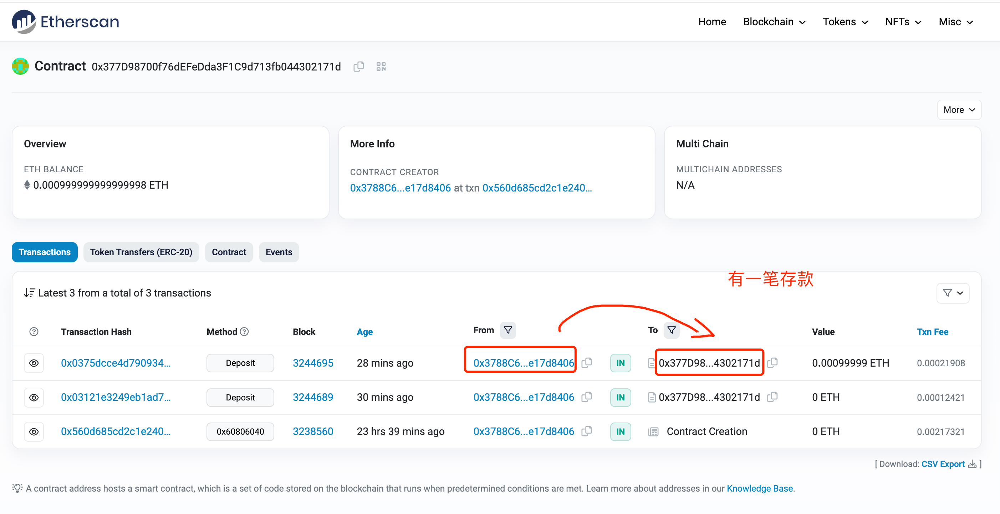
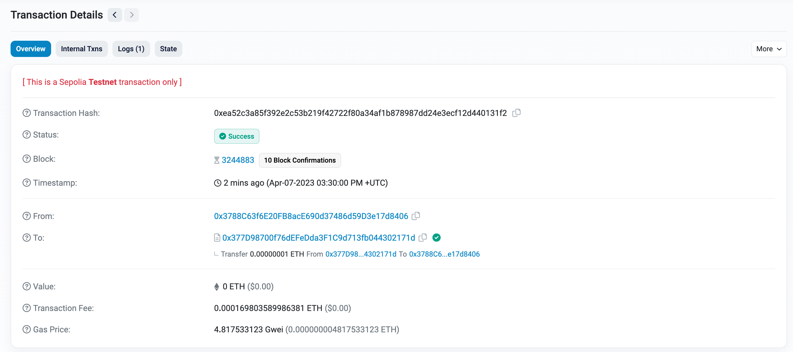
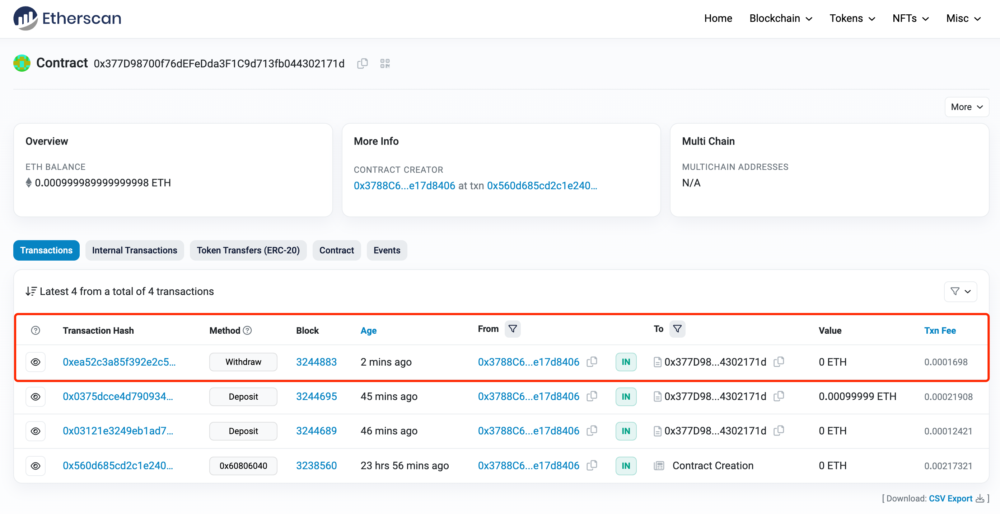
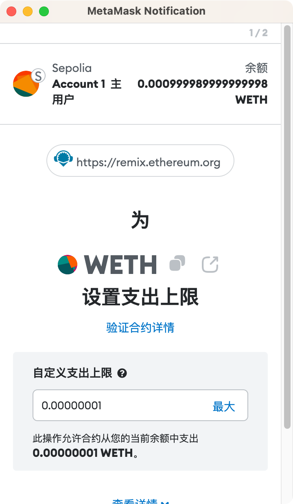
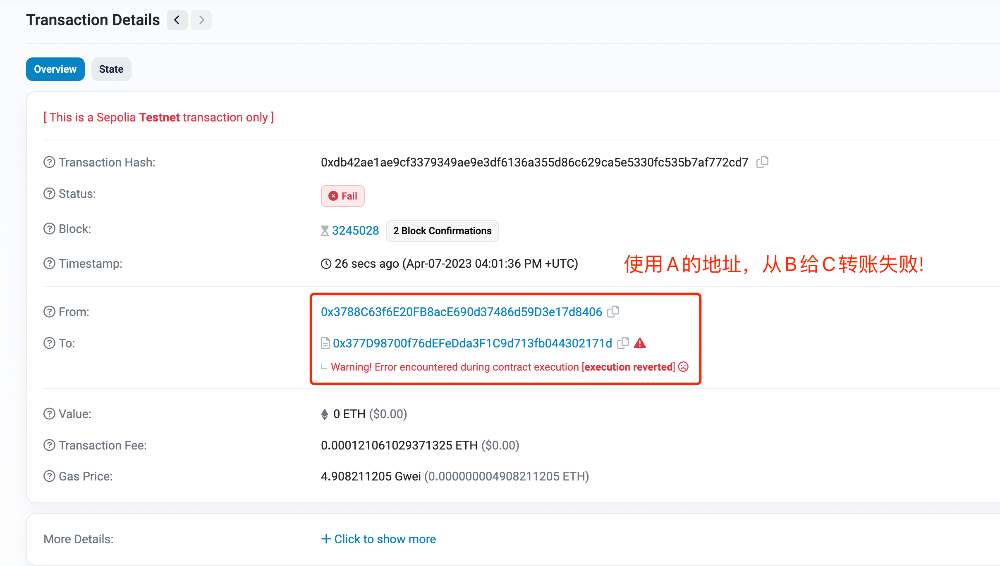
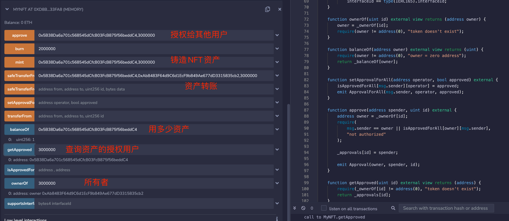

- # WETH/ERC-20/ERC-721

## WETH

```js
    string public name     = "Wrapped Ether";
    string public symbol   = "WETH";
    uint8  public decimals = 18;
```

三个方法描述WETH的基本信息


如何存款呢: deposit 
```js
    function deposit() public payable {
        balanceOf[msg.sender] += msg.value;
        emit Deposit(msg.sender, msg.value);
    }
```

那个用户调用该方法，就是往该合约里存钱。  
比如这个交易:  https://sepolia.etherscan.io/tx/0x03121e3249eb1ad7caed621842b4c11f4946982b9b895a7c7fecb5ee6c9d770a  

<br>
<div align=center>
  </img>
</div>


提取
```js
    function withdraw(uint wad) public {
        require(balanceOf[msg.sender] >= wad, "");
        balanceOf[msg.sender] -= wad;
        msg.sender.transfer(wad);
        emit Withdrawal(msg.sender, wad);
    }
```

<br>
<div align=center>
  </img>
</div>

<br>
<div align=center>
  </img>
</div>

总量
```sh
  function totalSupply() public view returns (uint) {
        return address(this).balance;
    }
```

> 是这个合约的总量，多个用户存款的总和。   

每次转账之前要授权:  
```js
    function approve(address guy, uint wad) public returns (bool) {
        allowance[msg.sender][guy] = wad;
        emit Approval(msg.sender, guy, wad);
        return true;
    }
```

```js
function transfer(address dst, uint wad) public returns (bool) {
        return transferFrom(msg.sender, dst, wad);
    }

    function transferFrom(address src, address dst, uint wad)
        public
        returns (bool)
    {
        require(balanceOf[src] >= wad, "");

        if (src != msg.sender && allowance[src][msg.sender] != uint(-1)) {
            require(allowance[src][msg.sender] >= wad, "");
            allowance[src][msg.sender] -= wad;
        }

        balanceOf[src] -= wad;
        balanceOf[dst] += wad;

        emit Transfer(src, dst, wad);

        return true;
    }
```

每次授权的金额会减少，超过授权额度之后，会再次授权。  

<br>
<div align=center>
  </img>
</div>


<br>
<div align=center>
  </img>
</div>

## ERC-20

ERC20标准方法
```js
function name() public view returns (string)
function symbol() public view returns (string)
function decimals() public view returns (uint8)
function totalSupply() public view returns (uint256)
function balanceOf(address _owner) public view returns (uint256 balance)
function transfer(address _to, uint256 _value) public returns (bool success)
function transferFrom(address _from, address _to, uint256 _value) public returns (bool success)
function approve(address _spender, uint256 _value) public returns (bool success)
function allowance(address _owner, address _spender) public view returns (uint256 remaining)
```

这个示例中在构造时，需要传入总量,并且往该账户中铸造币  
```js
    constructor(uint _totalSupply) public {
        uint chainId;
        assembly {
            chainId := chainid()
        }
        DOMAIN_SEPARATOR = keccak256(
            abi.encode(
                keccak256('EIP712Domain(string name,string version,uint256 chainId,address verifyingContract)'),
                keccak256(bytes(name)),
                keccak256(bytes('1')),
                chainId,
                address(this)
            )
        );
        _mint(msg.sender, _totalSupply);
    }

    function _mint(address to, uint value) internal {
        totalSupply = totalSupply.add(value);
        balanceOf[to] = balanceOf[to].add(value);
        emit Transfer(address(0), to, value);
    }
```

接下来是转账授权  
```js

    function _approve(address owner, address spender, uint value) private {
        allowance[owner][spender] = value;
        emit Approval(owner, spender, value);
    }

    function approve(address spender, uint value) external returns (bool) {
        _approve(msg.sender, spender, value);
        return true;
    }

    function transferFrom(address from, address to, uint value) external returns (bool) {
        if (allowance[from][msg.sender] != uint(-1)) {
            allowance[from][msg.sender] = allowance[from][msg.sender].sub(value);
        }
        _transfer(from, to, value);
        return true;
    }
```

另外转账还需要销毁
```js
    function _burn(address from, uint value) internal {
        balanceOf[from] = balanceOf[from].sub(value);
        totalSupply = totalSupply.sub(value);
        emit Transfer(from, address(0), value);
    }

    function _transfer(address from, address to, uint value) private {
        uint burnAmount = value / 100;
        _burn(from, burnAmount);
        uint transferAmount = value.sub(burnAmount);
        balanceOf[from] = balanceOf[from].sub(transferAmount);
        balanceOf[to] = balanceOf[to].add(transferAmount);
        emit Transfer(from, to, transferAmount);
    }

    function transfer(address to, uint value) external returns (bool) {
        _transfer(msg.sender, to, value);
        return true;
    }
```


另外还有一个`permit`  
```js
    function permit(address owner, address spender, uint value, uint deadline, uint8 v, bytes32 r, bytes32 s) external {
        require(deadline >= block.timestamp, 'EXPIRED');
        bytes32 digest = keccak256(
            abi.encodePacked(
                '\x19\x01',
                DOMAIN_SEPARATOR,
                keccak256(abi.encode(PERMIT_TYPEHASH, owner, spender, value, nonces[owner]++, deadline))
            )
        );
        address recoveredAddress = ecrecover(digest, v, r, s);
        require(recoveredAddress != address(0) && recoveredAddress == owner, 'INVALID_SIGNATURE');
        _approve(owner, spender, value);
    }
```  

如果使用approve，则允许spender最多使用wad个代币。

如果你给某人提供有效的签名，则该人可以调用permit以允许spender  使用你的代币。

因此，基本上，“无 gas”交易背后的模式是制作可以提供给某人的签名，以便他们可以安全地执行特殊交易。这就像授予某人执行函数的权限。

这是一种授权模式。  


## ERC-721

核心方法
```js
balanceOf(owner)

ownerOf(tokenId)

safeTransferFrom(from, to, tokenId, data)

safeTransferFrom(from, to, tokenId)

transferFrom(from, to, tokenId)

approve(to, tokenId)

setApprovalForAll(operator, _approved)

getApproved(tokenId)

isApprovedForAll(owner, operator)
```

`balanceOf(address owner) → uint256 balance`  
Returns the number of tokens in owner's account.

`ownerOf(uint256 tokenId) → address owner`  
Returns the owner of the tokenId token.

`safeTransferFrom(address from, address to, uint256 tokenId, bytes data)`   
Safely transfers tokenId token from from to to.  

`safeTransferFrom(address from, address to, uint256 tokenId)`  
Safely transfers tokenId token from `from` to `to`, checking first that contract recipients are aware of the ERC721 protocol to prevent tokens from being forever locked.  

`transferFrom(address from, address to, uint256 tokenId)`  
Transfers tokenId token from `from` to `to`.  

`approve(address to, uint256 tokenId)`  
Gives permission to `to` to transfer `tokenId` token to another account. The approval is cleared when the token is transferred.  

`setApprovalForAll(address operator, bool _approved)`  
Approve or remove `operator` as an operator for the caller. Operators can call transferFrom or safeTransferFrom for any token owned by the caller.  

`getApproved(uint256 tokenId) → address operator`  
Returns the account `approved` for `tokenId` token.  

`Transfer(address indexed from, address indexed to, uint256 indexed tokenId)`  

Emitted when `tokenId` token is transferred from `from` to `to`.

https://solidity-by-example.org/app/erc721/  

<br>
<div align=center>
  </img>
</div>

```js
// SPDX-License-Identifier: MIT
pragma solidity ^0.8.17;

interface IERC165 {
    function supportsInterface(bytes4 interfaceID) external view returns (bool);
}

interface IERC721 is IERC165 {
    function balanceOf(address owner) external view returns (uint balance);

    function ownerOf(uint tokenId) external view returns (address owner);

    function safeTransferFrom(address from, address to, uint tokenId) external;

    function safeTransferFrom(
        address from,
        address to,
        uint tokenId,
        bytes calldata data
    ) external;

    function transferFrom(address from, address to, uint tokenId) external;

    function approve(address to, uint tokenId) external;

    function getApproved(uint tokenId) external view returns (address operator);

    function setApprovalForAll(address operator, bool _approved) external;

    function isApprovedForAll(
        address owner,
        address operator
    ) external view returns (bool);
}

interface IERC721Receiver {
    function onERC721Received(
        address operator,
        address from,
        uint tokenId,
        bytes calldata data
    ) external returns (bytes4);
}

contract ERC721 is IERC721 {
    event Transfer(address indexed from, address indexed to, uint indexed id);
    event Approval(address indexed owner, address indexed spender, uint indexed id);
    event ApprovalForAll(
        address indexed owner,
        address indexed operator,
        bool approved
    );

    // Mapping from token ID to owner address
    mapping(uint => address) internal _ownerOf;

    // Mapping owner address to token count
    mapping(address => uint) internal _balanceOf;

    // Mapping from token ID to approved address
    mapping(uint => address) internal _approvals;

    // Mapping from owner to operator approvals
    mapping(address => mapping(address => bool)) public isApprovedForAll;

    function supportsInterface(bytes4 interfaceId) external pure returns (bool) {
        return
            interfaceId == type(IERC721).interfaceId ||
            interfaceId == type(IERC165).interfaceId;
    }

    function ownerOf(uint id) external view returns (address owner) {
        owner = _ownerOf[id];
        require(owner != address(0), "token doesn't exist");
    }

    function balanceOf(address owner) external view returns (uint) {
        require(owner != address(0), "owner = zero address");
        return _balanceOf[owner];
    }

    function setApprovalForAll(address operator, bool approved) external {
        isApprovedForAll[msg.sender][operator] = approved;
        emit ApprovalForAll(msg.sender, operator, approved);
    }

    function approve(address spender, uint id) external {
        address owner = _ownerOf[id];
        require(
            msg.sender == owner || isApprovedForAll[owner][msg.sender],
            "not authorized"
        );

        _approvals[id] = spender;

        emit Approval(owner, spender, id);
    }

    function getApproved(uint id) external view returns (address) {
        require(_ownerOf[id] != address(0), "token doesn't exist");
        return _approvals[id];
    }

    function _isApprovedOrOwner(
        address owner,
        address spender,
        uint id
    ) internal view returns (bool) {
        return (spender == owner ||
            isApprovedForAll[owner][spender] ||
            spender == _approvals[id]);
    }

    function transferFrom(address from, address to, uint id) public {
        require(from == _ownerOf[id], "from != owner");
        require(to != address(0), "transfer to zero address");

        require(_isApprovedOrOwner(from, msg.sender, id), "not authorized");

        _balanceOf[from]--;
        _balanceOf[to]++;
        _ownerOf[id] = to;

        delete _approvals[id];

        emit Transfer(from, to, id);
    }

    function safeTransferFrom(address from, address to, uint id) external {
        transferFrom(from, to, id);

        require(
            to.code.length == 0 ||
                IERC721Receiver(to).onERC721Received(msg.sender, from, id, "") ==
                IERC721Receiver.onERC721Received.selector,
            "unsafe recipient"
        );
    }

    function safeTransferFrom(
        address from,
        address to,
        uint id,
        bytes calldata data
    ) external {
        transferFrom(from, to, id);

        require(
            to.code.length == 0 ||
                IERC721Receiver(to).onERC721Received(msg.sender, from, id, data) ==
                IERC721Receiver.onERC721Received.selector,
            "unsafe recipient"
        );
    }

    function _mint(address to, uint id) internal {
        require(to != address(0), "mint to zero address");
        require(_ownerOf[id] == address(0), "already minted");

        _balanceOf[to]++;
        _ownerOf[id] = to;

        emit Transfer(address(0), to, id);
    }

    function _burn(uint id) internal {
        address owner = _ownerOf[id];
        require(owner != address(0), "not minted");

        _balanceOf[owner] -= 1;

        delete _ownerOf[id];
        delete _approvals[id];

        emit Transfer(owner, address(0), id);
    }
}

contract MyNFT is ERC721 {
    function mint(address to, uint id) external {
        _mint(to, id);
    }

    function burn(uint id) external {
        require(msg.sender == _ownerOf[id], "not owner");
        _burn(id);
    }
}
```