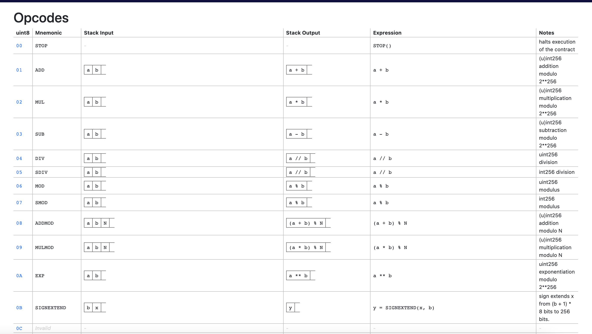

# solidity
[github源码](https://github.com/ethereum/solidity)  

Solidity, the Smart Contract Programming Language  

- ### [FISCO BCOS 技术文档](https://fisco-bcos-documentation.readthedocs.io/zh_CN/latest/index.html)  

## 源码编译
[官方文档](https://docs.soliditylang.org/en/latest/installing-solidity.html#building-from-source) 

环境准备:  
- CMake (version 3.13+)  
- Boost (version 1.77+ on Windows, 1.65+ otherwise)  
- Git
- [z3](https://github.com/Z3Prover/z3)(version 4.8+, Optional)
- cvc4 (Optional) 


环境安装:
boost
```
wget https://boostorg.jfrog.io/artifactory/main/release/1.69.0/source/boost_1_69_0.tar.gz
tar -zxvf boost_1_69_0.tar.gz  

#编译
# 进入源码目录
./bootstrap.sh
sudo ./b2 install  

# 查看库
ls -l /usr/local/lib/libboost_*  
ls -l /usr/local/include/boost/
```

z3
```shell
git clone https://github.com/Z3Prover/z3

# 编译
python scripts/mk_make.py
cd build
make
sudo make install
```

> 需要安装`4.8.17`指定版本，版本过高也无法编译。  

solidity编译
```
git clone git@github.com:ethereum/solidity.git  # 需要有.git目录

mkdir build && cd build
cmake .. && make
make install 
```

编译后的文件
```shell
CMakeCache.txt
CMakeFiles
cmake_install.cmake
_deps
deps
include
libevmasm
liblangutil
libsmtutil
libsolc
libsolidity
libsolutil
libyul
Makefile
solc
test
tools
```

还有一些编译选项
```shell
# disables only Z3 SMT Solver.
cmake .. -DUSE_Z3=OFF

# disables only CVC4 SMT Solver.
cmake .. -DUSE_CVC4=OFF

# disables both Z3 and CVC4
cmake .. -DUSE_CVC4=OFF -DUSE_Z3=OFF
```

## vscode 调试  

- ### [编译文档](https://docs.soliditylang.org/en/latest/using-the-compiler.html)  

solc的用法示例
```shell
solc --bin -o /tmp/solcoutput dapp-bin=/usr/local/lib/dapp-bin contract.sol
```

测试合约:  
```js
// SPDX-License-Identifier: GPL-3.0
pragma solidity >=0.7.0 <0.9.0;
contract ReceiverPays {
    address owner = msg.sender;

    mapping(uint256 => bool) usedNonces;

    constructor() payable {}

    function claimPayment(uint256 amount, uint256 nonce, bytes memory signature) external {
        require(!usedNonces[nonce]);
        usedNonces[nonce] = true;

        // this recreates the message that was signed on the client
        bytes32 message = prefixed(keccak256(abi.encodePacked(msg.sender, amount, nonce, this)));

        require(recoverSigner(message, signature) == owner);

        payable(msg.sender).transfer(amount);
    }

    /// destroy the contract and reclaim the leftover funds.
    function shutdown() external {
        require(msg.sender == owner);
        selfdestruct(payable(msg.sender));
    }

    /// signature methods.
    function splitSignature(bytes memory sig)
        internal
        pure
        returns (uint8 v, bytes32 r, bytes32 s)
    {
        require(sig.length == 65);

        assembly {
            // first 32 bytes, after the length prefix.
            r := mload(add(sig, 32))
            // second 32 bytes.
            s := mload(add(sig, 64))
            // final byte (first byte of the next 32 bytes).
            v := byte(0, mload(add(sig, 96)))
        }

        return (v, r, s);
    }

    function recoverSigner(bytes32 message, bytes memory sig)
        internal
        pure
        returns (address)
    {
        (uint8 v, bytes32 r, bytes32 s) = splitSignature(sig);

        return ecrecover(message, v, r, s);
    }

    /// builds a prefixed hash to mimic the behavior of eth_sign.
    function prefixed(bytes32 hash) internal pure returns (bytes32) {
        return keccak256(abi.encodePacked("\x19Ethereum Signed Message:\n32", hash));
    }
}
```

```shell
./solc/solc --bin -o test.bin  test.sol

# 输出 Bin文件  
.
├── test.bin
│   └── ReceiverPays.bin       # 编译后的bin文件, 二进制文件  
└── test.sol
```  

使用指令输出指令集`./../solc/solc --bin -o test.bin --ast-compact-json --asm  test.sol`  
```shell
├── test.bin
│   ├── ReceiverPays.bin
│   ├── ReceiverPays.evm       # 
│   └── test.sol_json.ast      # 抽象语法树
└── test.sol
```

>   --asm                EVM assembly of the contracts.
>   --asm-json           EVM assembly of the contracts in JSON format.  


`ReceiverPays.evm`文件详情:  
```asm
 /* "test.sol":68:1820  contract ReceiverPays {... */
  mstore(0x40, 0x80)
    /* "test.sol":112:122  msg.sender */
  caller
    /* "test.sol":96:122  address owner = msg.sender */
  0x00
  dup1
  0x0100
  exp
  dup2
  sload
  dup2
  0xffffffffffffffffffffffffffffffffffffffff
  mul
  not
  and
  swap1
  dup4
  0xffffffffffffffffffffffffffffffffffffffff
  and
  mul
  or
  swap1
  sstore
  pop
    /* "test.sol":68:1820  contract ReceiverPays {... */
  dataSize(sub_0)
  dup1
  dataOffset(sub_0)
  0x00
  codecopy
  0x00
  return
stop

sub_0: assembly {
        /* "test.sol":68:1820  contract ReceiverPays {... */
      mstore(0x40, 0x80)
      callvalue
      dup1
      iszero
      tag_1
      jumpi
      0x00
      dup1
      revert
...
```

remix 复制的字节码
```json
{
    "functionDebugData": {
        "@_13": {
            "entryPoint": null, 
            "id": 13, 
            "parameterSlots": 0, 
            "returnSlots": 0
        }
    }, 
    "generatedSources": [ ], 
    "linkReferences": { }, 
    "object": "6080604052336000806101000a81548173ffffffffffffffffffffffffffffffffffffffff021916908373ffffffffffffffffffffffffffffffffffffffff16021790555061077d806100536000396000f3fe608060405234801561001057600080fd5b50600436106100365760003560e01c8063a90ae8871461003b578063fc0e74d114610057575b600080fd5b61005560048036038101906100509190610470565b610061565b005b61005f61019e565b005b6001600083815260200190815260200160002060009054906101000a900460ff161561008c57600080fd5b600180600084815260200190815260200160002060006101000a81548160ff02191690831515021790555060006100ee338585306040516020016100d394939291906105e1565b6040516020818303038152906040528051906020012061020f565b905060008054906101000a900473ffffffffffffffffffffffffffffffffffffffff1673ffffffffffffffffffffffffffffffffffffffff16610131828461023f565b73ffffffffffffffffffffffffffffffffffffffff161461015157600080fd5b3373ffffffffffffffffffffffffffffffffffffffff166108fc859081150290604051600060405180830381858888f19350505050158015610197573d6000803e3d6000fd5b5050505050565b60008054906101000a900473ffffffffffffffffffffffffffffffffffffffff1673ffffffffffffffffffffffffffffffffffffffff163373ffffffffffffffffffffffffffffffffffffffff16146101f657600080fd5b3373ffffffffffffffffffffffffffffffffffffffff16ff5b60008160405160200161022291906106b1565b604051602081830303815290604052805190602001209050919050565b60008060008061024e856102ae565b925092509250600186848484604051600081526020016040526040516102779493929190610702565b6020604051602081039080840390855afa158015610299573d6000803e3d6000fd5b50505060206040510351935050505092915050565b600080600060418451146102c157600080fd5b6020840151915060408401519050606084015160001a92509193909250565b6000604051905090565b600080fd5b600080fd5b6000819050919050565b610307816102f4565b811461031257600080fd5b50565b600081359050610324816102fe565b92915050565b600080fd5b600080fd5b6000601f19601f8301169050919050565b7f4e487b7100000000000000000000000000000000000000000000000000000000600052604160045260246000fd5b61037d82610334565b810181811067ffffffffffffffff8211171561039c5761039b610345565b5b80604052505050565b60006103af6102e0565b90506103bb8282610374565b919050565b600067ffffffffffffffff8211156103db576103da610345565b5b6103e482610334565b9050602081019050919050565b82818337600083830152505050565b600061041361040e846103c0565b6103a5565b90508281526020810184848401111561042f5761042e61032f565b5b61043a8482856103f1565b509392505050565b600082601f8301126104575761045661032a565b5b8135610467848260208601610400565b91505092915050565b600080600060608486031215610489576104886102ea565b5b600061049786828701610315565b93505060206104a886828701610315565b925050604084013567ffffffffffffffff8111156104c9576104c86102ef565b5b6104d586828701610442565b9150509250925092565b600073ffffffffffffffffffffffffffffffffffffffff82169050919050565b600061050a826104df565b9050919050565b60008160601b9050919050565b600061052982610511565b9050919050565b600061053b8261051e565b9050919050565b61055361054e826104ff565b610530565b82525050565b6000819050919050565b61057461056f826102f4565b610559565b82525050565b6000819050919050565b600061059f61059a610595846104df565b61057a565b6104df565b9050919050565b60006105b182610584565b9050919050565b60006105c3826105a6565b9050919050565b6105db6105d6826105b8565b610530565b82525050565b60006105ed8287610542565b6014820191506105fd8286610563565b60208201915061060d8285610563565b60208201915061061d82846105ca565b60148201915081905095945050505050565b600081905092915050565b7f19457468657265756d205369676e6564204d6573736167653a0a333200000000600082015250565b6000610670601c8361062f565b915061067b8261063a565b601c82019050919050565b6000819050919050565b6000819050919050565b6106ab6106a682610686565b610690565b82525050565b60006106bc82610663565b91506106c8828461069a565b60208201915081905092915050565b6106e081610686565b82525050565b600060ff82169050919050565b6106fc816106e6565b82525050565b600060808201905061071760008301876106d7565b61072460208301866106f3565b61073160408301856106d7565b61073e60608301846106d7565b9594505050505056fea2646970667358221220aaf19d2292322ba117a13c1d5a3ab83fee819c4545b74c206cdc9dab1c53b55a64736f6c634300080f0033", 
    "opcodes": "PUSH1 0x80 PUSH1 0x40 MSTORE CALLER PUSH1 0x0 DUP1 PUSH2 0x100 EXP DUP2 SLOAD DUP2 PUSH20 0xFFFFFFFFFFFFFFFFFFFFFFFFFFFFFFFFFFFFFFFF MUL NOT AND SWAP1 DUP4 PUSH20 0xFFFFFFFFFFFFFFFFFFFFFFFFFFFFFFFFFFFFFFFF AND MUL OR SWAP1 SSTORE POP PUSH2 0x77D DUP1 PUSH2 0x53 PUSH1 0x0 CODECOPY PUSH1 0x0 RETURN INVALID PUSH1 0x80 PUSH1 0x40 MSTORE CALLVALUE DUP1 ISZERO PUSH2 0x10 JUMPI PUSH1 0x0 DUP1 REVERT JUMPDEST POP PUSH1 0x4 CALLDATASIZE LT PUSH2 0x36 JUMPI PUSH1 0x0 CALLDATALOAD PUSH1 0xE0 SHR DUP1 PUSH4 0xA90AE887 EQ PUSH2 0x3B JUMPI DUP1 PUSH4 0xFC0E74D1 EQ PUSH2 0x57 JUMPI JUMPDEST PUSH1 0x0 DUP1 REVERT JUMPDEST PUSH2 0x55 PUSH1 0x4 DUP1 CALLDATASIZE SUB DUP2 ADD SWAP1 PUSH2 0x50 SWAP2 SWAP1 PUSH2 0x470 JUMP JUMPDEST PUSH2 0x61 JUMP JUMPDEST STOP JUMPDEST PUSH2 0x5F PUSH2 0x19E JUMP JUMPDEST STOP JUMPDEST PUSH1 0x1 PUSH1 0x0 DUP4 DUP2 MSTORE PUSH1 0x20 ADD SWAP1 DUP2 MSTORE PUSH1 0x20 ADD PUSH1 0x0 KECCAK256 PUSH1 0x0 SWAP1 SLOAD SWAP1 PUSH2 0x100 EXP SWAP1 DIV PUSH1 0xFF AND ISZERO PUSH2 0x8C JUMPI PUSH1 0x0 DUP1 REVERT JUMPDEST PUSH1 0x1 DUP1 PUSH1 0x0 DUP5 DUP2 MSTORE PUSH1 0x20 ADD SWAP1 DUP2 MSTORE PUSH1 0x20 ADD PUSH1 0x0 KECCAK256 PUSH1 0x0 PUSH2 0x100 EXP DUP2 SLOAD DUP2 PUSH1 0xFF MUL NOT AND SWAP1 DUP4 ISZERO ISZERO MUL OR SWAP1 SSTORE POP PUSH1 0x0 PUSH2 0xEE CALLER DUP6 DUP6 ADDRESS PUSH1 0x40 MLOAD PUSH1 0x20 ADD PUSH2 0xD3 SWAP5 SWAP4 SWAP3 SWAP2 SWAP1 PUSH2 0x5E1 JUMP JUMPDEST PUSH1 0x40 MLOAD PUSH1 0x20 DUP2 DUP4 SUB SUB DUP2 MSTORE SWAP1 PUSH1 0x40 MSTORE DUP1 MLOAD SWAP1 PUSH1 0x20 ADD KECCAK256 PUSH2 0x20F JUMP JUMPDEST SWAP1 POP PUSH1 0x0 DUP1 SLOAD SWAP1 PUSH2 0x100 EXP SWAP1 DIV PUSH20 0xFFFFFFFFFFFFFFFFFFFFFFFFFFFFFFFFFFFFFFFF AND PUSH20 0xFFFFFFFFFFFFFFFFFFFFFFFFFFFFFFFFFFFFFFFF AND PUSH2 0x131 DUP3 DUP5 PUSH2 0x23F JUMP JUMPDEST PUSH20 0xFFFFFFFFFFFFFFFFFFFFFFFFFFFFFFFFFFFFFFFF AND EQ PUSH2 0x151 JUMPI PUSH1 0x0 DUP1 REVERT JUMPDEST CALLER PUSH20 0xFFFFFFFFFFFFFFFFFFFFFFFFFFFFFFFFFFFFFFFF AND PUSH2 0x8FC DUP6 SWAP1 DUP2 ISZERO MUL SWAP1 PUSH1 0x40 MLOAD PUSH1 0x0 PUSH1 0x40 MLOAD DUP1 DUP4 SUB DUP2 DUP6 DUP9 DUP9 CALL SWAP4 POP POP POP POP ISZERO DUP1 ISZERO PUSH2 0x197 JUMPI RETURNDATASIZE PUSH1 0x0 DUP1 RETURNDATACOPY RETURNDATASIZE PUSH1 0x0 REVERT JUMPDEST POP POP POP POP POP JUMP JUMPDEST PUSH1 0x0 DUP1 SLOAD SWAP1 PUSH2 0x100 EXP SWAP1 DIV PUSH20 0xFFFFFFFFFFFFFFFFFFFFFFFFFFFFFFFFFFFFFFFF AND PUSH20 0xFFFFFFFFFFFFFFFFFFFFFFFFFFFFFFFFFFFFFFFF AND CALLER PUSH20 0xFFFFFFFFFFFFFFFFFFFFFFFFFFFFFFFFFFFFFFFF AND EQ PUSH2 0x1F6 JUMPI PUSH1 0x0 DUP1 REVERT JUMPDEST CALLER PUSH20 0xFFFFFFFFFFFFFFFFFFFFFFFFFFFFFFFFFFFFFFFF AND SELFDESTRUCT JUMPDEST PUSH1 0x0 DUP2 PUSH1 0x40 MLOAD PUSH1 0x20 ADD PUSH2 0x222 SWAP2 SWAP1 PUSH2 0x6B1 JUMP JUMPDEST PUSH1 0x40 MLOAD PUSH1 0x20 DUP2 DUP4 SUB SUB DUP2 MSTORE SWAP1 PUSH1 0x40 MSTORE DUP1 MLOAD SWAP1 PUSH1 0x20 ADD KECCAK256 SWAP1 POP SWAP2 SWAP1 POP JUMP JUMPDEST PUSH1 0x0 DUP1 PUSH1 0x0 DUP1 PUSH2 0x24E DUP6 PUSH2 0x2AE JUMP JUMPDEST SWAP3 POP SWAP3 POP SWAP3 POP PUSH1 0x1 DUP7 DUP5 DUP5 DUP5 PUSH1 0x40 MLOAD PUSH1 0x0 DUP2 MSTORE PUSH1 0x20 ADD PUSH1 0x40 MSTORE PUSH1 0x40 MLOAD PUSH2 0x277 SWAP5 SWAP4 SWAP3 SWAP2 SWAP1 PUSH2 0x702 JUMP JUMPDEST PUSH1 0x20 PUSH1 0x40 MLOAD PUSH1 0x20 DUP2 SUB SWAP1 DUP1 DUP5 SUB SWAP1 DUP6 GAS STATICCALL ISZERO DUP1 ISZERO PUSH2 0x299 JUMPI RETURNDATASIZE PUSH1 0x0 DUP1 RETURNDATACOPY RETURNDATASIZE PUSH1 0x0 REVERT JUMPDEST POP POP POP PUSH1 0x20 PUSH1 0x40 MLOAD SUB MLOAD SWAP4 POP POP POP POP SWAP3 SWAP2 POP POP JUMP JUMPDEST PUSH1 0x0 DUP1 PUSH1 0x0 PUSH1 0x41 DUP5 MLOAD EQ PUSH2 0x2C1 JUMPI PUSH1 0x0 DUP1 REVERT JUMPDEST PUSH1 0x20 DUP5 ADD MLOAD SWAP2 POP PUSH1 0x40 DUP5 ADD MLOAD SWAP1 POP PUSH1 0x60 DUP5 ADD MLOAD PUSH1 0x0 BYTE SWAP3 POP SWAP2 SWAP4 SWAP1 SWAP3 POP JUMP JUMPDEST PUSH1 0x0 PUSH1 0x40 MLOAD SWAP1 POP SWAP1 JUMP JUMPDEST PUSH1 0x0 DUP1 REVERT JUMPDEST PUSH1 0x0 DUP1 REVERT JUMPDEST PUSH1 0x0 DUP2 SWAP1 POP SWAP2 SWAP1 POP JUMP JUMPDEST PUSH2 0x307 DUP2 PUSH2 0x2F4 JUMP JUMPDEST DUP2 EQ PUSH2 0x312 JUMPI PUSH1 0x0 DUP1 REVERT JUMPDEST POP JUMP JUMPDEST PUSH1 0x0 DUP2 CALLDATALOAD SWAP1 POP PUSH2 0x324 DUP2 PUSH2 0x2FE JUMP JUMPDEST SWAP3 SWAP2 POP POP JUMP JUMPDEST PUSH1 0x0 DUP1 REVERT JUMPDEST PUSH1 0x0 DUP1 REVERT JUMPDEST PUSH1 0x0 PUSH1 0x1F NOT PUSH1 0x1F DUP4 ADD AND SWAP1 POP SWAP2 SWAP1 POP JUMP JUMPDEST PUSH32 0x4E487B7100000000000000000000000000000000000000000000000000000000 PUSH1 0x0 MSTORE PUSH1 0x41 PUSH1 0x4 MSTORE PUSH1 0x24 PUSH1 0x0 REVERT JUMPDEST PUSH2 0x37D DUP3 PUSH2 0x334 JUMP JUMPDEST DUP2 ADD DUP2 DUP2 LT PUSH8 0xFFFFFFFFFFFFFFFF DUP3 GT OR ISZERO PUSH2 0x39C JUMPI PUSH2 0x39B PUSH2 0x345 JUMP JUMPDEST JUMPDEST DUP1 PUSH1 0x40 MSTORE POP POP POP JUMP JUMPDEST PUSH1 0x0 PUSH2 0x3AF PUSH2 0x2E0 JUMP JUMPDEST SWAP1 POP PUSH2 0x3BB DUP3 DUP3 PUSH2 0x374 JUMP JUMPDEST SWAP2 SWAP1 POP JUMP JUMPDEST PUSH1 0x0 PUSH8 0xFFFFFFFFFFFFFFFF DUP3 GT ISZERO PUSH2 0x3DB JUMPI PUSH2 0x3DA PUSH2 0x345 JUMP JUMPDEST JUMPDEST PUSH2 0x3E4 DUP3 PUSH2 0x334 JUMP JUMPDEST SWAP1 POP PUSH1 0x20 DUP2 ADD SWAP1 POP SWAP2 SWAP1 POP JUMP JUMPDEST DUP3 DUP2 DUP4 CALLDATACOPY PUSH1 0x0 DUP4 DUP4 ADD MSTORE POP POP POP JUMP JUMPDEST PUSH1 0x0 PUSH2 0x413 PUSH2 0x40E DUP5 PUSH2 0x3C0 JUMP JUMPDEST PUSH2 0x3A5 JUMP JUMPDEST SWAP1 POP DUP3 DUP2 MSTORE PUSH1 0x20 DUP2 ADD DUP5 DUP5 DUP5 ADD GT ISZERO PUSH2 0x42F JUMPI PUSH2 0x42E PUSH2 0x32F JUMP JUMPDEST JUMPDEST PUSH2 0x43A DUP5 DUP3 DUP6 PUSH2 0x3F1 JUMP JUMPDEST POP SWAP4 SWAP3 POP POP POP JUMP JUMPDEST PUSH1 0x0 DUP3 PUSH1 0x1F DUP4 ADD SLT PUSH2 0x457 JUMPI PUSH2 0x456 PUSH2 0x32A JUMP JUMPDEST JUMPDEST DUP2 CALLDATALOAD PUSH2 0x467 DUP5 DUP3 PUSH1 0x20 DUP7 ADD PUSH2 0x400 JUMP JUMPDEST SWAP2 POP POP SWAP3 SWAP2 POP POP JUMP JUMPDEST PUSH1 0x0 DUP1 PUSH1 0x0 PUSH1 0x60 DUP5 DUP7 SUB SLT ISZERO PUSH2 0x489 JUMPI PUSH2 0x488 PUSH2 0x2EA JUMP JUMPDEST JUMPDEST PUSH1 0x0 PUSH2 0x497 DUP7 DUP3 DUP8 ADD PUSH2 0x315 JUMP JUMPDEST SWAP4 POP POP PUSH1 0x20 PUSH2 0x4A8 DUP7 DUP3 DUP8 ADD PUSH2 0x315 JUMP JUMPDEST SWAP3 POP POP PUSH1 0x40 DUP5 ADD CALLDATALOAD PUSH8 0xFFFFFFFFFFFFFFFF DUP2 GT ISZERO PUSH2 0x4C9 JUMPI PUSH2 0x4C8 PUSH2 0x2EF JUMP JUMPDEST JUMPDEST PUSH2 0x4D5 DUP7 DUP3 DUP8 ADD PUSH2 0x442 JUMP JUMPDEST SWAP2 POP POP SWAP3 POP SWAP3 POP SWAP3 JUMP JUMPDEST PUSH1 0x0 PUSH20 0xFFFFFFFFFFFFFFFFFFFFFFFFFFFFFFFFFFFFFFFF DUP3 AND SWAP1 POP SWAP2 SWAP1 POP JUMP JUMPDEST PUSH1 0x0 PUSH2 0x50A DUP3 PUSH2 0x4DF JUMP JUMPDEST SWAP1 POP SWAP2 SWAP1 POP JUMP JUMPDEST PUSH1 0x0 DUP2 PUSH1 0x60 SHL SWAP1 POP SWAP2 SWAP1 POP JUMP JUMPDEST PUSH1 0x0 PUSH2 0x529 DUP3 PUSH2 0x511 JUMP JUMPDEST SWAP1 POP SWAP2 SWAP1 POP JUMP JUMPDEST PUSH1 0x0 PUSH2 0x53B DUP3 PUSH2 0x51E JUMP JUMPDEST SWAP1 POP SWAP2 SWAP1 POP JUMP JUMPDEST PUSH2 0x553 PUSH2 0x54E DUP3 PUSH2 0x4FF JUMP JUMPDEST PUSH2 0x530 JUMP JUMPDEST DUP3 MSTORE POP POP JUMP JUMPDEST PUSH1 0x0 DUP2 SWAP1 POP SWAP2 SWAP1 POP JUMP JUMPDEST PUSH2 0x574 PUSH2 0x56F DUP3 PUSH2 0x2F4 JUMP JUMPDEST PUSH2 0x559 JUMP JUMPDEST DUP3 MSTORE POP POP JUMP JUMPDEST PUSH1 0x0 DUP2 SWAP1 POP SWAP2 SWAP1 POP JUMP JUMPDEST PUSH1 0x0 PUSH2 0x59F PUSH2 0x59A PUSH2 0x595 DUP5 PUSH2 0x4DF JUMP JUMPDEST PUSH2 0x57A JUMP JUMPDEST PUSH2 0x4DF JUMP JUMPDEST SWAP1 POP SWAP2 SWAP1 POP JUMP JUMPDEST PUSH1 0x0 PUSH2 0x5B1 DUP3 PUSH2 0x584 JUMP JUMPDEST SWAP1 POP SWAP2 SWAP1 POP JUMP JUMPDEST PUSH1 0x0 PUSH2 0x5C3 DUP3 PUSH2 0x5A6 JUMP JUMPDEST SWAP1 POP SWAP2 SWAP1 POP JUMP JUMPDEST PUSH2 0x5DB PUSH2 0x5D6 DUP3 PUSH2 0x5B8 JUMP JUMPDEST PUSH2 0x530 JUMP JUMPDEST DUP3 MSTORE POP POP JUMP JUMPDEST PUSH1 0x0 PUSH2 0x5ED DUP3 DUP8 PUSH2 0x542 JUMP JUMPDEST PUSH1 0x14 DUP3 ADD SWAP2 POP PUSH2 0x5FD DUP3 DUP7 PUSH2 0x563 JUMP JUMPDEST PUSH1 0x20 DUP3 ADD SWAP2 POP PUSH2 0x60D DUP3 DUP6 PUSH2 0x563 JUMP JUMPDEST PUSH1 0x20 DUP3 ADD SWAP2 POP PUSH2 0x61D DUP3 DUP5 PUSH2 0x5CA JUMP JUMPDEST PUSH1 0x14 DUP3 ADD SWAP2 POP DUP2 SWAP1 POP SWAP6 SWAP5 POP POP POP POP POP JUMP JUMPDEST PUSH1 0x0 DUP2 SWAP1 POP SWAP3 SWAP2 POP POP JUMP JUMPDEST PUSH32 0x19457468657265756D205369676E6564204D6573736167653A0A333200000000 PUSH1 0x0 DUP3 ADD MSTORE POP JUMP JUMPDEST PUSH1 0x0 PUSH2 0x670 PUSH1 0x1C DUP4 PUSH2 0x62F JUMP JUMPDEST SWAP2 POP PUSH2 0x67B DUP3 PUSH2 0x63A JUMP JUMPDEST PUSH1 0x1C DUP3 ADD SWAP1 POP SWAP2 SWAP1 POP JUMP JUMPDEST PUSH1 0x0 DUP2 SWAP1 POP SWAP2 SWAP1 POP JUMP JUMPDEST PUSH1 0x0 DUP2 SWAP1 POP SWAP2 SWAP1 POP JUMP JUMPDEST PUSH2 0x6AB PUSH2 0x6A6 DUP3 PUSH2 0x686 JUMP JUMPDEST PUSH2 0x690 JUMP JUMPDEST DUP3 MSTORE POP POP JUMP JUMPDEST PUSH1 0x0 PUSH2 0x6BC DUP3 PUSH2 0x663 JUMP JUMPDEST SWAP2 POP PUSH2 0x6C8 DUP3 DUP5 PUSH2 0x69A JUMP JUMPDEST PUSH1 0x20 DUP3 ADD SWAP2 POP DUP2 SWAP1 POP SWAP3 SWAP2 POP POP JUMP JUMPDEST PUSH2 0x6E0 DUP2 PUSH2 0x686 JUMP JUMPDEST DUP3 MSTORE POP POP JUMP JUMPDEST PUSH1 0x0 PUSH1 0xFF DUP3 AND SWAP1 POP SWAP2 SWAP1 POP JUMP JUMPDEST PUSH2 0x6FC DUP2 PUSH2 0x6E6 JUMP JUMPDEST DUP3 MSTORE POP POP JUMP JUMPDEST PUSH1 0x0 PUSH1 0x80 DUP3 ADD SWAP1 POP PUSH2 0x717 PUSH1 0x0 DUP4 ADD DUP8 PUSH2 0x6D7 JUMP JUMPDEST PUSH2 0x724 PUSH1 0x20 DUP4 ADD DUP7 PUSH2 0x6F3 JUMP JUMPDEST PUSH2 0x731 PUSH1 0x40 DUP4 ADD DUP6 PUSH2 0x6D7 JUMP JUMPDEST PUSH2 0x73E PUSH1 0x60 DUP4 ADD DUP5 PUSH2 0x6D7 JUMP JUMPDEST SWAP6 SWAP5 POP POP POP POP POP JUMP INVALID LOG2 PUSH5 0x6970667358 0x22 SLT KECCAK256 0xAA CALL SWAP14 0x22 SWAP3 ORIGIN 0x2B LOG1 OR LOG1 EXTCODECOPY SAR GAS GASPRICE 0xB8 EXTCODEHASH 0xEE DUP2 SWAP13 GASLIMIT GASLIMIT 0xB7 0x4C KECCAK256 PUSH13 0xDC9DAB1C53B55A64736F6C6343 STOP ADDMOD 0xF STOP CALLER ", 
    "sourceMap": "68:1752:0:-:0;;;112:10;96:26;;;;;;;;;;;;;;;;;;;;68:1752;;;;;;"
}
```

remix abi
```json
[
	{
		"inputs": [],
		"stateMutability": "payable",
		"type": "constructor"
	},
	{
		"inputs": [
			{
				"internalType": "uint256",
				"name": "amount",
				"type": "uint256"
			},
			{
				"internalType": "uint256",
				"name": "nonce",
				"type": "uint256"
			},
			{
				"internalType": "bytes",
				"name": "signature",
				"type": "bytes"
			}
		],
		"name": "claimPayment",
		"outputs": [],
		"stateMutability": "nonpayable",
		"type": "function"
	},
	{
		"inputs": [],
		"name": "shutdown",
		"outputs": [],
		"stateMutability": "nonpayable",
		"type": "function"
	}
]
```

> 编译后的bin文件，可以使用evm运行


- ### [EVM操作码手册](https://www.ethervm.io/)  

<br>
<div align=center>
  </img>  
</div>


### [evmone](https://github.com/ethereum/evmone)   

```shell
git clone --recursive https://github.com/ethereum/evmone
cd evmone

# configure
cmake -S . -B build -DEVMONE_TESTING=ON

#build
cmake --build build --parallel

```

编译输出:
```shell
~/work/evmone# cmake --build build --parallel
[  3%] Built target tooling
[  8%] Built target instructions
[ 12%] Built target loader
[ 15%] Built target evmone-state
[ 20%] Built target evmone-bench-internal
[ 24%] Built target testutils
[ 41%] Built target evmone
[ 44%] Built target evmc-tool
[ 50%] Built target evmc-vmtester
[ 55%] Built target evmone-bench
[ 58%] Built target testutils-dump
[100%] Built target evmone-unittests
```


