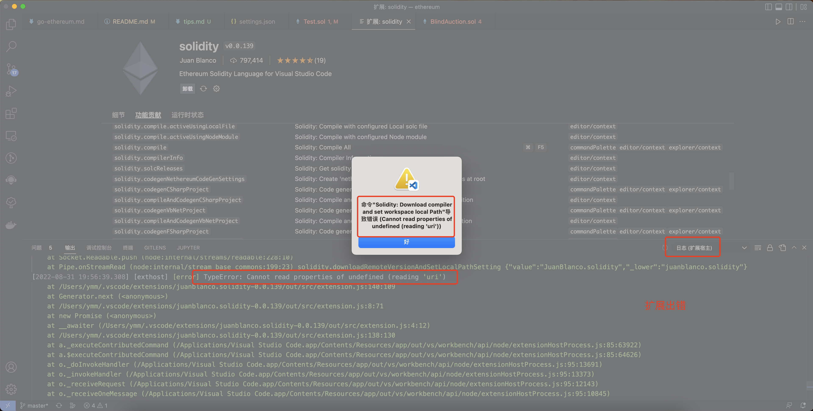

- # tips

## vscode solidity 
[ethereum/remix-vscode](https://github.com/ethereum/remix-vscode)   
[juanfranblanco/vscode-solidity](https://github.com/juanfranblanco/vscode-solidity)    
### 切换版本
直接在界面点击 `Set compiler version` 

### 使用本地编译器

默认状态  
```shell
[7:26:44 PM]: Compiling with version soljson-v0.8.0+commit.c7dfd78e.js
[7:26:47 PM]: Loading remote version v0.8.0+commit.c7dfd78e... please wait
[7:27:15 PM]: Remote version v0.8.0+commit.c7dfd78e loaded.
```

编译很慢，向切换到本地的编译器.   


<br>
<div align=center>
  </img>
</div>


```shell
# 本地
Compiling with version latest
Compiling with local or cached version: 0.8.6+commit.11564f7e.Emscripten.clang...

# 远程
Compiling with version soljson-v0.8.6+commit.11564f7e.js
```
`src/plugins/compile_worker.ts`  
查看源码
```js
process.on("message", async m => {
	if (m.command === "compile") {
		const vnReg = /(^[0-9].[0-9].[0-9]\+commit\..*?)+(\.)/g;
		const vnRegArr = vnReg.exec(solc.version());
		// @ts-ignore
		const vn = 'v' + (vnRegArr ? vnRegArr[1] : '');
		const input = m.payload;
		if (m.version === vn || m.version === 'latest') {
			try {
				console.log("compiling with local version vn: ", vn);
				console.log("m","");
				console.log("compiling with local version: ", solc.version());
				const output = await solc.compile(JSON.stringify(input), { import: (path) => findImports(path, m.root) });
				// @ts-ignore
				process.send({ compiled: output, version:solc.version() });
				// we should not exit process here as findImports still might be running
			} catch (e) {
				console.error(e);
				// @ts-ignore
				process.send({ error: e });
				// @ts-ignore
				process.exit(1);
			}
		} else {
			const v = m.version.replace('soljson-', '').replace('.js', '');
			console.log("Loading remote version " + v + "...");
			solc.loadRemoteVersion(v, async (err: Error, newSolc: any) => {
				if (err) {
					console.error(err);
					// @ts-ignore
					process.send({ error: e });
				} else {
					console.log("compiling with remote version ", newSolc.version());
					try {
						const output = await newSolc.compile(JSON.stringify(input), { import: (path) => findImports(path, m.root) });
						// @ts-ignore
						process.send({ compiled: output, version:newSolc.version() });
					} catch (e) {
						console.error(e);
						// @ts-ignore
						process.send({ error: e });
						// @ts-ignore
						process.exit(1);
					}
				}
			});
		}
	}
```

使用本地版本的场景是`最新版本`和`本地solc版本`  
  